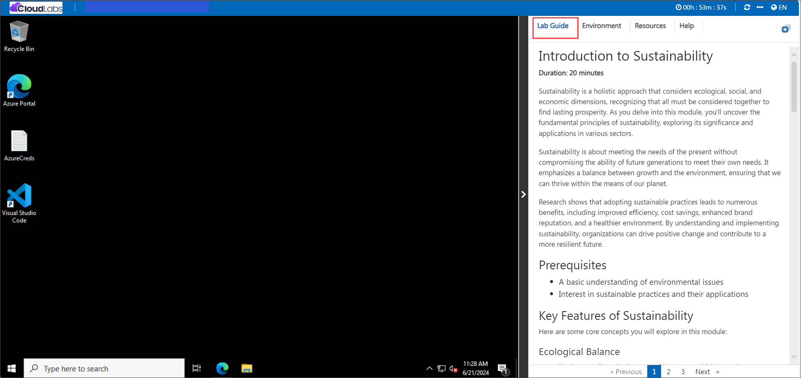
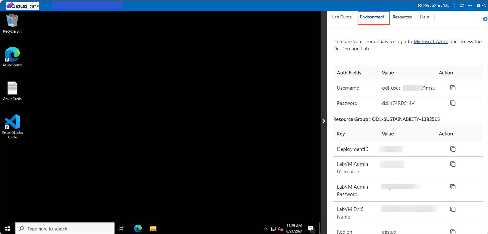
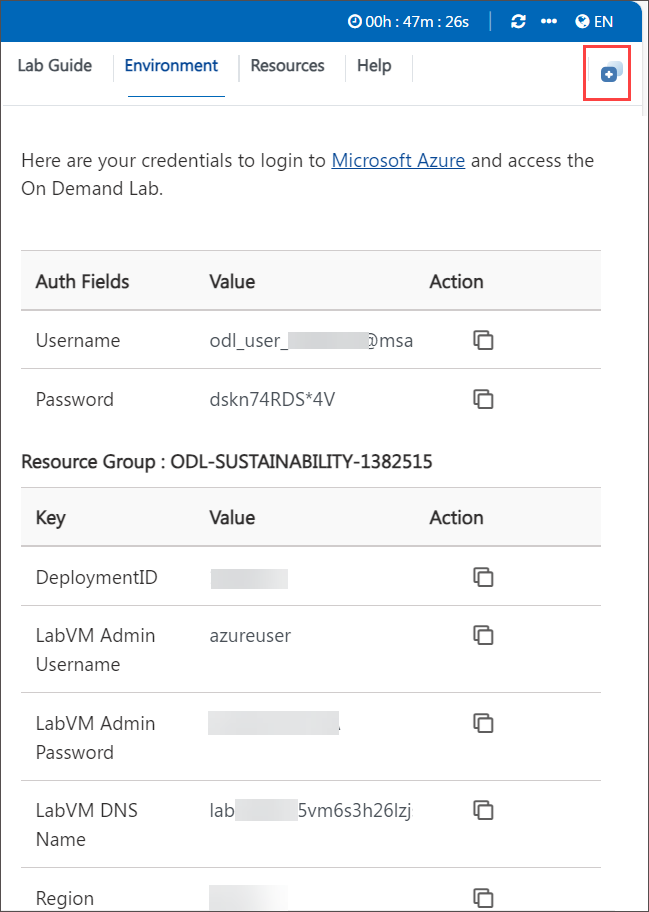
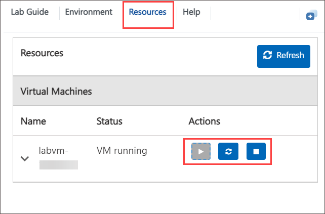

# Getting Started with Your Microsoft Sustainability Manager Workshop
 
Microsoft Sustainability Manager is a comprehensive tool designed to help organizations manage and track their sustainability efforts, enabling them to achieve their environmental, social, and governance (ESG) goals. It provides robust features for data collection, analysis, and reporting, ensuring compliance and facilitating informed decision-making.

## Accessing Your Lab Environment
 
Once you're ready to dive in, your virtual machine and lab guide will be right at your fingertips within your web browser.

  

### Virtual Machine & Lab Guide
 
Your virtual machine is your workhorse throughout the workshop. The lab guide is your roadmap to success.
 
## Exploring Your Lab Resources
 
To get a better understanding of your lab resources and credentials, navigate to the **Environment Details** tab.

   
   
## Utilizing the Split Window Feature
 
For convenience, you can open the lab guide in a separate window by selecting the **Split Window** button from the Top right corner.

   
   
## Managing Your Virtual Machine
 
Feel free to start, stop, or restart your virtual machine as needed from the **Resources** tab. Your experience is in your hands!

   
   
### Click "Next" from the bottom right corner to embark on your Lab journey!
