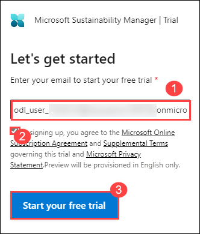
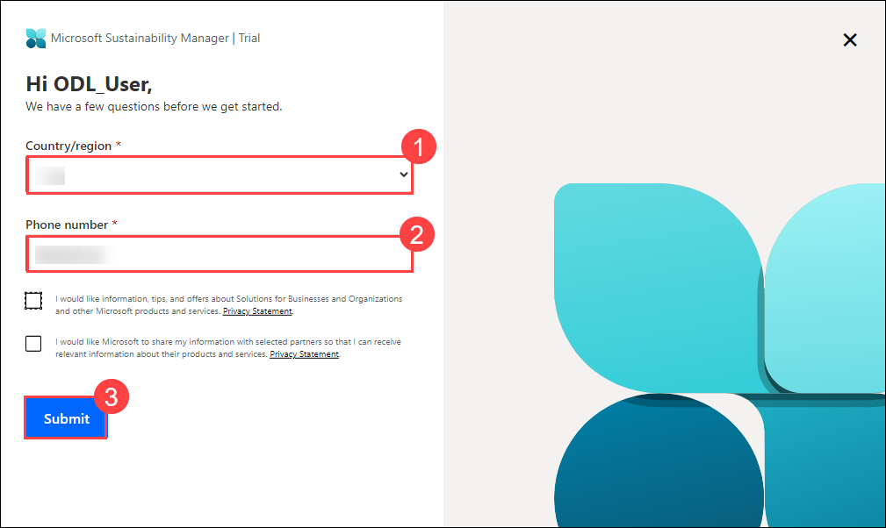
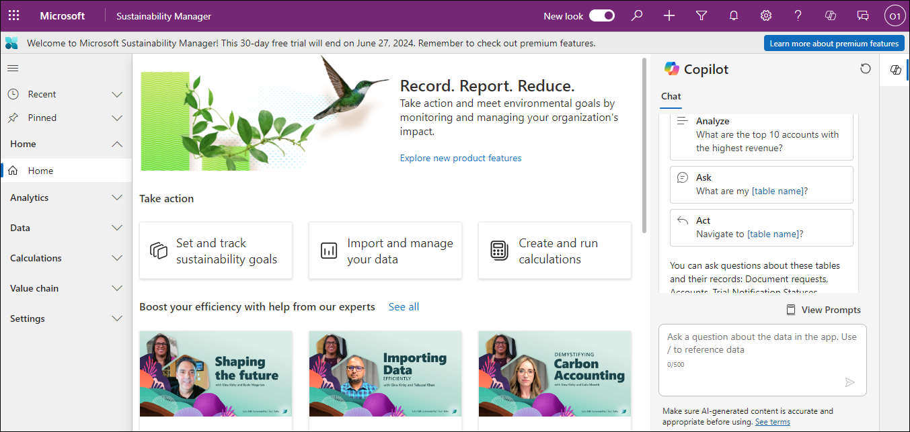

# Lab 1: Deploy a Microsoft Sustainability Manager instance

## Lab Objective: 
Deploy and configure a trial version of Microsoft Sustainability Manager to track and manage sustainability data and metrics for a fictional company, Contoso Corp Inc.

## Lab Scenario:
Contoso Corp is a specialty coffee distribution business with operations in APAC, US, Africa, and Europe.Contoso Corp is experiencing supply chain challenges when transporting its finished goods across the United States. Additionally, it wants to augment its transportation and logistics capacities. To overcome this challenge, Contoso Corp acquired a transportation business called Wide World Importers, which is based in Florida, US. Wide World Importers has two office facilities with 100 employees that coordinate a fleet of 40 electric trucks that will be used for transportation of finished goods across the US. As an IT specialist at GreenFuture Inc., you are tasked with deploying and configuring a trial version of Microsoft Sustainability Manager.

### Task 1: Deploy a Microsoft Sustainability Manager instance

In this task, you will sign up for a trial version of Microsoft Sustainability Manager. Follow these steps to complete the signup process:

1. Go to the [Microsoft Sustainability Manager free trial page](https://dynamics.microsoft.com/en-us/sustainability/sustainability/free-trial/)

1. On the **Let's get started** page, enter the <inject key="AzureAdUserEmail"></inject> and select the checkbox and click on **Start your free trial**

   

1. Follow the on-screen guidance to provide the contact details and click on **Submit**

   

1. You will be redirected to the Sustainability Manager page, where you can start using the trial version of Microsoft Sustainability Manager.

   
