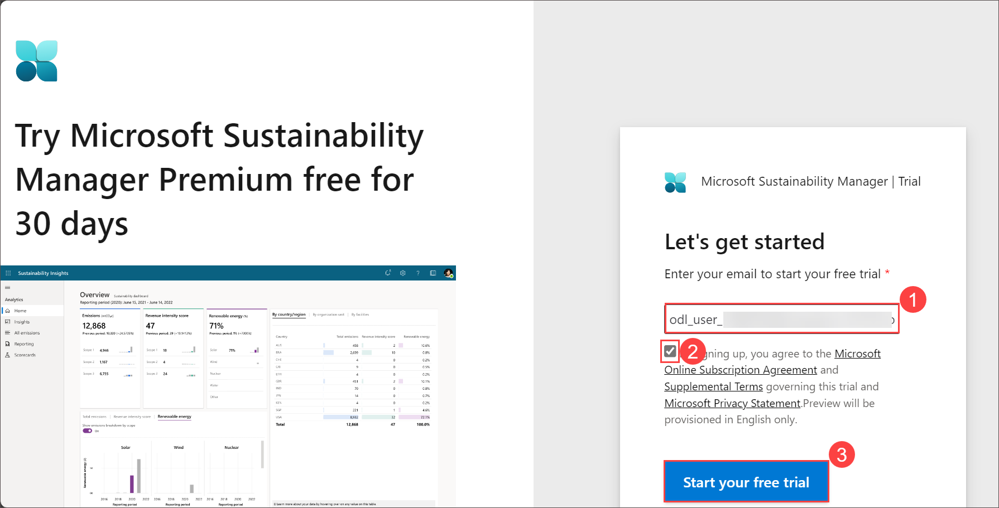
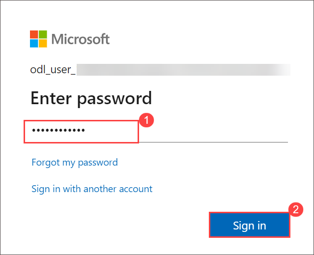
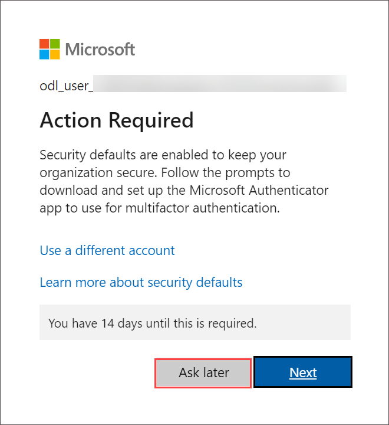
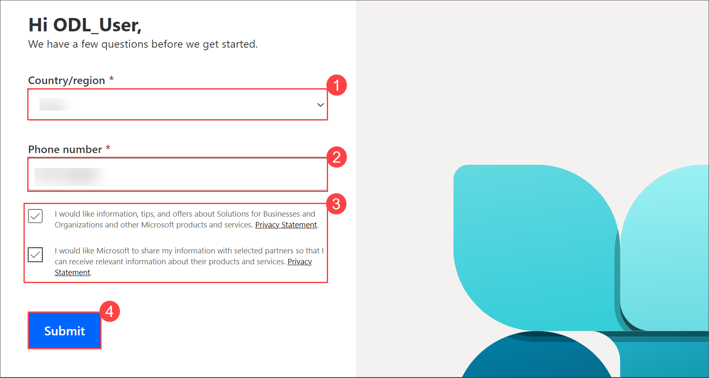

# Lab 1: Deploy a Microsoft Sustainability Manager instance

## Lab Overview
In this lab, you will deploy an instance of Microsoft Sustainability Manager by signing up for a trial version. This hands-on exercise will guide you through the signup process, allowing you to explore the features and capabilities of the Microsoft Sustainability Manager.

## Lab Scenario:

Contoso Corp is a specialty coffee distribution business with operations in APAC, US, Africa, and Europe. Contoso Corp is experiencing supply chain challenges when transporting its finished goods across the United States. Additionally, it wants to augment its transportation and logistics capacities. To overcome this challenge, Contoso Corp acquired a transportation business called Wide World Importers, which is based in Florida, US. Wide World Importers has two office facilities with 100 employees that coordinate a fleet of 40 electric trucks that will be used for transportation of finished goods across the US. As an IT specialist at GreenFuture Inc., you are tasked with deploying and configuring a trial version of Microsoft Sustainability Manager.

## Lab Objectives
In this lab, you will complete the following tasks:

- Task 1: Deploy a Microsoft Sustainability Manager instance

## Estimated timing: 20 minutes

### Task 1: Deploy a Microsoft Sustainability Manager instance

In this task, you will sign up for a trial version of Microsoft Sustainability Manager. Follow these steps to complete the signup process:
  
1. Use the below link to access the trial version of Microsoft Sustainability Manager.

   ```
    https://dynamics.microsoft.com/en-us/sustainability/sustainability/free-trial/
   ```
1. On the **Let's get started** page, enter the <inject key="AzureAdUserEmail"></inject> **(1)** and select the checkbox next to **By signing up, you agree to the (2)** and click on **Start your free trial (3)**

   

1. When prompted provide the **Password:** <inject key="User's Password"></inject>.

     
   
1. On the **Action required** page click on **Ask Later**.

     
   
1. Follow the on-screen guidance to provide the contact details then select the check boxs and click on **Submit**

    

1. You will be redirected to the Microsoft Sustainability Manager page, where you can begin exploring and using the trial version.

   

## Review 

During this lab, you have learned how to sign up for a trial version of Microsoft Sustainability Manager.

## You have successfully completed the lab. Click on Next >>.
