# Lab 2: Configure Microsoft Sustainability Manager 

### Task 1: Prepare Business Units and Hierarchy  

In this task, you will set up the Company profile, hierarchy, and facilities for the Wide World Importers organization in Microsoft Sustainability Manager.

1. In the left navigation pane, Select **Company profile** under **Settings** .

1. The Company profile page includes basic information about the organization, such as name, address, company logo, the annual reporting period, and relevant industries. Additionally, there are tabs at the top of the page for setting up organization structure and facilities, both will be covered in this exercise.

   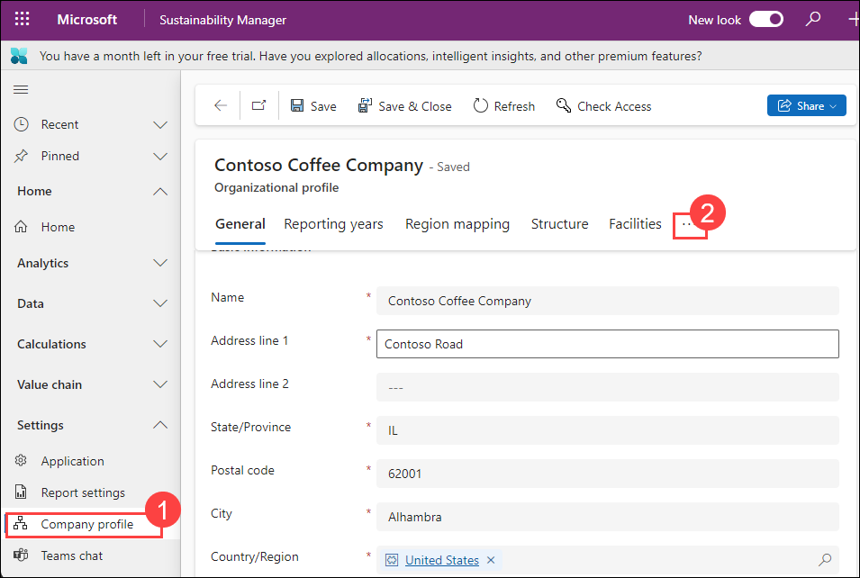

1. On the **Company profile** page, select the **Industries** tab. Microsoft Sustainability Manager includes a selection of pre-defined industries and sub-verticals based on NACE standards, see NACE Code at https://nacev2.com/en. Select **+Add**.

   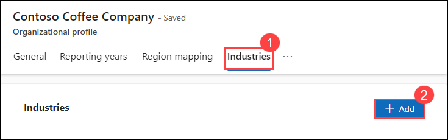

1. Select **Transportation and storage**.

   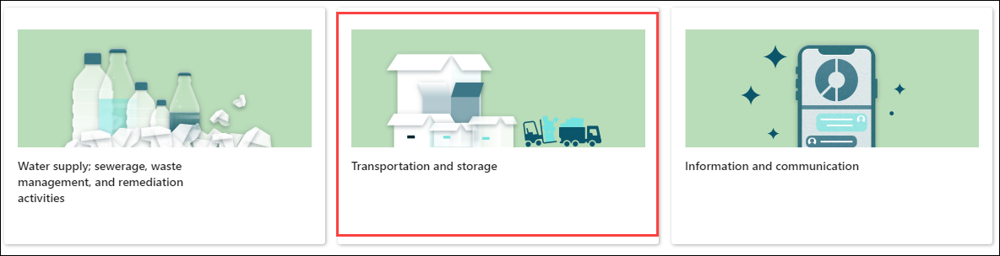

1. In the next screen, select **Land transport and transport via pipelines** and select **Add**.

   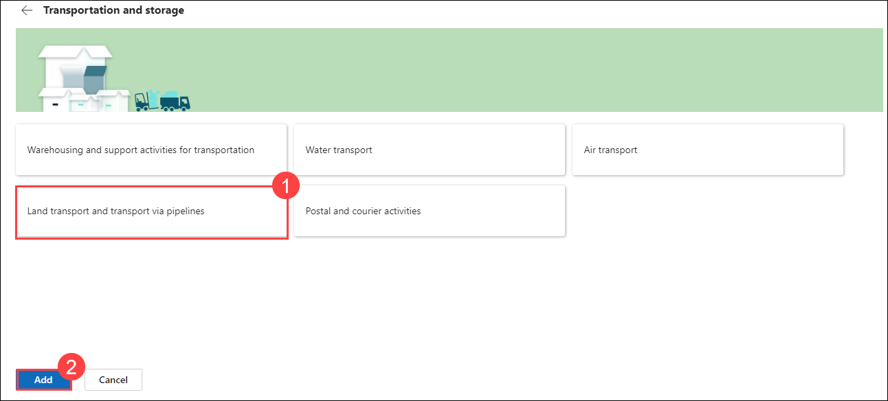

1. **Land transport and transport via pipelines** is now visible in the **Industries** section at the bottom of the **Company profile** page.

1. In the **Company profile** page, switch to the **Structure** tab.

   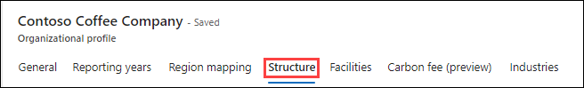

1. Select **Contoso USA** and select **Add** to add a new organizational unit under it.

   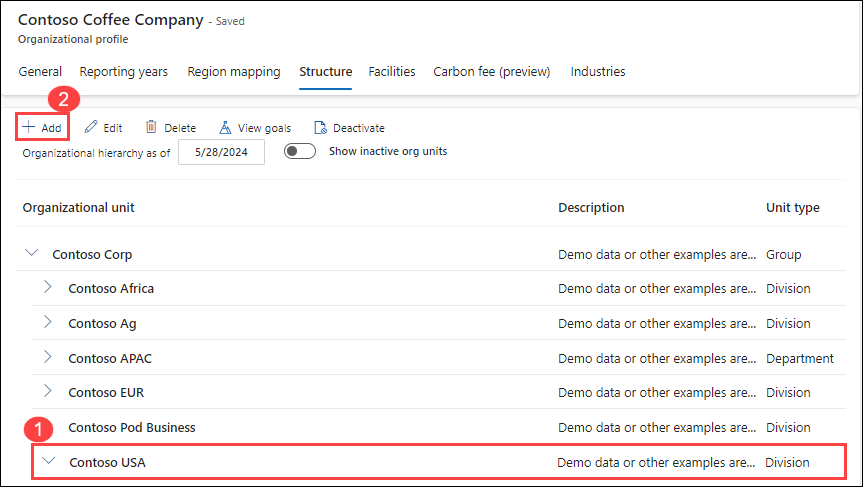

1. Enter the following data for organizational unit and select **Save** in the button pane:

    * **Name**: Wide World Importers
    * **Organizational unit type**: Department

      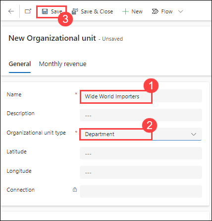

1. In the **Organizational hierarchies** section, which appears after selecting **Save**, select **+ New Organizational hierarchy**.

    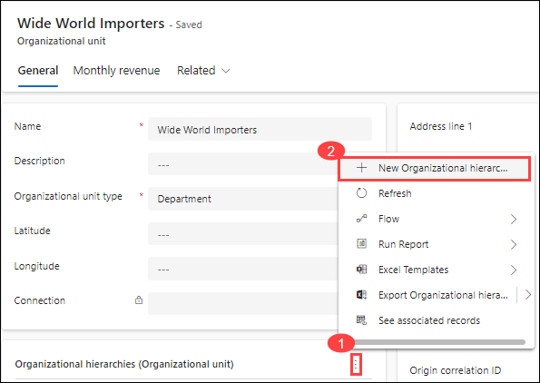

1. Set the following values and select **Save & Close**:

    * **Parent**: Contoso USA
    * **Effective start date**: The first day of the current month (MM/DD/YYYY)

      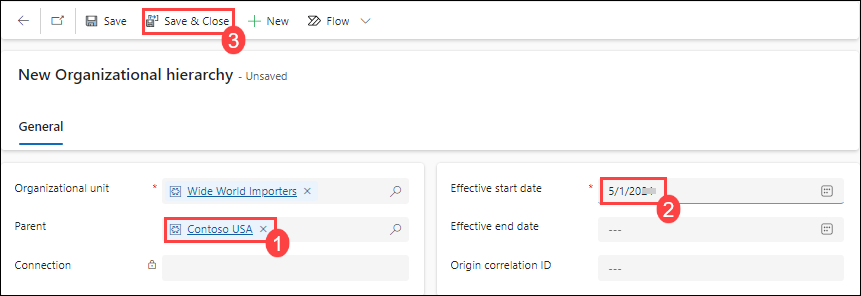

1. After being returned to the **Organizational Unit**, select **Save & Close** to return to the **Company profile**.

   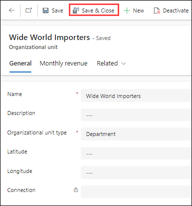

1. If necessary, navigate to **Company profile**, switch to the **Facilities** tab page and select **Add facility**.

   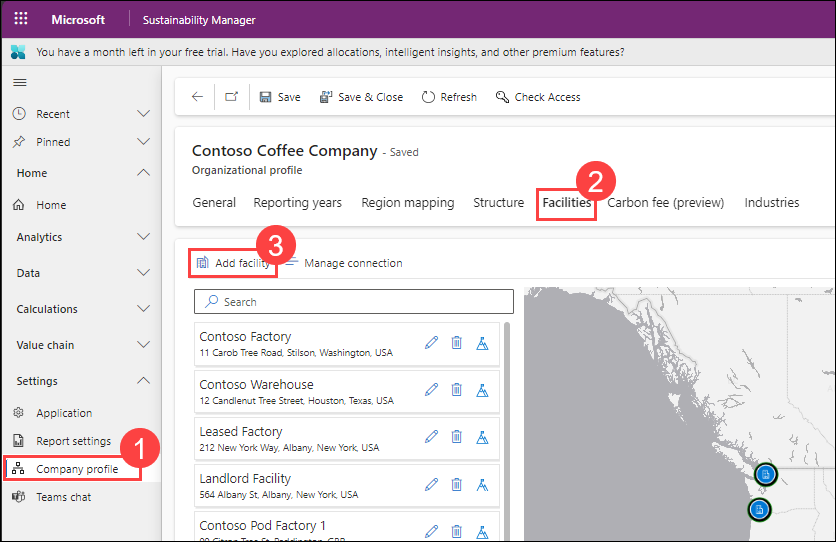

15. Create a new Facility with the following details. Once the values are entered, select **Save & Close**:

    >**Note:** Pay close attention to the data used in this lab. The following labs will reference this data, and it will need to match exactly as seen in the lab.

    1. **Name**: Wide World Importers - Miami Office
    1. **Address line 1**: Brickell Avenue
    1. **City**: Miami
    1. **State**: Florida
    1. **Zip**: 33132
    1. **Country**: United States
    1. **Latitude**: 25.774320
    1. **Longitude**: -80.187720

    >**Note:** Latitude and Longitude are not required but are used to display a pin on the Facilities map. They can be automatically added by selecting an address from the autocomplete options in Address line 1, or manually entered.

     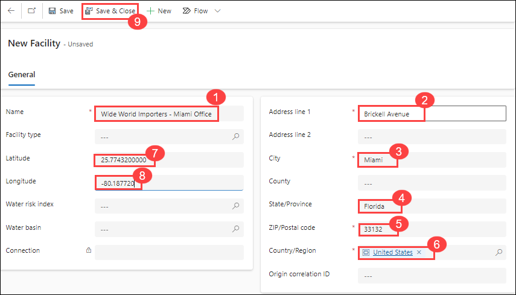

16. Using the same steps, add another new **Facility**. Once the values are entered, select **Save & Close**.

    >**Note:** Pay close attention to the data used in this lab. The following labs will reference this data, and it will need to match exactly as seen in the lab.

    1. **Name**: Wide World Importers - Tampa Office
    1. **Address line 1**: Lois Avenue
    1. **City**: Tampa
    1. **State**: Florida
    1. **Zip**: 33609
    1. **Country**: United States
    1. **Latitude**: 27.944830
    1. **Longitude**: -82.514050

    **Note:** Latitude and Longitude are not required but are used to display a pin on the Facilities map. They can be automatically added by selecting an address from the autocomplete options in Address line 1, or manually entered.

     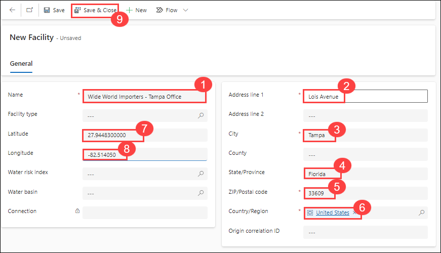

Great job, by completing these steps, you have completed the organizational setup in Microsoft Sustainability Manager for Wide World of Importers. This included the Company profile, hierarchy, and facilities. Organizational structure and facility management will be linked to activity and emission data to group emissions by Organization, facility, and even regions. This is an important part of carbon emission reporting and organization disclosures. **Please continue to the next task.**

## Task 2 : Emission Calculations

# Module 5 Lesson 2 Lab 3: Design Emission calculations

## Overview

### Background

In the previous two labs, we laid the foundation for emission calculations by setting up the organization, reference data such as Contractual instrument types and ingesting the Activity data. Now that the groundwork and data has been laid for emission calculations, this lab will focus on performing the emission calculations using a combination of factor libraries, emission factors, estimation factors and calculation profiles. Once the calculations are performed, we will review the emission calculations output.

### Learning Objectives

In this lab, you will do the following:

-   Review the Microsoft Sustainability Manager’s Dynamic calculation capabilities using Factor libraries, Emission factors and more.
-   Review the existing “EPA 2022 - eGRID” factor library and emission factors
-   Create a new custom factor library for estimating miles to kilowatt hours (kWh)
-   Create new calculation models and new calculation profiles for calculation jobs
-   The emissions calculated during this lab exercise will be utilized in the remaining scenarios (reporting and goals) in the upcoming lab exercises.

### Prerequisites

-   Microsoft Sustainability manager environment is set up with sample data
-   Lab 01 organization and reference data is entered
-   Lab 02 activity data is ingested

### Solution Focus Area

In the Emission calculations focus area calculation models are designed to calculate the emissions produced by the ingested activity data. The setup of the calculations breaks it down into two concepts: factor mappings and calculation models. Currently, Sustainability Manager has been verified with EPA default calculations and factor sets only. Additional factor sets will be available over time. Any factor set can easily be added or created by organizations based on their own business needs and regional requirements.

The following terminologies will be used throughout the configuration of Emission Calculations:

-   **Estimation Factor**: Provides a way to convert from one unit type to another, such as night stays to kilowatt hour (kWh) used.
-   **Emission Factor**: Defines the amount of greenhouse gas emitted by a given unit type, this includes defining gas emissions such as CO2, CH4, and N2O.
-   **Factor Mapping**: Provides a way to map reference data to a specific emission factor, simplifying calculation models by allowing customers to choose a reference data type and allowing the system to find the appropriate emission factor.
-   **Factor Library**: A collection/grouping of emission or estimation factors and factor mappings, used by calculation models.
-   **Calculation Model**: Thought of as the instruction set used by the application to perform the emission calculations, utilizes factor libraries, factor mappings, and emission/estimation factors to perform the emission calculations.
-   **Calculation Profile**: Provides the scheduling for calculation jobs, defining activity data filter and the calculation model (instruction set) to use.
-   **Allocation Profile**: An allocation profile configures methods to distribute emissions from a source (like a facility) to specific entities based on chosen parameters. It allows visualization of emissions distribution without altering default reporting, offering insights into how emissions are divided.
-   **Custom dimensions**: Custom dimensions can be used in emission calculation models, for example, in condition, calculation, and reporting actions.

   

### Personas and Scenarios

In this lab, Alex Serra – Emissions Analyst for Wide World Importers sets up factor mappings for Purchased electricity for facilities, mapping Contractual instrument types to the Florida electric grid (FRCC).

Alex also creates a new estimation factor library for estimating miles driven to kilowatt hours (kWh) for Fabrikam electric trucks. Alex then creates calculation models for calculating the carbon emissions produced per the facility’s purchased electricity. Post that, Alex creates a calculation model for estimated carbon emissions produced by the purchased electricity for charging Fabrikam Electric trucks (based on the kWh per mile driven estimate).

Finally, Alex creates and runs calculation profiles, filtering to Wide World Importers activity data. Post running the Calculation profile, Alex reviews the calculated emissions data before notifying Amber Rodriguez – Sustainability specialist that the emission calculations are complete.

In this lab exercise, we will focus on the scenarios illustrated below:

## Exercise 1: Set up Factor Libraries

In this exercise, you will learn about the steps that Alex takes to define the factor mappings for Purchased electricity, and an estimation factor library for estimating the amount of electricity purchased based on the Miles driven by Wide World Importers fleet of electric trucks. While electric vehicles do not have Scope 1, direct tailpipe emissions, they do have to be charged while transporting goods, in this case - across the USA. This charging of Electric trucks results in Scope 2 purchased electricity.

Wide World Importers may not know exactly how much electricity was purchased for charging the Electric Trucks, which grids the electricity came from, or what the energy source is. However, Wide World Importers can estimate the amount of electricity purchased by identifying how many kilowatt hours (kWh) are used per 100 miles, based on EPA vehicle efficiency data. You can explore this functionality in deeper detail on Microsoft Docs, please visit **Overview of Emission factors** at https://docs.microsoft.com/en-us/industry/sustainability/calculate-emission-factors.

1. Log into the virtual machine using the virtual machine credentials located on the **Resources** tab above.

2. Open a new browser window and navigate to https://make.powerapps.com.

3. Log into your Microsoft 365 tenant using the credentials for the tenant located on the **Resources** tab above.

4. If needed, change the environment to your trial on the top bar.

5. Open the **Sustainability Manager** Application by clickin on Play button.

**Important** Please make sure that you have completed the previous lab to create Activity Data. **The emissions calculations require all the Data Ingestion processes from the previous lab to be completed.** Failure to do so will result in errors or incorrect values during the calculations

## Task 1 : Add eGRID factor mappings
In this task, Alex will create factor mappings to map the contractual instrument types for Wide World Importers that Reed previously added to the respective electric grid emission factor. This process allows Microsoft Sustainability Manager to find the correct electric grid for a given contractual instrument type. This type can be expanded to map other reference data to specific emission factors, avoiding the need to create calculation models that are for specific emission factors.

1. In the left navigation pane, select Calculations > Factor libraries.

2. Select the EPA 2022 - eGRID factor library to open it.

     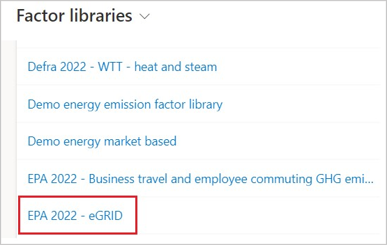

3. Explore the EPA 2022 - eGRID factor library. The General tab includes the following identifying information about the factor library:

   - Name - Identifies the factor library in the list.
      
   - Description - Provides more information about the factor library.
      
   - Documentation reference - Identifies the documentation that's used to generate the factor library.
      
   - Type of factor library - Identifies if this factor library type is Custom, Demo (sample), or Standard (preloaded based on EPA libraries). For more information, see Emission 
       factors.
      
   - Library type - This functionally switches the library type between Emission or Estimation library. Emission libraries calculate emission gases. Estimation libraries create 
       estimated conversions from one unit type to another, such as night stays at a hotel to kWh used.   
     
      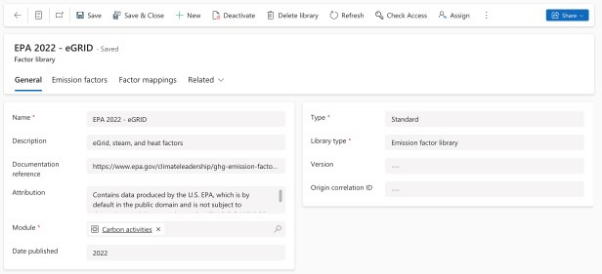

4. Select the Emission factors tab to view a list of emission factors in the factor library.

5. The Emission factors list displays the name of the emission factor, the unit type, sub type, documentation reference, and gases generated. Because Wide World Importers is a Florida-based business and is connected to the FRCC electrical grid, select FRCC (FRCC All) from the list of emission factors.

    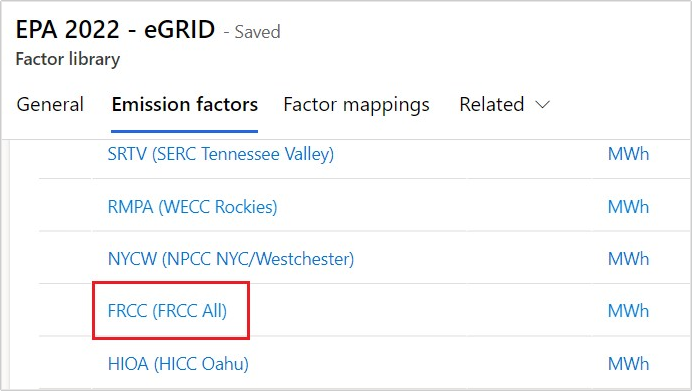

    The FRCC (FRCC All) emission factor shows the carbon emissions that have been produced, 861 lb of CO2, 0.055 lb of CH4, and 0.007 lb of N2O, for each megawatt-hour (MWh) of energy consumed.

    This information is important to understand how the final CO2E (carbon dioxide equivalent) will be calculated later. When creating a new emission factor, you'll want to define how much of each gas is produced for a given unit. Several other gas types can be tracked, as shown on the screen, depending on the scenario. Some or all gas types might be used.

   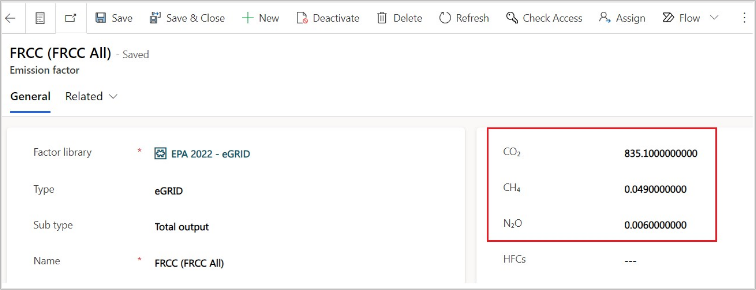

6. Return to EPA 2022 - eGRID by selecting the back arrow. Select the Factors mapping tab.

   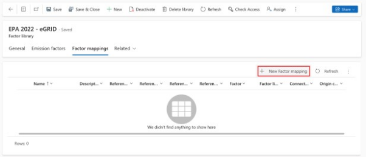

7. Create factor mappings for the two contractual instrument types that were created in previous exercise and then associate them with the FRCC (FRCC All) emission factor. Each contractual instrument is a local power provider in Florida, and they're part of the FRCC electric grid. Select + New Factor mapping.

    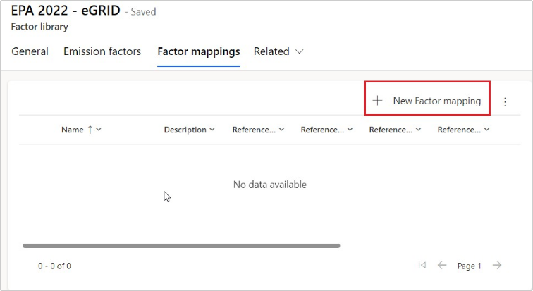

8. Use the following information to populate the fields on the New Factor mapping screen:

      Name - FRCC - Purchased Electricity - VanArsdel Ltd
      
      Reference data - VanArsdel Ltd
      
      Factor - FRCC (FRCC All)
   
   The fields and their values are defined as follows (numbers corresponding to numerals in the ensuing screenshot):
   
      The Name of the factor mapping identifies the factor mapping in the list.
      
      The Reference data maps the contractual instrument type.
      
      The Factor maps the emission factor.
      
      You can select the Save & Close button to save the record.

      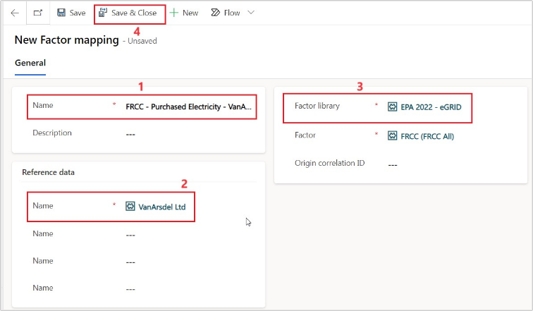

9. Select + New Factor mapping.

     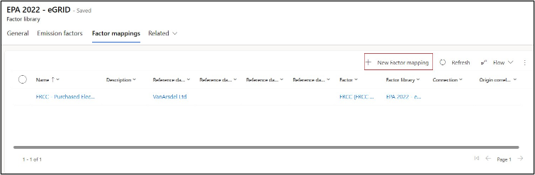

10. Use the following information to populate the fields on the New Factor mapping screen:

         Name - FRCC - Purchased Electricity - Adatum Corp
         
         Reference data - Adatum Corp
         
         Factor - FRCC (FRCC All)

The fields and their values are defined as follows (numbers corresponding to numerals in the ensuing screenshot):

      The Name of the factor mapping identifies the factor mapping in the list.
      
      The Reference data maps the contractual instrument type.
      
      The Factor maps the emission factor.
      
      You can select Save & Close to save the record.

   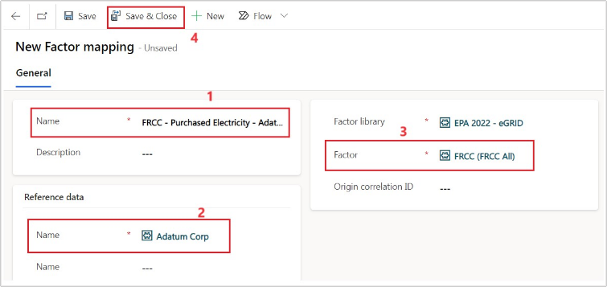

Now, you have two additional factor mappings, one for each contractual instrument that was added during the previous exercise.

  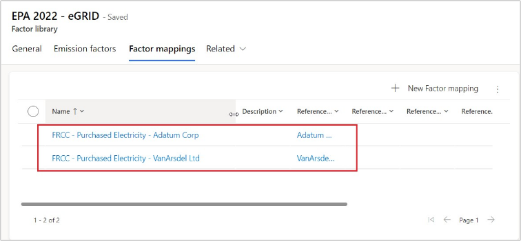

You've completed adding the factor mappings for your purchased electricity activity data. This step is important toward the creation of calculation models that will calculate emissions for multiple emission factors based on reference data, such as contractual instrument types or facilities.

By creating these factor mappings, you can choose contractual instrument types as emission factors during your calculation model creation. This information tells Microsoft Sustainability Manager to map the contractual instrument type on an activity data record to the emission factor that's listed in the factor mapping. Now, you can create more dynamic calculations rather than calculations that are specific to a given emission factor.

## Task 2: Create an estimation factor library

In this task, Alex will create an estimation factor library to define the estimation factor for estimating the kilowatt-hours (kWh) that are used for each mile driven. While electric vehicles don't have Scope 1, direct tailpipe emissions, they do need to be charged while transporting goods across the US, resulting in Scope 2 purchased electricity. Wide World Importers don't know the exact amount of electricity purchased, what grid the electricity came from, or the energy source; however, they can estimate the amount of purchased electricity by identifying the number of kilowatt-hours (kWh) that are used every 100 miles based on EPA vehicle efficiency.

1. Go to Factor libraries on the left navigation pane and select New to create a new library.

2. Use the following information to populate the fields on the New Factor library page:

   Name - Electric Vehicle Estimation Library
   
   Description - Scope 2 Emissions from Electric Vehicles
   
   Module - Select Carbon activities
   
   Documentation reference - https://fueleconomy.gov/feg/byfuel/EV2022.shtml
   
   Type - Custom
   
   Library Type - Estimation factor library
   
   The fields and their values are defined as follows (numbers corresponding to numerals in the ensuing screenshot):
   
   The Name of the factor library identifies the factor library in the list.
   
   The Description of the factor library provides more information about the factor library for others.
   
   The Module is the data type that should appear in the Activity data.
   
   The Documentation reference for the factor library identifies the documentation that's used to generate the factor library.
   
   The Type of factor library identifies if it's a Custom, Demo (sample), or Standard (preloaded based on EPA libraries) type. For more information, see Emission factors.
   
   The Library Type of the factor library switches the library type between Emission or Estimation library. Emission libraries calculate emission gases. Estimation libraries create estimated conversions from one unit type to another, such as 100 miles driven to kWh.
   
   You can select Save & Close to save the record.

   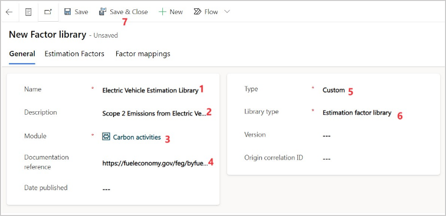

## Task 3: Create an estimation factor
In this task, Alex will create the estimation factor for estimating the kilowatt-hours (kWh) that are used for every mile driven. The EPA estimates electric vehicle efficiency in kilowatt-hours (kWh) for every 100 miles. Alex will use this same metric in the estimation factor to ensure that the estimation factor is consistent with the EPA.

1. Scroll down on the Factor library view and select Electric Vehicle Estimation Library (it will be near the bottom of your page) under Estimation factors.

    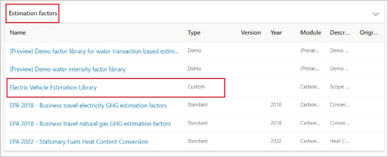

2. Select the Estimation Factors tab.

   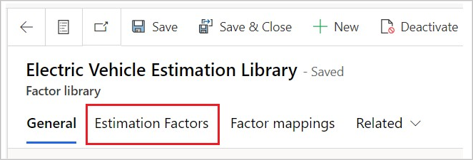

3. Select + New Estimation factor.
 
  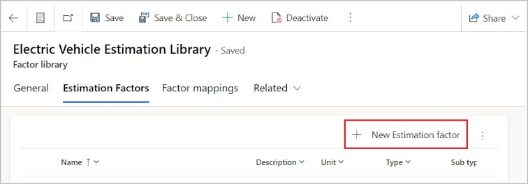

4. Review the Fabrikam Electric truck details on the EPA website and then enter the following information on the New Estimation factor screen:

      Name - Fabrikam Electric Truck - EPA Estimate
      
      Documentation reference - https://fueleconomy.gov/feg/noframes/45318.shtml
      
      Factor Library - Electric Vehicle Estimation Library
      
      Unit - 100 Mile
      
      Factor value - 49.00
      
      Factor value unit - kWh

      The fields and their values are defined as follows (numbers corresponding to numerals in the ensuing screenshot):

      The Name identifies the emission factor in the list.
      
      The Documentation reference identifies the documentation that's used to generate the estimation factor.
      
      The Factor library links the estimation factor to the factor library. This value will default if you select New Estimation factor while you're in a factor library.
      
      The Unit identifies what unit will be converted.
      
      The Factor value determines the amount to be estimated according to the Factor value unit.
      
      The Factor value unit specifies the unit type to be converted to.
      
      You can select Save & Close to save the record.

      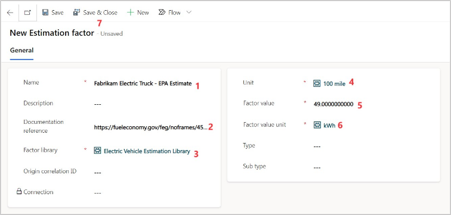

5. The new emission factor is estimating that every 100 miles is equivalent to 49 kWh.

     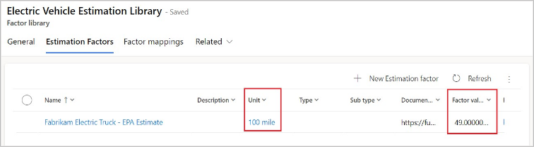

    You've now created an estimation factor. Estimation factors are important to be able to convert from one unit type to another when an estimate is appropriate, such as estimated fuel or battery economy of vehicles or when estimating gas and electric usage during hotel stays.

## Exercise 2 - Set up calculation models
 
 
In this exercise, you learn about the steps that Alex takes to define calculation models that Microsoft Sustainability Manager uses to calculate emissions. Calculation models are the instruction sets, or recipes, that define the steps and values to use during the emission calculations. Microsoft Sustainability Manager provides several calculation models.

Take the opportunity to review some prebuilt models. They're excellent sources of information when you're creating new calculation models. You can also use calculation models as a template for new models. This exercise and the next discuss the algorithm that's used to calculate emissions. For more information, see Overview of Calculation models. 
 
 
## Task 1 : Create a purchased electricity model
 
1. Select Calculations > Models on the left navigation pane.

2. Select + New to create a new calculation model.

   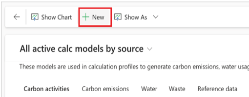

3. A new page opens, where you can set up the new calculation model. A Source action is added by default.

   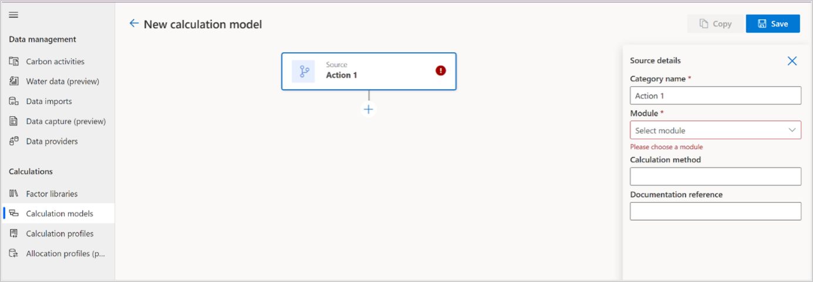
 
4. Populate the Source Details pane with the following data:

   Category name - Purchased Electricity: Contractual Instrument Based - 2022
   
   Module - Carbon Activities
   
   Activity data - Purchased electricity
   
   Calculation method - EPA Equation 1: Electricity (MWh) * EF
   
   Documentation reference - https://www.epa.gov/sites/default/files/2020-12/documents/electricityemissions.pdf

The fields and their values are defined as follows (numbers corresponding to numerals in the ensuing screenshot):

      The Category name identifies the calculation model in the list.
      
      The Module is used to identify which data types should appear in the Activity data field.
      
      The Activity data identifies which type of activity data that the model processes.
      
      Use the Calculation method to roughly estimate what the calculation does.
      
      The Documentation reference identifies the documentation that's used to create the calculation model.
      
      You can select Save to save the record.

   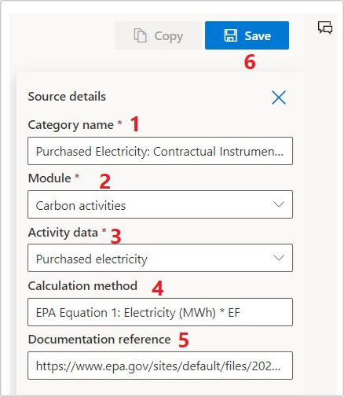

4. Select the plus (+) icon to add a new action to the calculation model.

    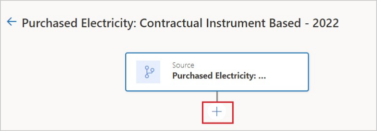

5. Select Report on the Available actions screen.   

   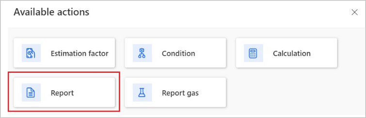
 
6. A new Report action is added to the calculation model. Select that action to edit it.

    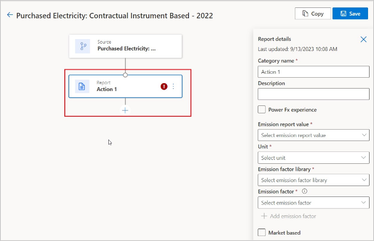

 You can use the Report action to calculate and report carbon emissions to the emissions table. This action uses the emission factor or factor mapping to identify the emission factor to be used based on the Emission factor dropdown list. In this exercise, the action uses a contractual instrument type field to identify the factor mapping and emission factor to use in the calculation.

After you've determined the emission factor for the activity data line, the activity data quantity and quantity unit will be converted to the same unit type as the emission factor. In this exercise, the kilowatt-hours (kWh) from the activity data are converted to megawatt-hours (MWh).

After the quantity has been converted, the converted value will be multiplied against each gas that's listed in the emission factor, determining the volume of gases produced.

To determine the CO2E (carbon dioxide equivalency), the gases produced are multiplied against their Global Warming Potential (GWP) factor, which is stored in the Greenhouse Gases Dataverse table and are added together.

The Report action stores the gases produced values, CO2E value, and other identifying information about the activity data row in the emissions table.

7. Populate the Report action with the following data:

      Category name - Electricity * EF (Contractual Instrument Type)
      
      Description - EPA Equation 1: Electricity (MWh) * EF
      
      Emission report value - Quantity
      
      Unit - Quantity unit
      
      Emission factor library - EPA 2022 - eGRID
      
      Emission factor - Contractual Instrument Type
      
   The fields and their values are defined as follows (numbers corresponding to numerals in the ensuing screenshot):

   The Category name identifies the action in the calculation model.
      
   Use the Description to roughly note what the calculation does.
      
   The Emission report value identifies which field from the activity data type should be used to retrieve the value that's used in the emission calculation.
      
   The Unit identifies the field from the activity data type to be used to retrieve the unit type of the value. Alternatively, you can specify a unit to always be used in the action, regardless of which unit is specified on the activity date type.
      
   The Emission factor library identifies which factor library is used to identify the emission factor.
      
   The Emission factor identifies which emission factor or factor mapping to use to calculate the emissions. Choosing a factor mapping allows multiple reference data values to map to an emission factor, allowing for a calculation model to not be bound to a single emission factor.
      
   You can select Save to save the record.

   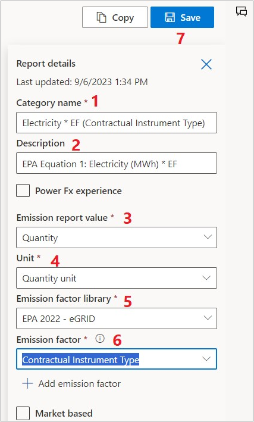

8. Select the back arrow on the record to return to the list of calculation models.

   The new calculation model should appear in the list. 

    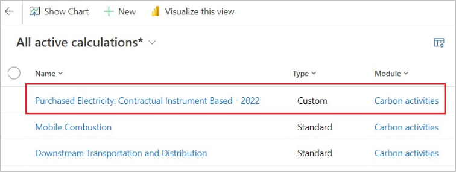
 
    Now, you've created a new calculation model. In this calculation model you've used factor mappings, an important differentiator for Microsoft Cloud for Sustainability. 
    Factor mappings allow the calculation models to be more dynamic by mapping reference data to emission factors, allowing you to have one model that can calculate multiple 
    emission factors. Calculation models are the instruction sets that Microsoft Cloud for Sustainability uses to calculate emissions. Several calculation models are included 
    with Microsoft Cloud for Sustainability based on EPA calculations. Occasionally, these included models might not match your unique customer needs, so you need to create new 
    models to provide custom calculations. Make sure that you review the included models to view other types of complex calculation models.

 ## Task 2: Create an electric vehicle miles driven model

In this task, Alex creates a new calculation model to calculate carbon emissions for miles driven by electric vehicles. This exercise uses the estimation factor library that was created in the previous exercise to estimate the kilowatt-hours (kWh) that are used by an electric vehicle and then calculate the carbon emissions for that electricity based on the US Average emission factor.

1. Select + New again to create another new calculation model. A new page opens, where you can set up the calculation model. A Source action is added by default.

2. Populate the Source Details pane with the following data:
      
      Category name - Electric Vehicle Miles Driven - 2022
      
      Module - Carbon Activities
      
      Activity data - Purchased electricity
      
      Calculation method - Miles Driven to kWh * EF
      
      Documentation reference - https://fueleconomy.gov/feg/byfuel/EV2022.shtml

  The fields and their values are defined as follows (numbers corresponding to numerals in the ensuing screenshot):

   The Category name identifies the calculation model in the list.
   
   The Module is used to identify which data types should appear in the Activity data field.
   
   The Activity data identifies which type of activity data that the model processes.
   
   Use the Calculation method to roughly note what the calculation is doing.
   
   The Documentation reference identifies the documentation that's used to create the calculation model.
   
   You can select Save to save the record.

   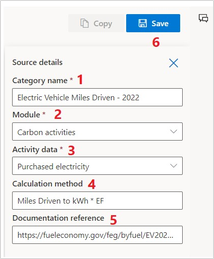

 3. Select the plus (+) icon to add a new action to the calculation model.
 
     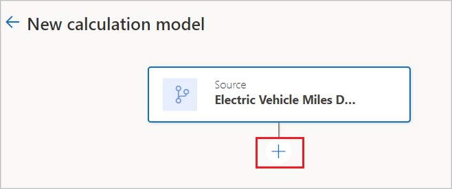

 4. Select Estimation factor on the list of Available actions.

    
 
 5. A new action is added to the calculation model. Select that action to edit it.

    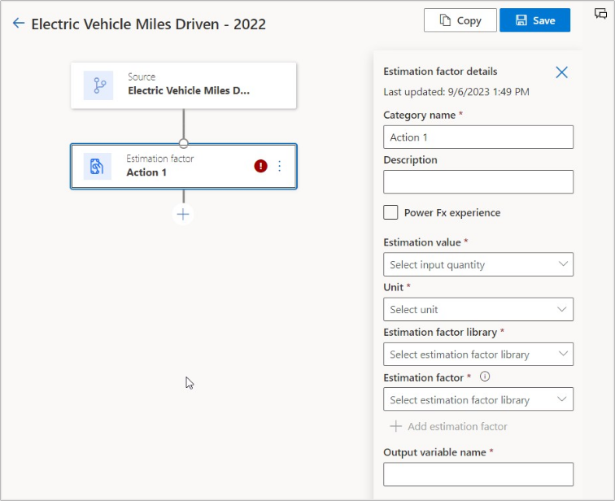

    You can use the Estimation factor action to create an estimated value for converting one unit type to another in a different unit group, such as converting night stays to 
    kilowatt-hours (kWh) used. This action is beneficial when it might be difficult to determine the exact amount of a given emission source that's used. In this exercise, the 
    action is used to convert miles driven by the fleet of electric vehicles to kWh used. This approach helps Wide World Importers estimate the carbon emissions for their fleet 
    of electric vehicles that are driving across the US and might be charging various amounts and on different grids and energy sources.

    The activity data quantity and quantity unit are converted to the same unit type as the estimation factor. In this exercise, the mile unit from the activity data is converted to 100-mile units.
   
    After the quantity has been converted, the converted value will be multiplied against the Factor quantity and stored in the output variable. The output variable is only accessible within the calculation model, available for use by actions further down the chain. The estimated value isn't stored in a table.

6. Populate the Estimation factor Details pane with the following data:

   Category name - Estimate kWh/100 Mile
   
   Estimation value - Quantity
   
   Unit - Quantity unit
   
   Estimation factor library - Electric Vehicle Estimation Library
   
   Estimation factor - Fabrikam Electric Truck - EPA Estimate
   
   Output variable name - kWhQuantity

 The fields and their values are defined as follows (numbers corresponding to numerals in the ensuing screenshot):

   The Category name identifies the action in the calculation model.
   
   The Estimation value identifies which field from the activity data type should be used to retrieve the value that's used in the estimation calculation.
    
  The Unit identifies the field from the activity data type that should be used to retrieve the unit type of the value. Alternatively, you can specify a unit to always be used 
  in the action, regardless of which unit is specified on the activity date type.

  The Estimation factor library identifies which factor library is used to identify the estimation factor.

  The Estimation factor identifies which estimation factor or factor mapping is used calculate the estimation. In this scenario, only one estimation factor has been created, so 
  it doesn't make sense to select a factor mapping currently.

  Use the Output variable name to name the output of the estimation factor calculation for use in actions further down the chain.

  You can select Save to save the record.

   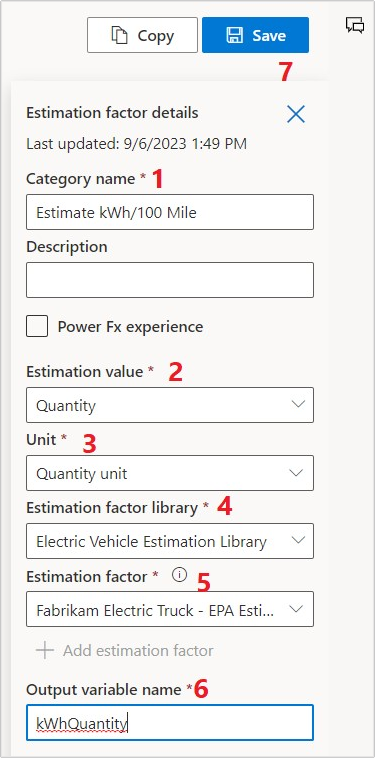

 7. Select the plus (+) icon to add a new action to the calculation model.

    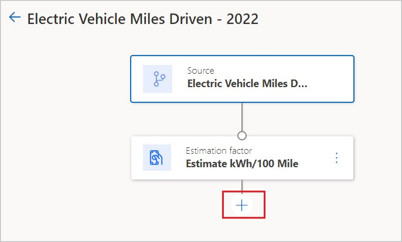

 
 8. Select Report on the Available actions list.

   

9. A new action is added to the calculation model. Select that action to edit it.

    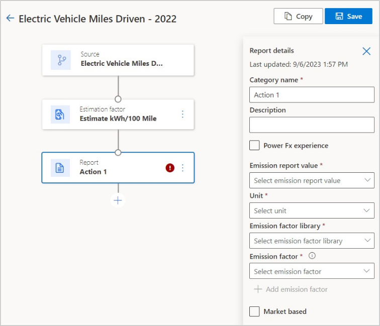

10. Populate the Report Details pane with the following data:

      Category name - kWh * EF
      
      Emission report value - kWhQuantity
      
      Unit - kWh
      
      Emission factor library - EPA 2022 - eGrid
      
      Emission factor - US Average

  The fields and their values are defined as follows (numbers corresponding to numerals in the ensuing screenshot):

     - The Category name identifies the action in the calculation model.
      
     - The Emission report value identifies which field should be used to retrieve the value that's used in the emission calculation. In this scenario, the Output variable from the Estimation factor action is used.

     - The Emission factor library identifies which factor library is used to identify the emission factor.

     - The Emission factor identifies which emission factor or factor mapping is used to calculate the emissions. In this scenario, Alex and Wide World Importers might not know which electric grid that a vehicle was charged on or the energy source, so Alex chooses the US Average emission factor to provide the estimated emissions.

     - You can select Save to save the record.

   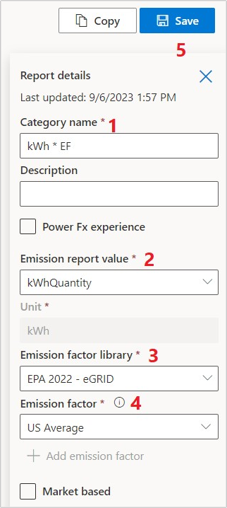

11. Select the back arrow on the record to return to the list of calculation models.

   The new calculation model should now appear in the list.

   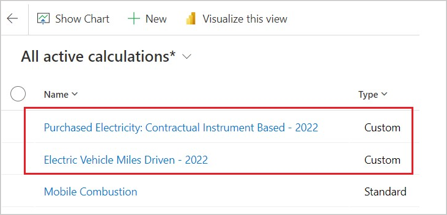

  You've now created a new calculation model. This calculation model includes an estimation factor, which allows you to calculate emissions in areas where you might not know 
  the exact quantity of an emission source but still need to account for the carbon emissions. Calculation models are the instruction sets that Microsoft Cloud for 
  Sustainability uses to calculate emissions. Several calculation models are included with Microsoft Cloud for Sustainability based on EPA calculations. Occasionally, these 
  included models might not match your unique customer needs, so you need to create new models to provide custom calculations. Make sure that you review the included models to 
  view other types of complex calculation models.

  
 ## Task 3 : Access/Permissions 

https://learn.microsoft.com/en-us/azure/carbon-optimization/permissions

