# Lab 3.2: Emission Calculations

## Lab Overview

In this exercise, you will learn about the steps to define the factor mappings for Purchased electricity, and an estimation factor library for estimating the amount of electricity purchased based on the Miles driven by Wide World Importers fleet of electric trucks. While electric vehicles do not have Scope 1, direct tailpipe emissions, they do have to be charged while transporting goods, in this case - across the USA. This charging of Electric trucks results in Scope 2 purchased electricity.

Wide World Importers may not know exactly how much electricity was purchased for charging the Electric Trucks, which grids the electricity came from, or what the energy source is. However, Wide World Importers can estimate the amount of electricity purchased by identifying how many kilowatt hours (kWh) are used per 100 miles, based on EPA vehicle efficiency data. 

## Lab Scenario

In the Emission calculations focus area calculation models are designed to calculate the emissions produced by the ingested activity data. The setup of the calculations breaks it down into two concepts: factor mappings and calculation models. Currently, Sustainability Manager has been verified with EPA default calculations and factor sets only. Additional factor sets will be available over time. Any factor set can easily be added or created by organizations based on their own business needs and regional requirements.

## Lab Objectives

- Exercise 1 - Set up Factor Libraries
   + Task 1 : Add eGRID factor mappings
   + Task 2: Create an estimation factor library
   + Task 3: Create an estimation factor
   + Task 4: Set up calculation models

- Exercise 2 - Run calculations
   + Task 1 : Create a purchased electricity calculation profile
   + Task 2 : Create an electric vehicle miles driven calculation profile
   + Task 3 : Run calculation profiles

- Exercise 3 : Create allocation profiles and run calculations

   + Task 1 : Create allocation methods
   + Task 2 : Create the allocation method details
   + Task 3 : Create an allocation profile

### Learning Objectives

The following terminologies will be used throughout the configuration of Emission Calculations:

-   **Estimation Factor**: Provides a way to convert from one unit type to another, such as night stays to kilowatt hour (kWh) used.
-   **Emission Factor**: Defines the amount of greenhouse gas emitted by a given unit type, this includes defining gas emissions such as CO2, CH4, and N2O.
-   **Factor Mapping**: Provides a way to map reference data to a specific emission factor, simplifying calculation models by allowing customers to choose a reference data type and allowing the system to find the appropriate emission factor.
-   **Factor Library**: A collection/grouping of emission or estimation factors and factor mappings, used by calculation models.
-   **Calculation Model**: Thought of as the instruction set used by the application to perform the emission calculations, utilizes factor libraries, factor mappings, and emission/estimation factors to perform the emission calculations.
-   **Calculation Profile**: Provides the scheduling for calculation jobs, defining activity data filter and the calculation model (instruction set) to use.
-   **Allocation Profile**: An allocation profile configures methods to distribute emissions from a source (like a facility) to specific entities based on chosen parameters. It allows visualization of emissions distribution without altering default reporting, offering insights into how emissions are divided.
-   **Custom dimensions**: Custom dimensions can be used in emission calculation models, for example, in condition, calculation, and reporting actions.

## Exercise 1 -  Set up Factor Libraries

In this exercise, you will learn about the steps that takes to define the factor mappings for Purchased electricity, and an estimation factor library for estimating the amount of electricity purchased based on the Miles driven by Wide World Importers fleet of electric trucks. While electric vehicles do not have Scope 1, direct tailpipe emissions, they do have to be charged while transporting goods, in this case - across the USA. This charging of Electric trucks results in Scope 2 purchased electricity.

### Task 1 : Add eGRID factor mappings

In this task, we will create factor mappings to link contractual instrument types for Wide World Importers with their corresponding electric grid emission factors. This ensures Microsoft Sustainability Manager accurately identifies the appropriate electric grid for each contractual instrument type. This approach can be extended to map other reference data to specific emission factors, streamlining calculation models.

1. In the left navigation pane, select **Calculations (1)**, then **Factor libraries (2)**. Next, select the **EPA 2022 - eGRID (3)** factor library to open it.

     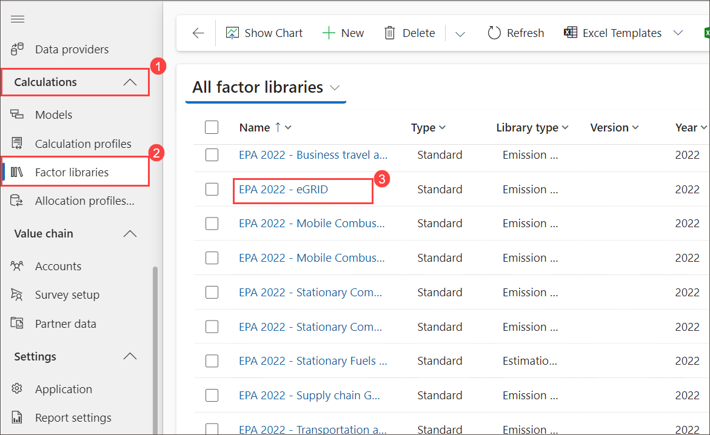

1. Explore the EPA 2022 - eGRID factor library. The General tab includes the following identifying information about the factor library:

   - Name - Identifies the factor library in the list.
      
   - Description - Provides more information about the factor library.
      
   - Documentation reference - Identifies the documentation that's used to generate the factor library.
      
   - Type of factor library - Identifies if this factor library type is Custom, Demo (sample), or Standard (preloaded based on EPA libraries). For more information, see Emission 
       factors.
      
   - Library type - This functionally switches the library type between Emission or Estimation library. Emission libraries calculate emission gases. Estimation libraries create 
       estimated conversions from one unit type to another, such as night stays at a hotel to kWh used.   
     
      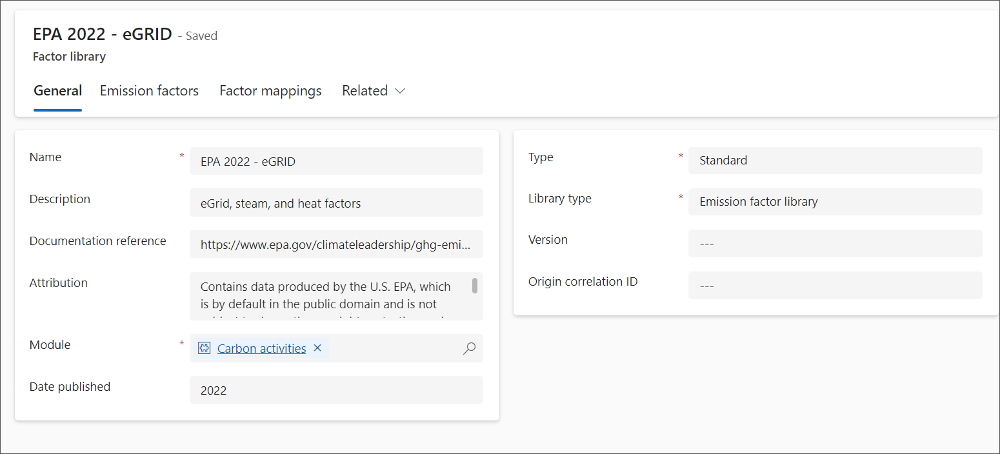

1. Select the **Emission factors** tab to view a list of emission factors in the factor library.

1. The Emission factors list displays the name of the emission factor, the unit type, sub type, documentation reference, and gases generated. Because Wide World Importers is a Florida-based business and is connected to the FRCC electrical grid, select **FRCC (FRCC All)** from the list of emission factors.

    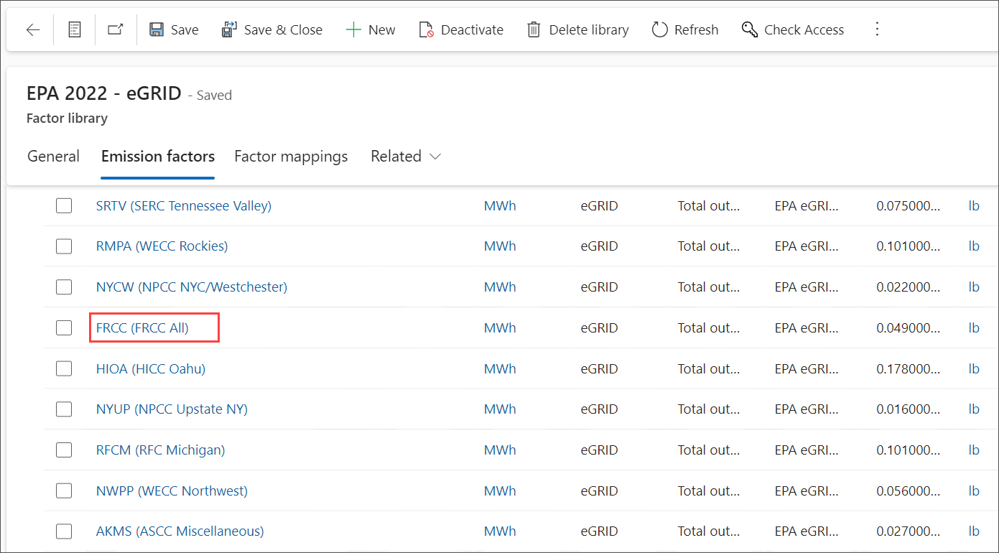

    - The FRCC (FRCC All) emission factor shows the carbon emissions that have been produced, 861 lb of CO2, 0.055 lb of CH4, and 0.007 lb of N2O, for each megawatt-hour (MWh) of energy consumed.

    - This information is important to understand how the final CO2E (carbon dioxide equivalent) will be calculated later. When creating a new emission factor, you'll want to define how much of each gas is produced for a given unit. Several other gas types can be tracked, as shown on the screen, depending on the scenario. Some or all gas types might be used.

      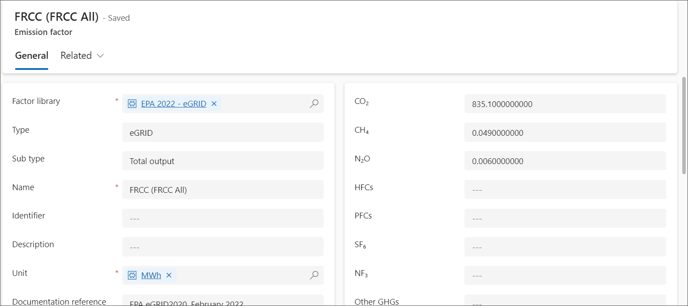

1. Click the back arrow to navigate to **EPA 2022 - eGRID**, then select the **Factors mapping** tab.

    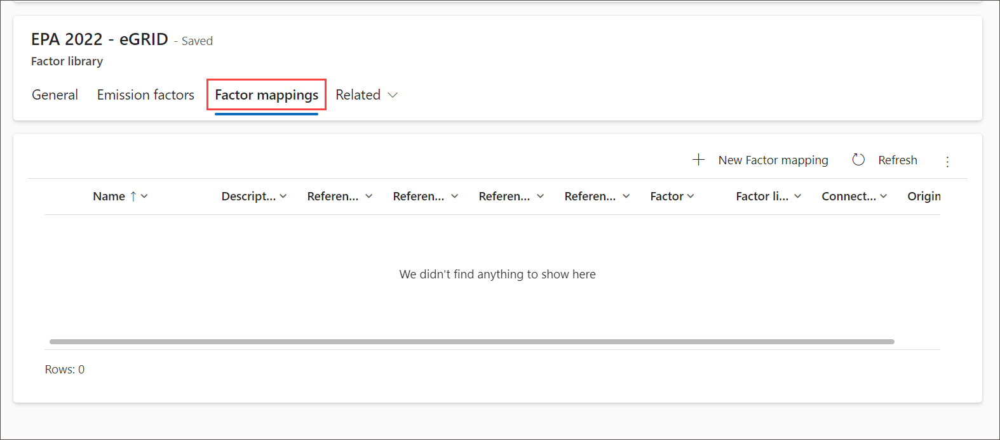

1. Create factor mappings for the two contractual instrument types that were created in previous exercise and then associate them with the FRCC (FRCC All) emission factor. Each contractual instrument is a local power provider in Florida, and they're part of the FRCC electric grid. Select **+ New Factor mapping**.

     

1. Use the following information to populate the fields on the New Factor mapping screen and select the **Save & Close** button to save the record.

     - Name - FRCC - Purchased Electricity - VanArsdel Ltd
      
     - Reference data - VanArsdel Ltd

     - Factor library EPA 2022 - eGRID
      
     - Factor - FRCC (FRCC All)

       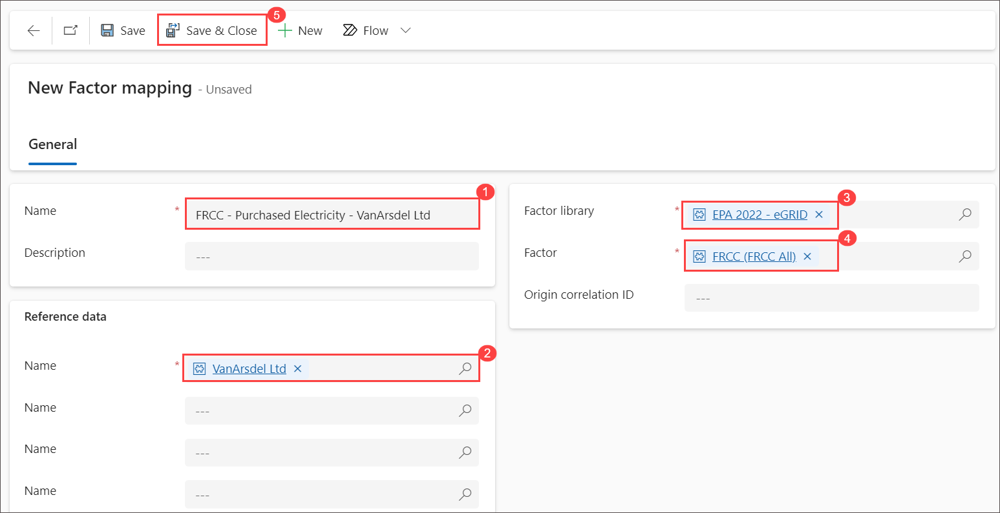
      
1. Select **+ New Factor mapping**.

      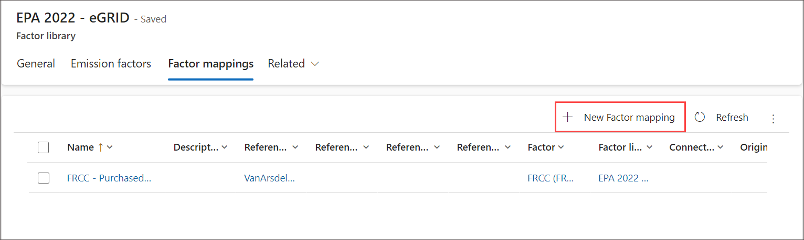

1. Use the following information to populate the fields on the New Factor mapping screen and select the **Save & Close** button to save the record.

      - Name - FRCC - Purchased Electricity - Adatum Corp

      - Factor library EPA 2022 - eGRID

      - Reference data - Adatum Corp
         
      - Factor - FRCC (FRCC All)

        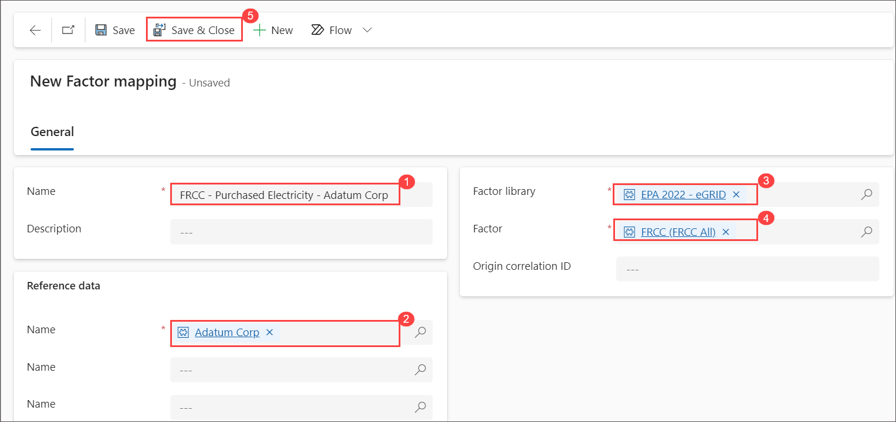

1. Now, you have two additional factor mappings, one for each contractual instrument that was added in previous step.

    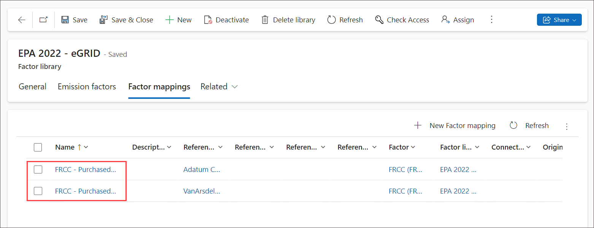

   You've completed adding the factor mappings for your purchased electricity activity data. This step is important toward the creation of calculation models that will calculate emissions for multiple emission factors based on reference data, such as contractual instrument types or facilities.

   By creating these factor mappings, you can choose contractual instrument types as emission factors during your calculation model creation. This information tells Microsoft Sustainability Manager to map the contractual instrument type on an activity data record to the emission factor that's listed in the factor mapping. Now, you can create more dynamic calculations rather than calculations that are specific to a given emission factor.

## Task 2: Create an estimation factor library

In this task, Alex will create an estimation factor library to define the estimation factor for estimating the kilowatt-hours (kWh) that are used for each mile driven. While electric vehicles don't have Scope 1, direct tailpipe emissions, they do need to be charged while transporting goods across the US, resulting in Scope 2 purchased electricity. Wide World Importers don't know the exact amount of electricity purchased, what grid the electricity came from, or the energy source; however, they can estimate the amount of purchased electricity by identifying the number of kilowatt-hours (kWh) that are used every 100 miles based on EPA vehicle efficiency.

1. Go to Factor libraries on the left navigation pane and select **+ New** to create a new library.

     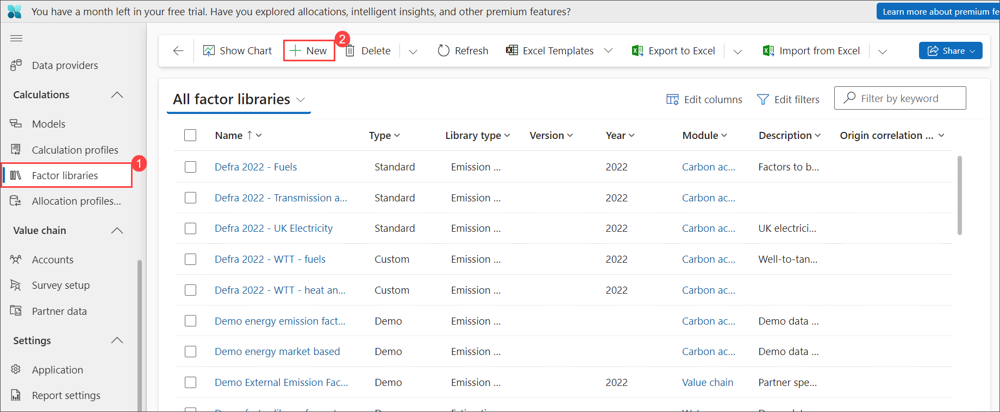

1. Use the following information to populate the fields on the New Factor library page and select **Save & Close** to save the record.

     - Name - Electric Vehicle Estimation Library
   
     - Description - Scope 2 Emissions from Electric Vehicles
   
     - Documentation reference - https://fueleconomy.gov/feg/byfuel/EV2022.shtml

     - Module - Select Carbon activities

     - Type - Custom
   
     - Library Type - Estimation factor library

       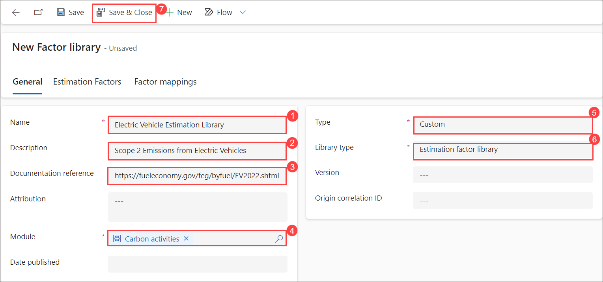
   
1. The fields and their values are defined as follows (numbers corresponding to numerals in the ensuing screenshot):
   
    - The Name of the factor library identifies the factor library in the list.
   
    - The Description of the factor library provides more information about the factor library for others.
   
    - The Module is the data type that should appear in the Activity data.
   
    - The Documentation reference for the factor library identifies the documentation that's used to generate the factor library.
   
    - The Type of factor library identifies if it's a Custom, Demo (sample), or Standard (preloaded based on EPA libraries) type. For more information, see Emission factors.
   
    - The Library Type of the factor library switches the library type between Emission or Estimation library. Emission libraries calculate emission gases. Estimation libraries create estimated conversions from one unit type to another, such as 100 miles driven to kWh.
      
## Task 3: Create an estimation factor

In this task, Alex will create the estimation factor for estimating the kilowatt-hours (kWh) that are used for every mile driven. The EPA estimates electric vehicle efficiency in kilowatt-hours (kWh) for every 100 miles. Alex will use this same metric in the estimation factor to ensure that the estimation factor is consistent with the EPA.

1. Scroll down on the Factor library view and select Electric Vehicle Estimation Library (it will be near the bottom of your page) under Estimation factors.

    

1. Select the Estimation Factors tab then click on  **+ New Estimation factor**.

    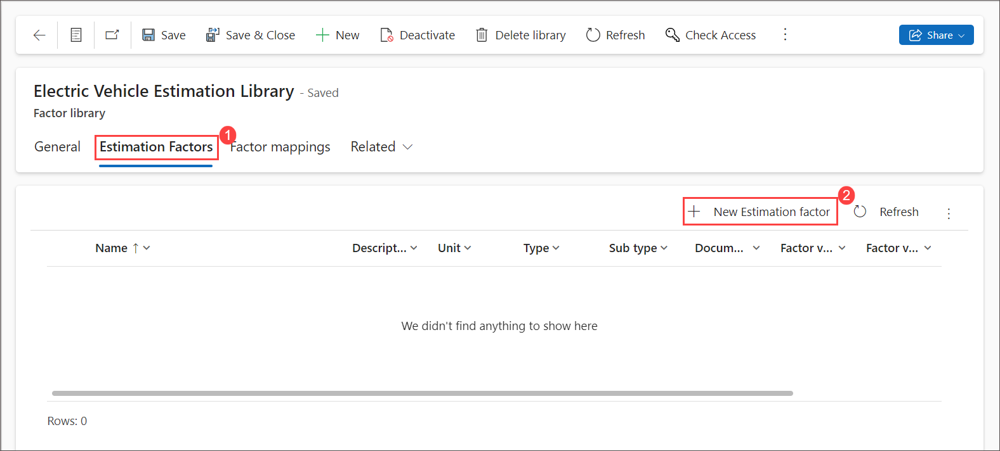

1. Review the Fabrikam Electric truck details on the EPA website and then enter the following information on the New Estimation factor screen and select Save & Close to save the record.

     - Name - Fabrikam Electric Truck - EPA Estimate
      
     - Documentation reference - https://fueleconomy.gov/feg/noframes/45318.shtml
      
     - Factor Library - Electric Vehicle Estimation Library
      
     - Unit - 100 Mile
      
     - Factor value - 49.00
      
     - Factor value unit - kWh

       

1. The fields and their values are defined as follows (numbers corresponding to numerals in the ensuing screenshot):

      - The Name identifies the emission factor in the list.
      
      - The Documentation reference identifies the documentation that's used to generate the estimation factor.
      
      - The Factor library links the estimation factor to the factor library. This value will default if you select New Estimation factor while you're in a factor library.
      
      - The Unit identifies what unit will be converted.
      
      - The Factor value determines the amount to be estimated according to the Factor value unit.
      
      - The Factor value unit specifies the unit type to be converted to.
      
1. The new emission factor is estimating that every 100 miles is equivalent to 49 kWh.

     

   >**Note**: You've now created an estimation factor. Estimation factors are important to be able to convert from one unit type to another when an estimate is appropriate, such as estimated fuel or battery economy of vehicles or when estimating gas and electric usage during hotel stays.

## Task 4: Set up calculation models
  
In this exercise, you learn about the steps that Alex takes to define calculation models that Microsoft Sustainability Manager uses to calculate emissions. Calculation models are the instruction sets, or recipes, that define the steps and values to use during the emission calculations. Microsoft Sustainability Manager provides several calculation models.

Take the opportunity to review some prebuilt models. They're excellent sources of information when you're creating new calculation models. You can also use calculation models as a template for new models. This exercise and the next discuss the algorithm that's used to calculate emissions. For more information, see Overview of Calculation models. 
 
### Task 4.1: Create a purchased electricity model
 
1. Select Calculations > Models on the left navigation pane. Select + New to create a new calculation model.

    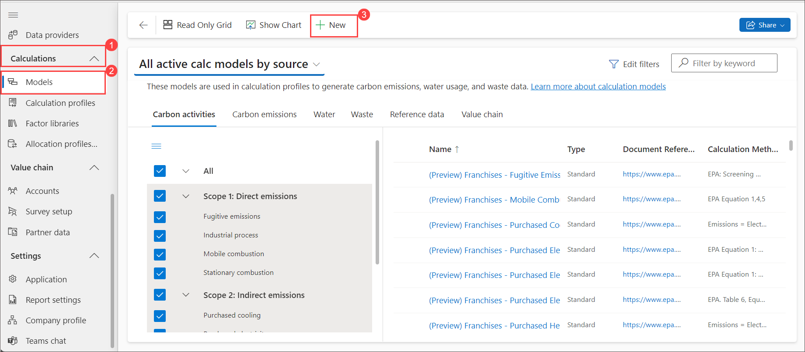

1. A new page opens, where you can set up the new calculation model. A Source action is added by default.

1. Populate the Source Details pane with the following data and select Save to save the record.

    - Category name - Purchased Electricity: Contractual Instrument Based - 2022
   
    - Module - Carbon Activities
   
    - Activity data - Purchased electricity
   
    - Calculation method - EPA Equation 1: Electricity (MWh) * EF
   
    - Documentation reference - https://www.epa.gov/sites/default/files/2020-12/documents/electricityemissions.pdf

      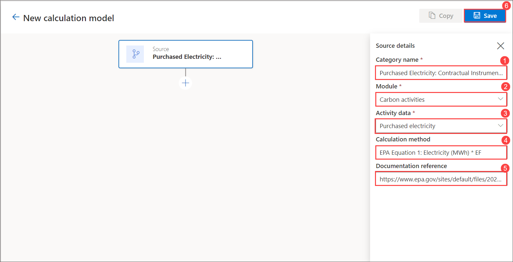

1. The fields and their values are defined as follows (numbers corresponding to numerals in the ensuing screenshot):

      - The Category name identifies the calculation model in the list.
      
      - The Module is used to identify which data types should appear in the Activity data field.
      
      - The Activity data identifies which type of activity data that the model processes.
      
      - Use the Calculation method to roughly estimate what the calculation does.
      
      - The Documentation reference identifies the documentation that's used to create the calculation model.
      
1. Select the plus (+) icon to add a new action to the calculation model.

    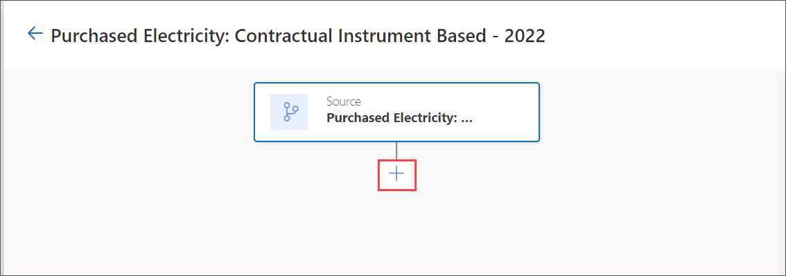

1. Select Report on the Available actions screen.   

   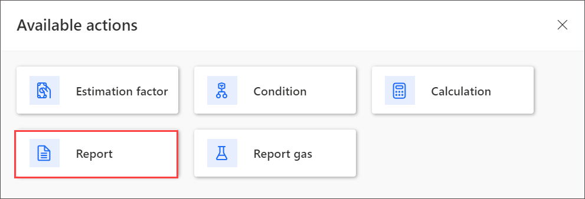
 
1. A new Report action is added to the calculation model. Select that action to edit it.

   - You can use the Report action to calculate and report carbon emissions to the emissions table. This action uses the emission factor or factor mapping to identify the emission factor to be used based on the Emission factor dropdown list. In this exercise, the action uses a contractual instrument type field to identify the factor mapping and emission factor to use in the calculation.

   - After you've determined the emission factor for the activity data line, the activity data quantity and quantity unit will be converted to the same unit type as the emission factor. In this exercise, the kilowatt-hours (kWh) from the activity data are converted to megawatt-hours (MWh).

   - After the quantity has been converted, the converted value will be multiplied against each gas that's listed in the emission factor, determining the volume of gases produced.

   - To determine the CO2E (carbon dioxide equivalency), the gases produced are multiplied against their Global Warming Potential (GWP) factor, which is stored in the Greenhouse Gases Dataverse table and are added together.

   - The Report action stores the gases produced values, CO2E value, and other identifying information about the activity data row in the emissions table.

1. Populate the Report action with the following data and select Save to save the record.

     - Category name - Electricity * EF (Contractual Instrument Type)
      
     - Description - EPA Equation 1: Electricity (MWh) * EF
      
     - Emission report value - Quantity
      
     - Unit - Quantity unit
      
     - Emission factor library - EPA 2022 - eGRID
      
     - Emission factor - FRCC (FRCC All)

       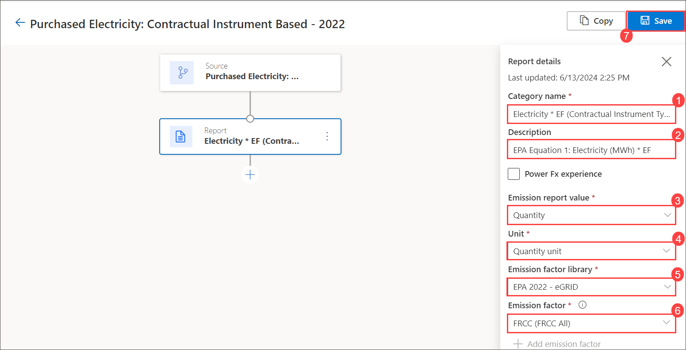

1. The fields and their values are defined as follows (numbers corresponding to numerals in the ensuing screenshot):

    - The Category name identifies the action in the calculation model.
      
    - Use the Description to roughly note what the calculation does.
      
    - The Emission report value identifies which field from the activity data type should be used to retrieve the value that's used in the emission calculation.
      
    - The Unit identifies the field from the activity data type to be used to retrieve the unit type of the value. Alternatively, you can specify a unit to always be used in the action, regardless of which unit is specified on the activity date type.
      
    - The Emission factor library identifies which factor library is used to identify the emission factor.
      
    - The Emission factor identifies which emission factor or factor mapping to use to calculate the emissions. Choosing a factor mapping allows multiple reference data values to map to an emission factor, allowing for a calculation model to not be bound to a single emission factor.
      
8. Select the back arrow on the record to return to the list of calculation models.

    The new calculation model should appear in the list. 
 
    Now, you've created a new calculation model. In this calculation model you've used factor mappings, an important differentiator for Microsoft Cloud for Sustainability. 
    Factor mappings allow the calculation models to be more dynamic by mapping reference data to emission factors, allowing you to have one model that can calculate multiple 
    emission factors. Calculation models are the instruction sets that Microsoft Cloud for Sustainability uses to calculate emissions. Several calculation models are included 
    with Microsoft Cloud for Sustainability based on EPA calculations. Occasionally, these included models might not match your unique customer needs, so you need to create new 
    models to provide custom calculations. Make sure that you review the included models to view other types of complex calculation models.

### Task 4.2: Create an electric vehicle miles driven model

In this task, we will creates a new calculation model to calculate carbon emissions for miles driven by electric vehicles. This exercise uses the estimation factor library that was created in the previous exercise to estimate the kilowatt-hours (kWh) that are used by an electric vehicle and then calculate the carbon emissions for that electricity based on the US Average emission factor.

1. Select **+ New** again to create another new calculation model. A new page opens, where you can set up the calculation model. A Source action is added by default.

1. Populate the Source Details pane with the following data and select Save to save the record.
      
      - Category name - Electric Vehicle Miles Driven - 2022
      
      - Module - Carbon Activities
      
      - Activity data - Purchased electricity
      
      - Calculation method - Miles Driven to kWh * EF
      
      - Documentation reference - https://fueleconomy.gov/feg/byfuel/EV2022.shtml

        

1. The fields and their values are defined as follows (numbers corresponding to numerals in the ensuing screenshot):

    - The Category name identifies the calculation model in the list.
   
    - The Module is used to identify which data types should appear in the Activity data field.
   
    - The Activity data identifies which type of activity data that the model processes.
   
    - Use the Calculation method to roughly note what the calculation is doing.
   
    - The Documentation reference identifies the documentation that's used to create the calculation model.
   
 1. Select the plus (+) icon to add a new action to the calculation model.
 
     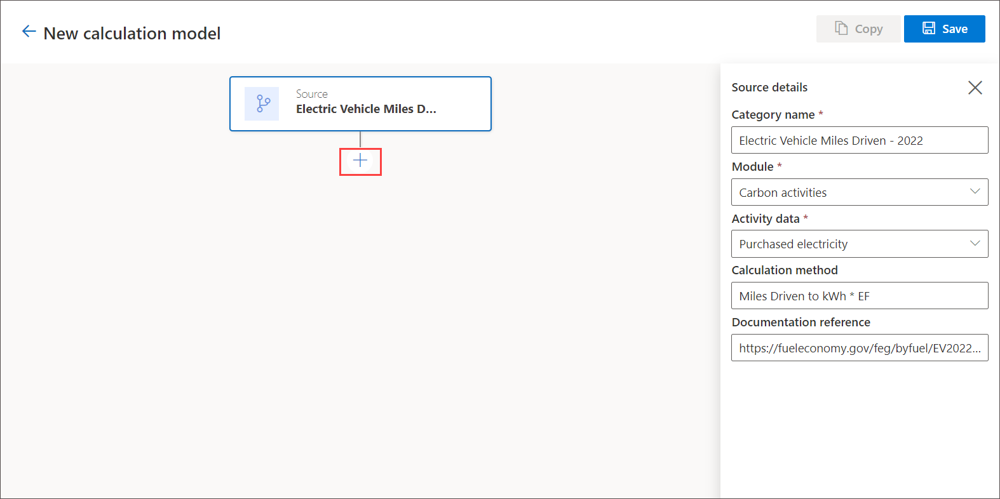

 1. Select Estimation factor on the list of Available actions.

    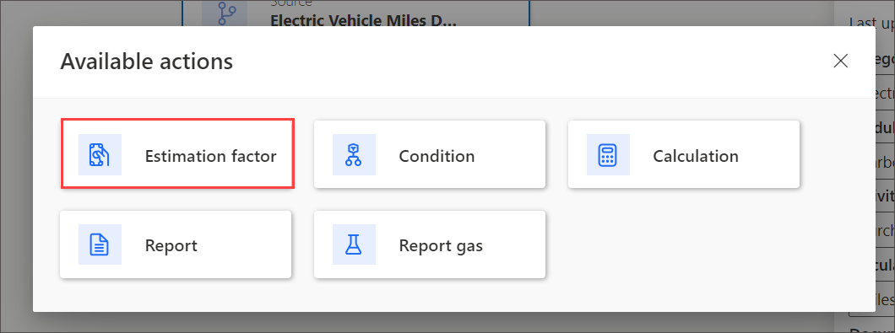

 1. A new action is added to the calculation model.

    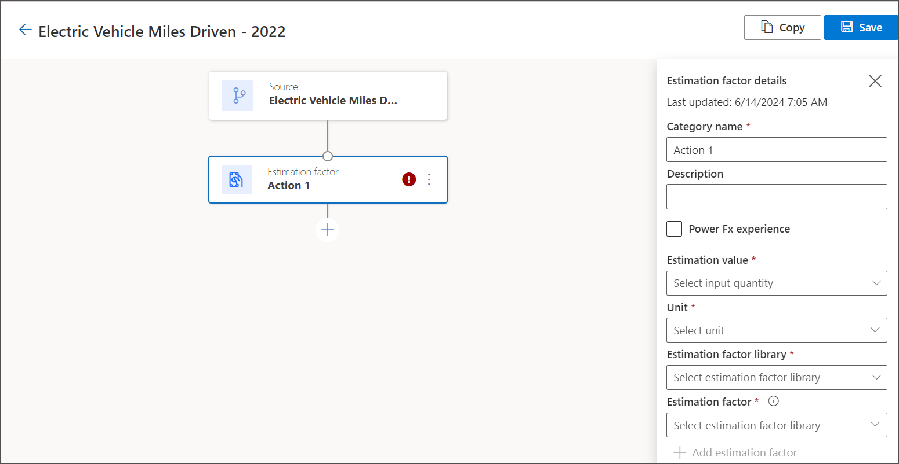

     - You can use the Estimation factor action to create an estimated value for converting one unit type to another in a different unit group, such as converting night stays to 
    kilowatt-hours (kWh) used. This action is beneficial when it might be difficult to determine the exact amount of a given emission source that's used. In this exercise, the 
    action is used to convert miles driven by the fleet of electric vehicles to kWh used. This approach helps Wide World Importers estimate the carbon emissions for their fleet 
    of electric vehicles that are driving across the US and might be charging various amounts and on different grids and energy sources.

     - The activity data quantity and quantity unit are converted to the same unit type as the estimation factor. In this exercise, the mile unit from the activity data is converted to 100-mile units.
   
     - After the quantity has been converted, the converted value will be multiplied against the Factor quantity and stored in the output variable. The output variable is only accessible within the calculation model, available for use by actions further down the chain. The estimated value isn't stored in a table.

1. Populate the Estimation factor Details pane with the following data and select **Save** to save the record.

    - Category name - Estimate kWh/100 Mile
   
    - Estimation value - Quantity
   
    - Unit - Quantity unit
   
    - Estimation factor library - Electric Vehicle Estimation Library
   
    - Estimation factor - Fabrikam Electric Truck - EPA Estimate
   
    - Output variable name - kWhQuantity

      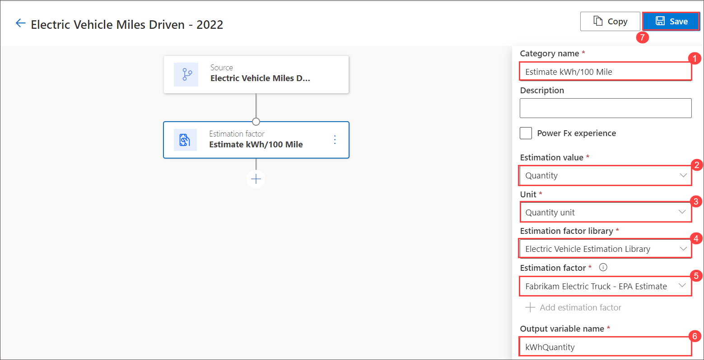

1. The fields and their values are defined as follows (numbers corresponding to numerals in the ensuing screenshot):

   - The Category name identifies the action in the calculation model.
   
   - The Estimation value identifies which field from the activity data type should be used to retrieve the value that's used in the estimation calculation.
    
   - The Unit identifies the field from the activity data type that should be used to retrieve the unit type of the value. Alternatively, you can specify a unit to always be used 
  in the action, regardless of which unit is specified on the activity date type.

   - The Estimation factor library identifies which factor library is used to identify the estimation factor.

   - The Estimation factor identifies which estimation factor or factor mapping is used calculate the estimation. In this scenario, only one estimation factor has been created, so 
  it doesn't make sense to select a factor mapping currently.

   - Use the Output variable name to name the output of the estimation factor calculation for use in actions further down the chain.

  
1. Select the plus (+) icon to add a new action to the calculation model.

     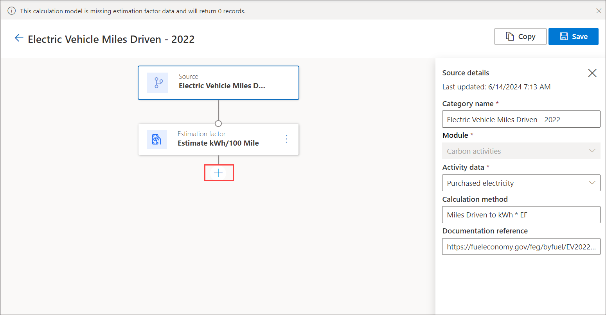

1. Select Report on the Available actions list.

    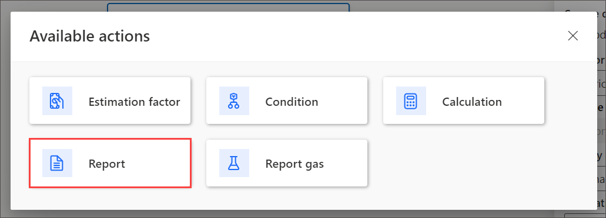

1. A new action is added to the calculation model. Select that action to edit it.

    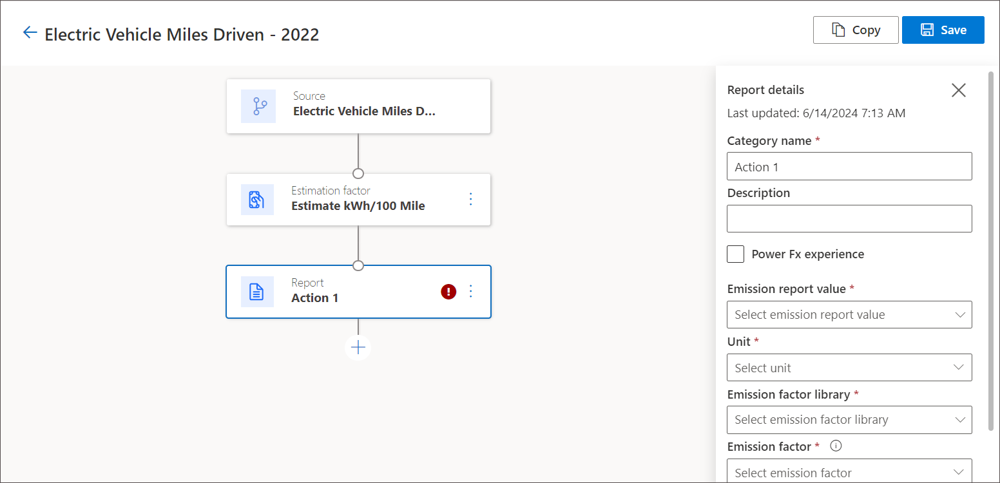

1. Populate the Report Details pane with the following data and select Save to save the record.

      - Category name - kWh * EF
      
      - Emission report value - kWhQuantity
      
      - Unit - kWh
      
      - Emission factor library - EPA 2022 - eGrid
      
      - Emission factor - US Average

     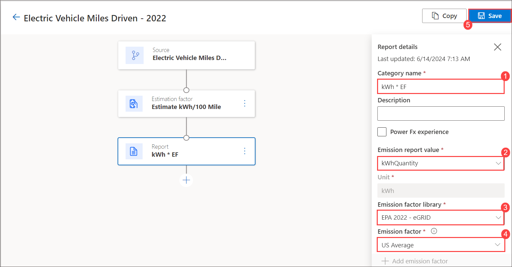
    
1. The fields and their values are defined as follows (numbers corresponding to numerals in the ensuing screenshot):

     - The Category name identifies the action in the calculation model.
      
     - The Emission report value identifies which field should be used to retrieve the value that's used in the emission calculation. In this scenario, the Output variable from the Estimation factor action is used.

     - The Emission factor library identifies which factor library is used to identify the emission factor.

     - The Emission factor identifies which emission factor or factor mapping is used to calculate the emissions. In this scenario, Alex and Wide World Importers might not know which electric grid that a vehicle was charged on or the energy source, so Alex chooses the US Average emission factor to provide the estimated emissions.

11. Select the back arrow on the record to return to the list of calculation models.

   The new calculation model should now appear in the list.

   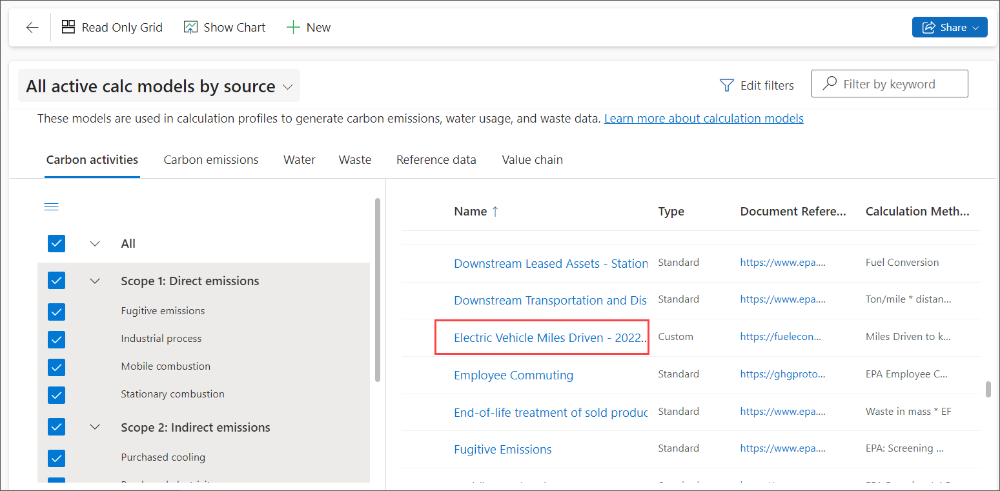

  You've now created a new calculation model. This calculation model includes an estimation factor, which allows you to calculate emissions in areas where you might not know 
  the exact quantity of an emission source but still need to account for the carbon emissions. Calculation models are the instruction sets that Microsoft Cloud for 
  Sustainability uses to calculate emissions. Several calculation models are included with Microsoft Cloud for Sustainability based on EPA calculations. Occasionally, these 
  included models might not match your unique customer needs, so you need to create new models to provide custom calculations. Make sure that you review the included models to 
  view other types of complex calculation models.

## Exercise 2  - Run calculations

In this exercise, you learn about the steps that Alex takes to define and run calculation profiles. Microsoft Sustainability Manager uses calculation profiles to define the parameters and scheduling of calculation jobs. Calculation profiles allow an organization to define what activity data to calculate emissions for, the filters on that data, which calculation model to use, and if the calculation should be redone whenever the chosen activity data changes. Calculation profiles use the parameters to create calculation jobs. These calculation jobs are the background worker jobs that iterate over an organization's activity data. The calculations determine the carbon emissions based on the calculation model that's defined in the calculation profile. 

## Task 1 : Create a purchased electricity calculation profile
In this task, Alex creates a calculation profile for the electricity that Wide World Importers purchased for their facilities in 2022. Alex uses the calculation model that was previously defined in this exercise. Alex filters the profile to only activity data for the Wide World Importers organizational unit and where the unit type is kilowatt-hours (kWh). These filters ensure that only the purchased electricity for Wide World Importers is included in the calculation job. This task excludes the miles driven by the fleet of electric vehicles, which is covered in the next task.

1. Go to Calculation profiles on the left navigation pane. Select + New to create a new calculation profile

     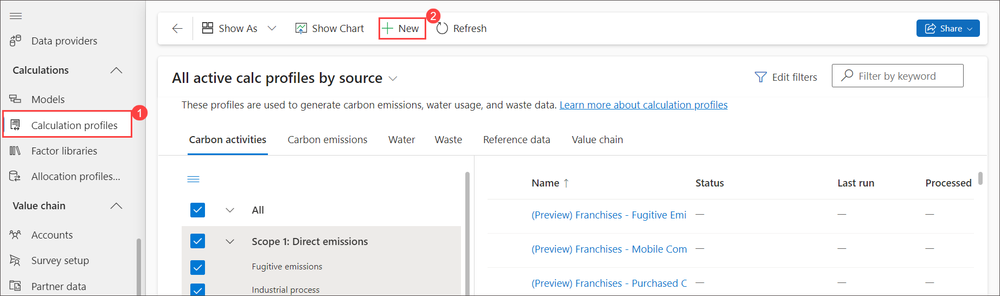

1. Populate the following information on the New calculation profile wizard.

     - Calculation profile name - **Purchased Electricity: Contractual Instrument Based 2022 Wide World Importers**
      
     - Module - Select **Carbon activities**
      
     - Emissions source - **Purchased electricity**
      
     - Activity data to include in calculation - Select **Add** > **Add row** and select **Organizational Unit** equals **Wide World Importers** then  select **Add** > **Add row** and **Quantity unit** equals **kWh**
      
     - Calculation model - Select **Purchased Electricity: Contractual Instrument Based - 2022** from the dropdown list
      
     - Schedule - Select the **Automatically run this calculation when data is refreshed** checkbox

     - Select **Next**.

       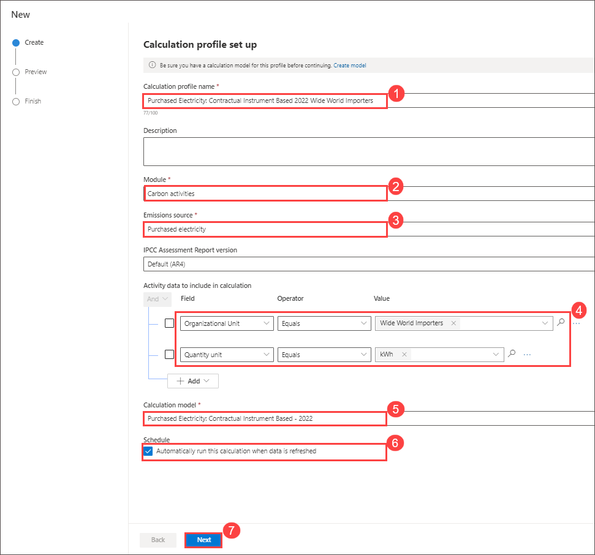

1. The fields and their values are defined as follows (numbers corresponding to numerals in the ensuing screenshot):
      
     - The Calculation profile identifies the calculation profile in the list.
      
     - The Module is used to identify which data types should appear in the Activity data field.
      
     - The Emissions source identifies which activity data type should be used in the calculation.
      
     - Use Activity data to include in calculation to filter activity data to a specific subset of the activity data type.
      
     - The Calculation model identifies which calculation model should be used for the calculation. Be sure to choose the calculation model from the dropdown list.
      
     - Use the Automatically run this calculation when data is refreshed filter to automatically trigger calculations when the matching activity data is refreshed.
      
1. On the Preview page of the New calculation profile wizard, the emissions are calculated for the first row of data that matches the Activity data to include filter. In this scenario, 
   the values that are shown in the preview might differ from the following image. Select Save to save your calculation profile.

     .png)

   These values were determined by converting the consumed kilowatt-hours (kWh) to megawatt-hours (MWh): 3519.038/1000 = 3.519038 MWh

1. Select Done.

   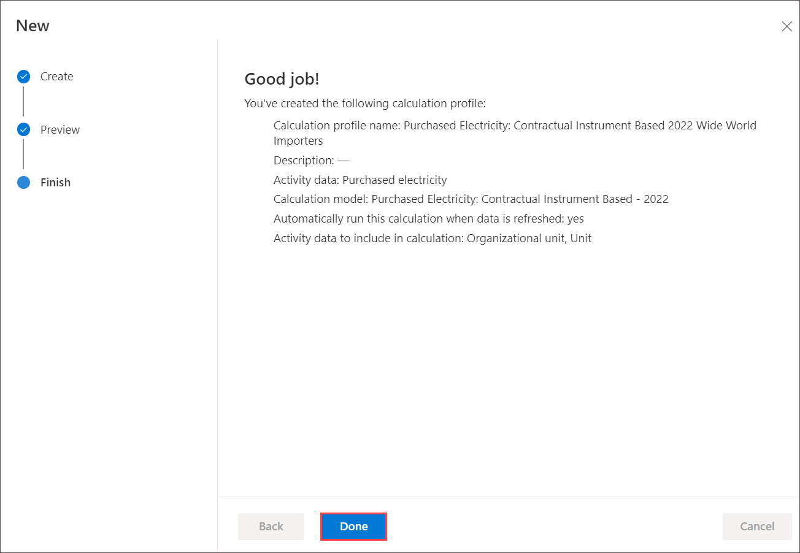

## Task 2 : Create an electric vehicle miles driven calculation profile

In this task, Alex creates a calculation profile for the miles driven by Wide World Importers' fleet of electric vehicles for 2022. Alex uses the calculation model that was previously defined in this exercise. Additionally, Alex filters the profile to only activity data for the Wide World Importers organizational unit and where the unit type is mile. These filters ensure that only the miles driven for Wide World Importers' fleet of electric vehicles are included in the calculation job. This task excludes the purchased electricity, which was covered in the previous task.

1. Select + New Calculation profile to create a new calculation profile.

   

1. Populate the following information on the New calculation profile wizard.

     - Calculation profile name - **Electric Vehicle Miles Driven 2022**

     - Module - **Carbon activities**

     - Emissions source - **Purchased electricity**

     - Activity data to include in calculation - Select **Add** > **Add row** and select **Organizational Unit** equals** Wide World Importers** and select **Add** > **Add row** **Quantity unit** equals **mile**.

     - Calculation model - Select **Electric Vehicle Miles Driven - 2022** from the dropdown list

     - Schedule - Select the **Automatically run this calculation when data is refreshed** checkbox

        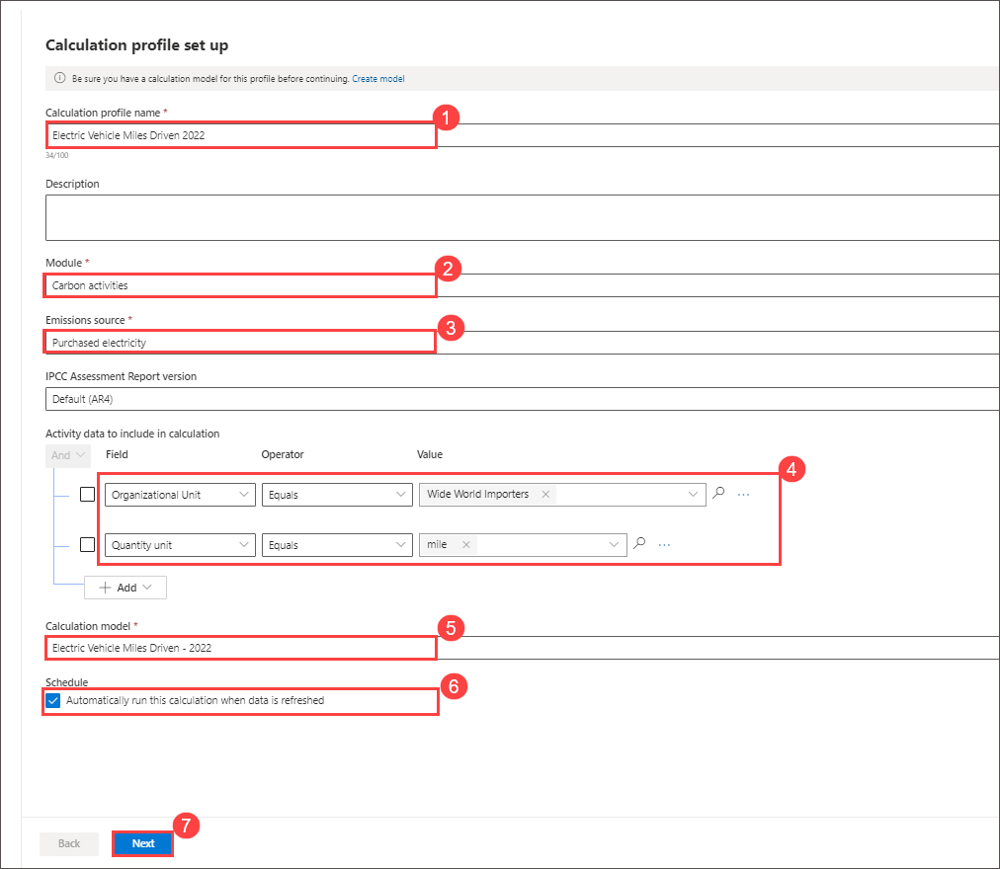
       
1. The fields and their values are defined as follows (numbers corresponding to numerals in the ensuing screenshot):

      The Calculation profile name identifies the calculation profile in the list.
      
      The Module is used to identify which data types should appear in the Activity data field.
      
      The Emissions source identifies which activity data type should be used in the calculation.
      
      Use Activity data to include in calculation to filter activity data to a specific subset of the activity data type.
      
      The Calculation model identifies which calculation model should be used for the calculation. Be sure to choose the calculation model from the dropdown list.
      
      Use Automatically run this calculation when data is refreshed to automatically trigger calculations when the matching activity data is refreshed.
      
      The form should resemble the following image. Select Next.

1. The Preview page of the New calculation profile wizard shows the emissions that were calculated for the first row of data that matches your Activity data to include filter. In this scenario, the values that are shown in the preview might differ from the following image and select Save to save your calculation profile.

     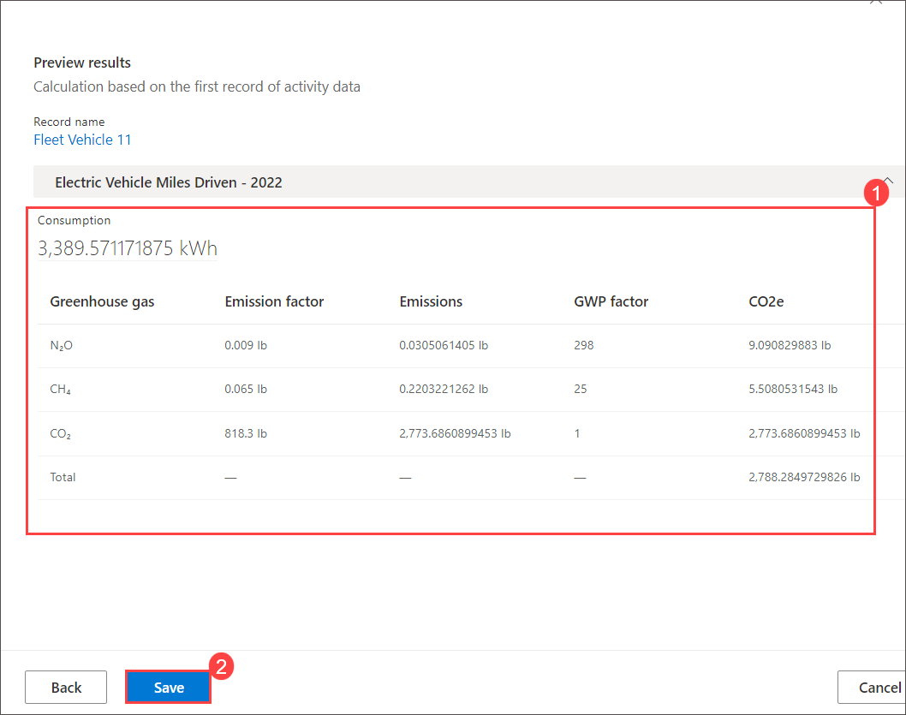

    These values were determined by converting the miles driven to kWh: (7484.724 / 100) * 49 = 3667.515 kWh
    
    The consumed kWh converted to MWh: 3667.515/1000 = 3.667515 MWh
    
5. Select Done.

   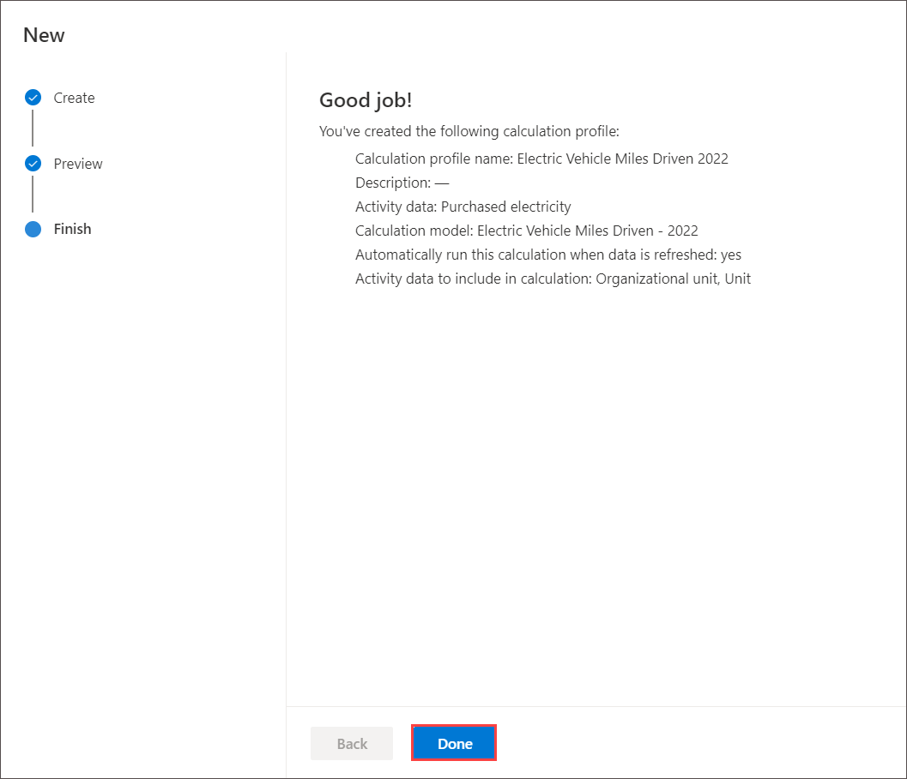

## Task 3 : Run calculation profiles
 
In this task, Alex runs the newly created calculation profiles for the electricity that Wide World Importers purchased and for miles that Wide World Importers' fleet of electric vehicles drove. This task creates a calculation job that iterates over each activity data row that matches the calculation profile filter criteria. Additionally, it uses the calculation models that you created previously in this exercise to calculate the carbon emissions for each row. The results are placed in the emissions table, which Alex will review after the calculations are complete.

1. To run the calculation profile for Purchased Electricity: Contractual Instrument Type 2022, complete the following steps:

    - Select Purchased Electricity: Contractual Instrument Type 2022 in the list.

    - Select Run calculation on the command bar.

       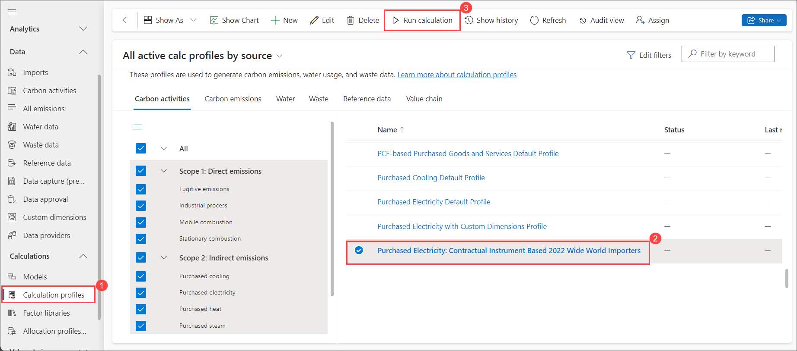
      
1. To run the calculation profile for Electric Vehicle Miles Driven 2022, follow these steps:

    - Select Electric Vehicle Miles Driven 2022 in the list.

    - Select Run calculation on the command bar.

      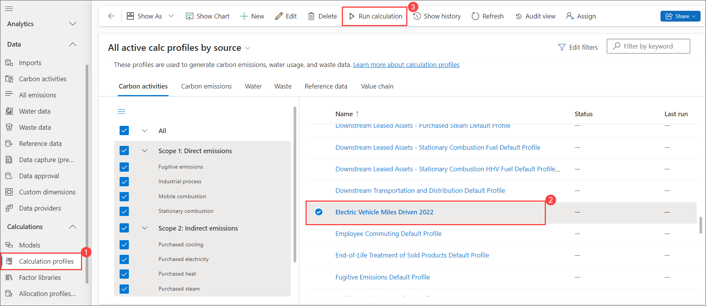
   
1. After several minutes (approximately six minutes), both calculation jobs should be completed. Select the Refresh button on the command bar to check the status of the calculation jobs. The two calculation profiles should now have a Status of Succeeded.

    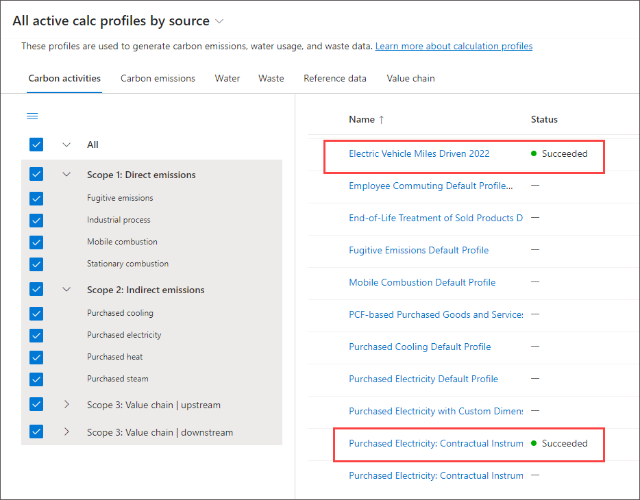

1. Go to All emissions on the left side of the page under **Data** section.

1. The All emissions view shows all emissions that have been calculated or directly imported.

1. Select Filter icon click on  **Add** > **Add row** >  **Organizational Unit** equal **Wide World Importers**. Select Apply.

    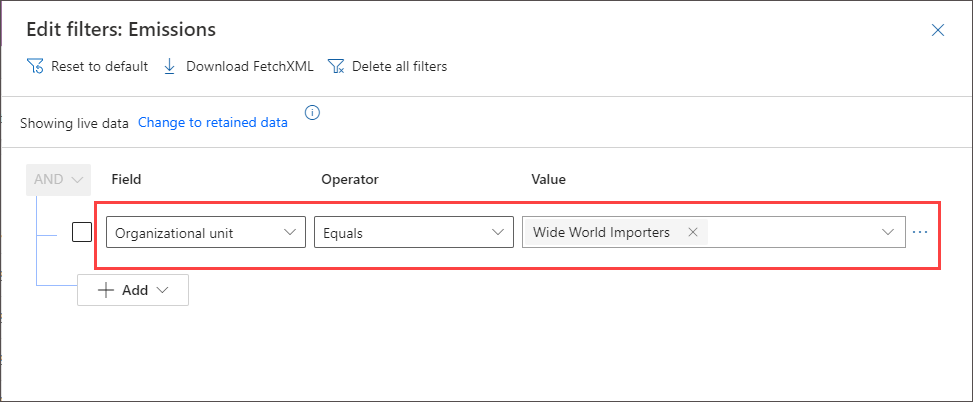

1. After a few moments, the view refreshes. The calculated emissions data for each activity data record that was imported in previous exercises is shown. Scroll to the right to view the CO2E carbon emission values.

    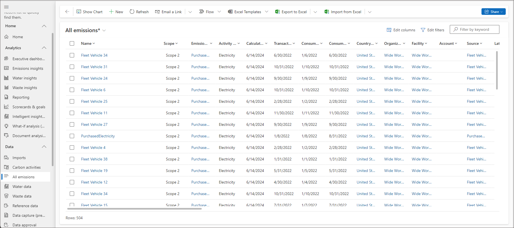
   
You've now created and run calculation profiles. Calculation profiles are the final step in calculating and recording your carbon emissions in Microsoft Cloud for Sustainability. Now, you'll be able to report and reduce your carbon emissions, which are discussed in the next exercises. It might take 30 minutes for your emissions to appear in the reporting areas.

## Exercise 3 : Create allocation profiles and run calculations

In this exercise, you learn about the steps that Alex takes to create the allocation method, method details and an allocations profile. Allocations help visualize how your emissions are generated in multiple methods without impacting the default emissions reporting. With allocations, you can visualize how your emissions are distributed based on a parameter.

## Task 1 : Create allocation methods

In this task, Alex creates an allocation method called Headcount to understand the emissions distributed based on the purchased electricity.

1. Select Data on the left navigation pane. Select Reference data and click on View for (Preview) Allocation methods.

    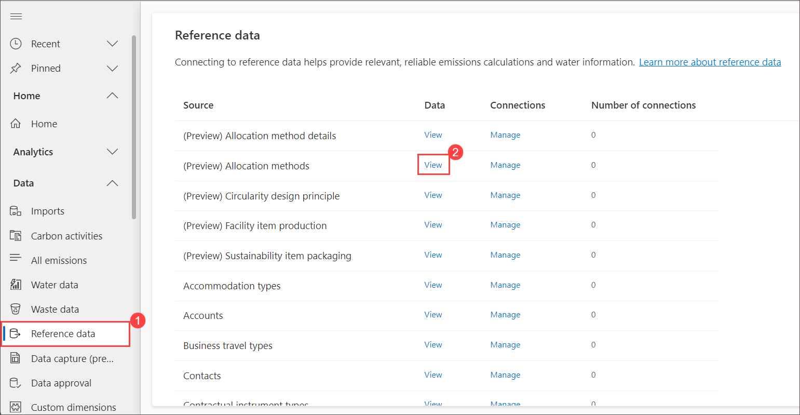

1. Select New.

1. Enter the Name as **Headcount** and select **Save & Close**. The allocation method is created.

     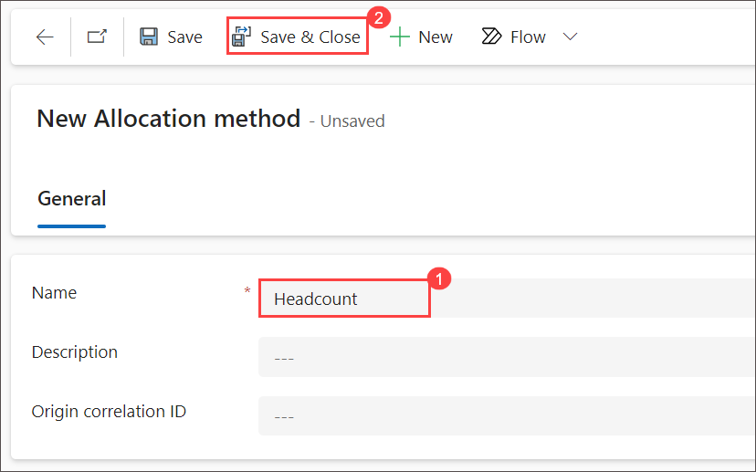

## Task 2 : Create the allocation method details

In this task, Alex creates the allocation method details by importing an excel file with the details. You must download the sample data - Allocation Method Details.zip for this task.

1. Expand **Data** from left navigation pane, then select **Reference data**. Click View for (Preview) Allocation method details.

    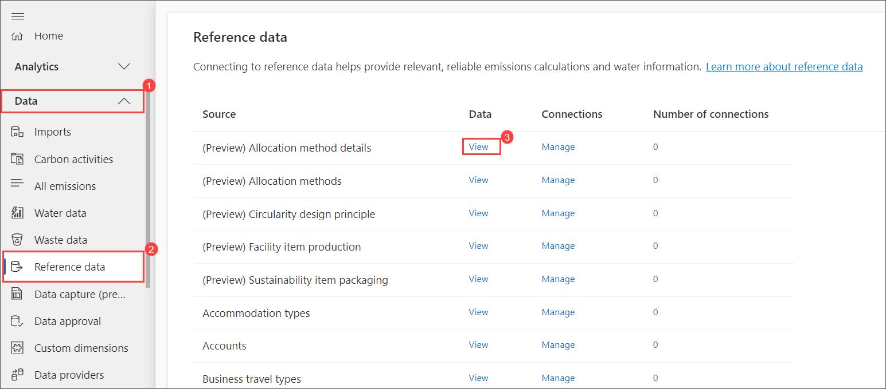

1. Select the three horizontal dots and select Import from Excel.

    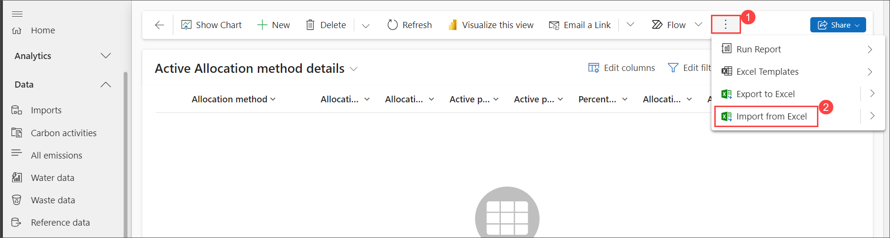

1. Select **Choose File** and then upload the **Allocation method details** sample data by navigating to **C:\Allfiles**.

    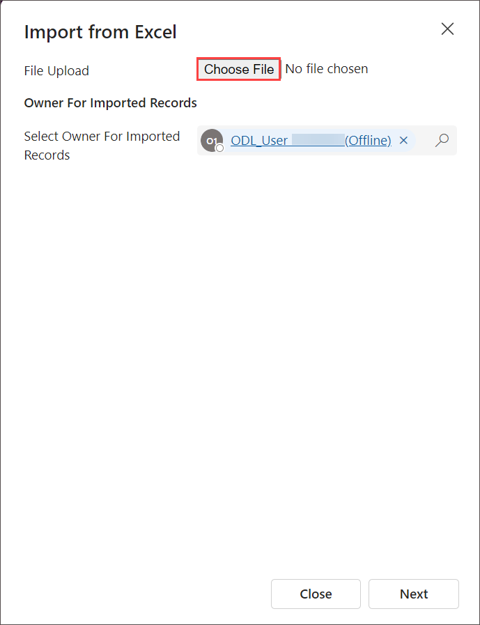

    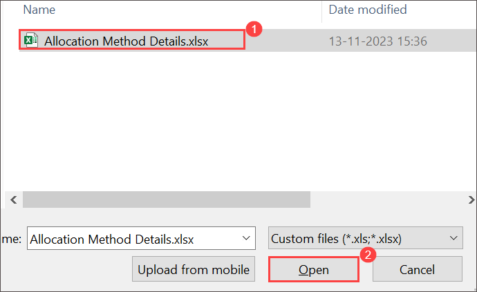
    
1. Once **Allocation method details** is uploaded select **Next**.

     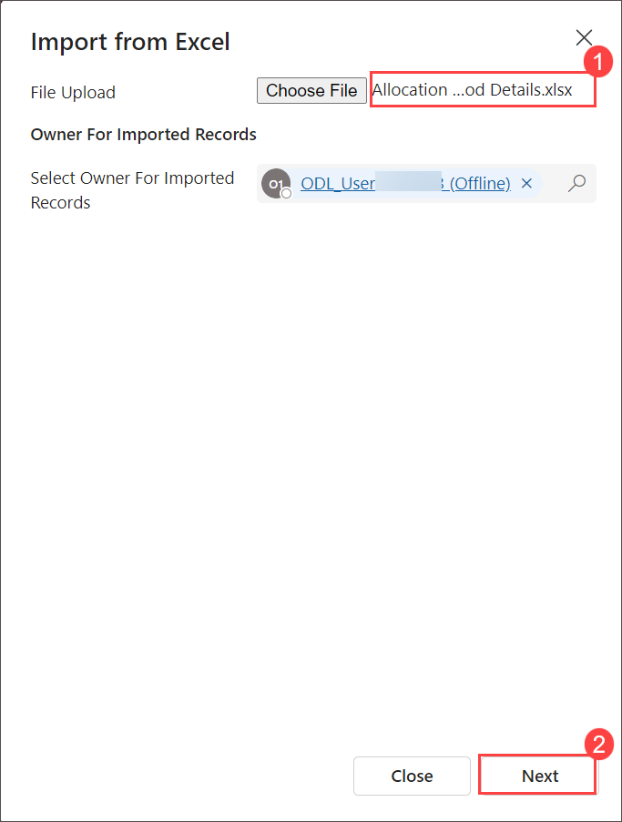

1. Select Finish Import.

    

1. Select Done. The data is imported successfully.

    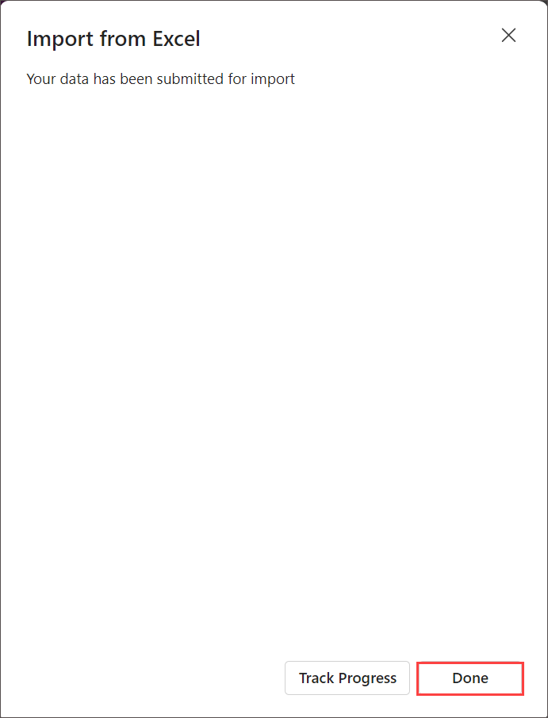

## Task 3 : Create an allocation profile

1. Expand **Calculations** from the left navigation pane then select Allocation profile(preview) and click on **New**

   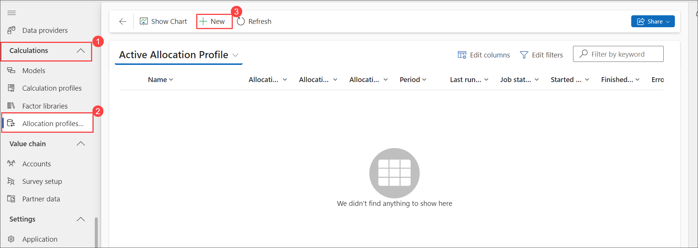

1. On the **Create new allocation profiles** blade, from the **Emission source** drop down select **Purchased electricity (Emission)**.

   - Start date : 1/1/2022.

   - End date : 31/1/2022

     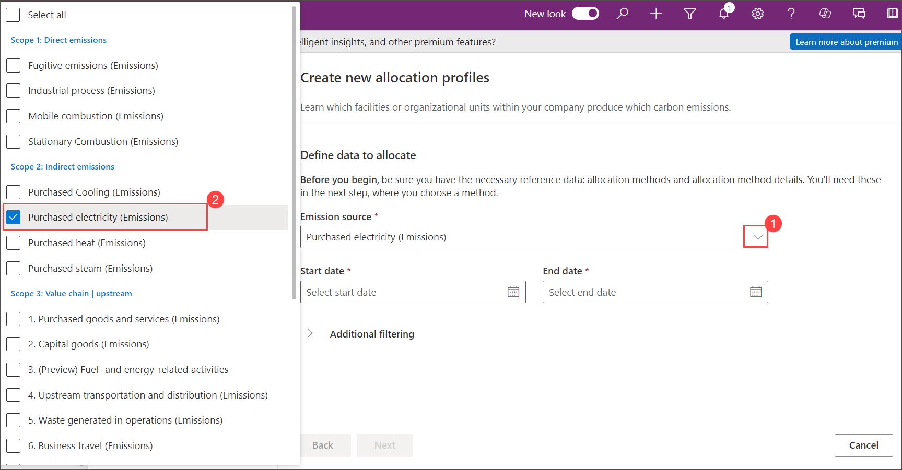

     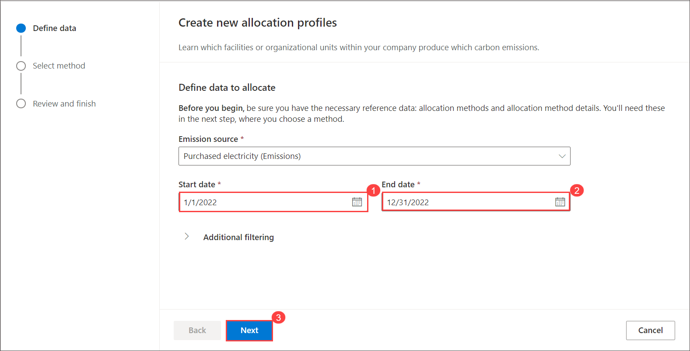

1. Under **Set up allocation type** sepcify the following details and click on **Next**.

      - Profile method **Headcount**.
      - Profile period **Yearly**.

   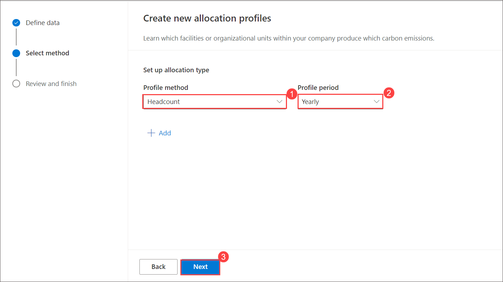

1. Enter the Allocation profile name as Headcount and select Done.

    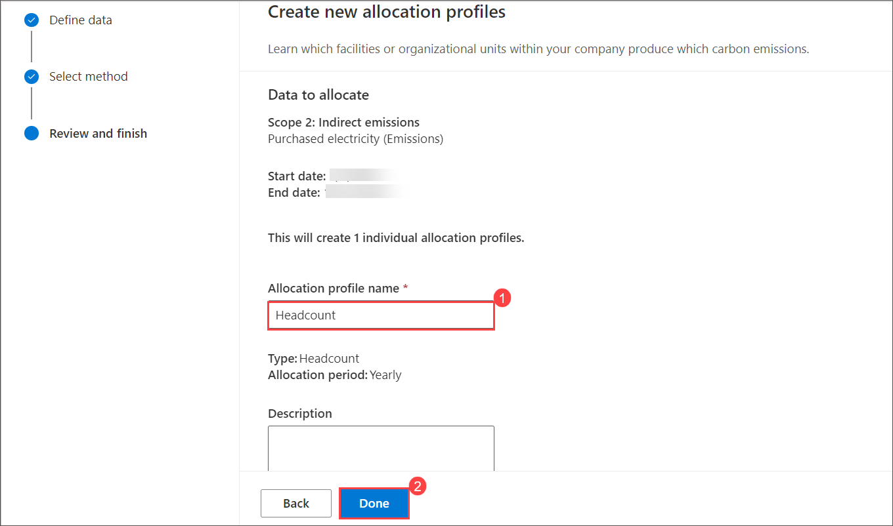

1. Select Continue.

    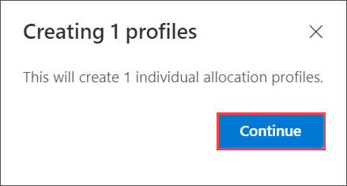
   
1. Select OK. The allocation profile is created successfully.

    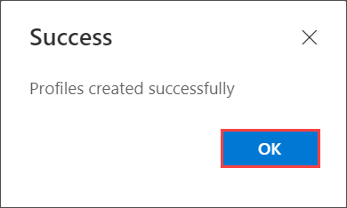
   
1. In the Active Allocation Profile page, select the profile and select Run allocation for the profile created.

    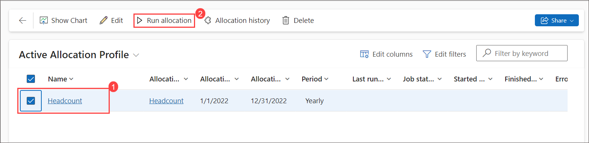
    
1. Refresh the page and select the Allocation profile to view the status of the calculation.

   You created the allocation methods and set up the allocation profile with this method. Now, you'll be able to visualize how your emissions are generated using these methods without impacting the default emissions reporting. 

## Review

During this lab, we have successfully navigated through the comprehensive steps required to set up factor libraries, create estimation and emission factors, establish calculation models, and run calculation profiles within Microsoft Sustainability Manager. This process is pivotal for organizations like Wide World Importers to accurately estimate and report their carbon emissions, specifically focusing on Scope 2 emissions from purchased electricity and emissions derived from electric vehicle operations.

## You have successfully completed the lab. Click on Next >>.
