# Lab 4: Insights and Reporting

## Lab Overview

In the previous lab, the ingested Activity data was taken through calculation designs using calculation models and the output was reviewed in terms of CO2E unit. In this lab, we will perform a set of activities to generate emissions reports, activity reports, and review Power BI dashboards.

##  Lab Scenarios

In this lab, Sustainability specialist for Contoso Corp reviews the data in the Insights section of Microsoft Sustainability Manager, noticing that Wide World Importers was a large contributor to Scope 2 emissions in 2022. Sustainability lead for Contoso Corp that the Activity and Emission Reports are available for review. We will explore the reporting section and creates a new Activity report and a new Emissions report. Reviews the generated report and includes the report in the sustainability reporting procedures for Contoso Corp.

## Lab Objectives

  - Task 1 : Executive dashboard
  - Task 2 : Explore Emission Insights
  - Task 3 : Waste and Water Insights
  - Task 4 : Generate Quantitative preparation report
  - Task 5 : Sustainability scorecards and goals

## Exercise 1: Sustainability Dashboards

## Task 1 :  Executive dashboard

1. The Executive dashboard in Microsoft Sustainability Manager provides an overview of total emissions, revenue intensity, and renewable energy categorized by scope, geography, organizational unit, and facility.

     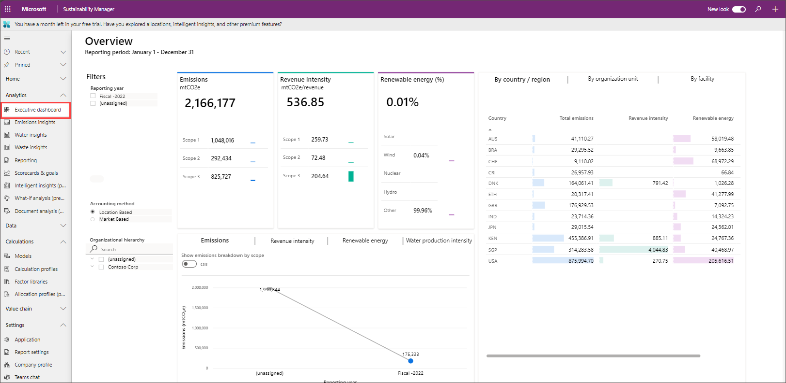

2. You can filter this dashboard by Reporting year, Accounting method, and Organizational hierarchy. Under Filters select **Fiscal -2023** then **Organizational hierarchy** expand **Contoso Corp** > **Contoso USA** then select check box next to **Wide World Importers**. 

    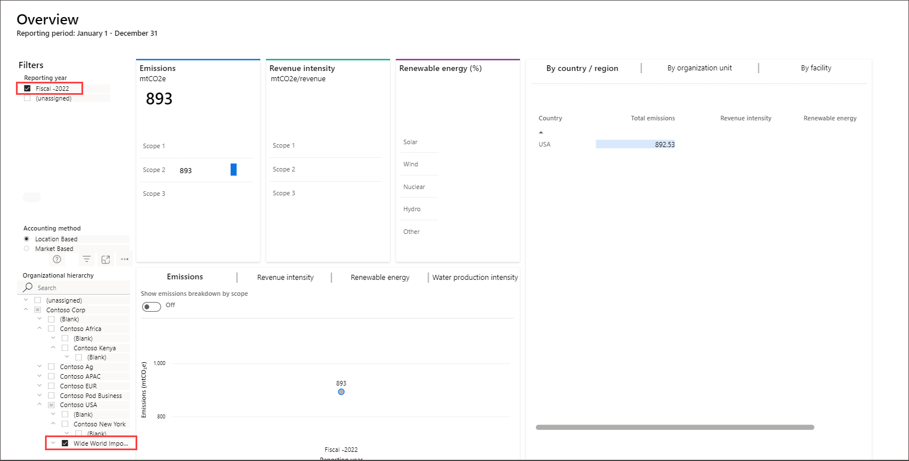

   >**Note**: It might take around 5 hrs to generate the report after completing the emission calculations.

3. The options for Accounting method include:

    - Location Based: Reflects the average emissions intensity of grids on which energy consumption occurs.
    - Market Based: Reflects emissions from electricity you purposefully chose.
    - The tiles at the top of the dashboard let you quickly assess the following metrics:

        a). Emissions: Total emissions, together with a breakdown by scope 1, scope 2, and scope 3.

        b). Revenue intensity: Revenue intensity score, together with a breakdown by scope 1, scope 2, and scope 3. (Revenue intensity equals emissions divided by revenue.)

        c). Renewable energy (%): Renewable energy as a percentage of total energy, together with a breakdown by renewable energy source.

4. You can review the option by **By country / region**, **By organization unit** and  **By facility**. 
    
    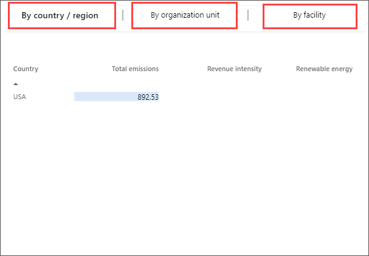

## View trends

The bottom tile has three tabs that show a graphical representation of emissions, revenue intensity score, renewable energy, and water production intensity.

Emissions: This tab has a toggle that lets you view either total emissions in a trend line chart or emissions by scope. Emissions by scope appear in column charts for the three scopes that show emissions over time.

Revenue intensity score: This tab has a toggle that lets you view either revenue intensity in a trend line chart or revenue intensity categorized by scope. Revenue intensity by scope appears in column charts for the three scopes that show emissions over time.

Renewable energy: This tab has a toggle that lets you view either renewable energy as a percentage in a column chart over time or renewable energy breakdown by source. Renewable by source data appears in a column chart for each source showing the percentage of renewable energy as a percentage of total energy over time.

Water production intensity: This tab shows values for water production intensity consumed, discharged, and withdrawn. Water production intensity is the total amount of water used in relation to the total weight of products produced.

## Task 2: Explore Emission Insights 

In this task, Amber explores the various **Sustainability** dashboards which provide an overview of total emissions, revenue intensity, and renewable energy broken down by scope, geography, organizational unit, and facility.

1.  In the left navigation pane, under **Analytics**, select **Emission Insights.**

2.  Select **Insights** on the left pane.

3.  The page displays the **Emissions overview** dashboard, the dashboard is filtered by selecting a reporting period and accounting method. The top tile in the dashboard has four tabs: All emissions, By month (comparison), By scope, and By scope (line chart). The first, third, and fourth tabs have a toggle that is used to **Show a comparison by year**. When the toggle is off, data for the selected reporting period is shown in a monthly view. When the toggle is on, all available years are shown on a trend chart. The details around each of the tabs in the top tile are as follows:

    -   (1) All emissions – This tab shows total emissions over time.
    -   (2) By month - This tab shows a breakdown of emissions by month for the selected reporting period.
    -   (3) By scope – This tab shows a breakdown of emissions by scope 1, scope 2, and scope 3. It includes a chart for each scope.
    -   (4) By scope (line chart) – This tab shows each scope as a separate line on one chart. Therefore, you can easily compare emissions by scope over time.
    -   (5) The **By source and scope** tile at the bottom shows a further breakdown of data in each scope. It shows specific sources and their contribution to emissions overall.
    -   (6) The tile at the bottom right has three tabs: **By country/region**, **By organizational unit**, and **By facility**. Each tab shows a breakdown of emissions by scope 1, scope 2, and scope 3.
    -   (7) Select **2022** under **Filters : Reporting period** on the left side to explore the data. **Note**: The data in the image below may not match your data.

4.  Select **Scope 1** on the top tab to view the Scope 1 emissions dashboard. Scope 1 emissions are emissions that are owned or directly controlled by the organization. Like the Emissions overview, the **Scope 1 emissions** dashboard lets users view scope 1 emissions by reporting period.

    (1) Summary statistics can be viewed in the left tile. These statistics include the total scope 1 emissions for the current reporting period compared to the previous period. They also include emissions by source type and emissions broken down by greenhouse emissions. Greenhouse emissions include the following gases:

    -   **CO2** – Carbon dioxide
    -   **CH4** – Methane
    -   **N2O** – Nitrous oxide
    -   **HFCs** – Hydrofluorocarbons (that is, manufactured compounds that contain hydrogen and fluorine atoms)
    -   **PFCs** – Perfluorocarbons (that is, manufactured compounds that contain carbon and fluorine atoms)
    -   **NF3** – Nitrogen trifluoride
    -   **SF6** – Sulfur hexafluoride

    (2) The top tile has four tabs: **Scope 1 emissions**, **By month (comparison), **By source**, and **By source (line chart)**. The first, third, and fourth tabs have a toggle that is used to **Show a comparison by year**. When the toggle is off, data for the selected reporting period is shown in a monthly view. When the toggle is on, data for all reporting periods is shown on a trend chart.

    (3) The bottom-left tile provides a deeper dive into the source of the scope 1 emissions by category. It has a tab for each category of scope 1 emissions:

    -   **Stationary combustion** – This category includes emissions from electricity, heat, steam, or energy to power industrial or commercial uses. The tab shows emissions by fuel type.
    -   **Mobile combustion** – This category includes emissions from cars, trucks, and other motor vehicles; boats and other water vessels; locomotives; and aircraft. The tab shows emissions by vehicle type.
    -   **Industrial processes** – This category includes emissions from various non-energy-related industrial events or manufacturing activities, or from consumers. The tab shows emissions by process type.
    -   **Fugitive emissions** – This category includes emissions that were accidentally released into the atmosphere. These emissions include gases and vapors. The tab shows emissions by activity type.

    (4) The bottom-right tile has three tabs: **By country/region**, **By organizational unit**, and **By facility**. Each tab shows scope 1 emissions for the corresponding delineation of data.

5.  Select **Scope 2** on the top tab to view the Scope 2 emissions dashboard. Scope 2 are emissions that a company causes indirectly when the energy it purchases and uses. For example, for Wide World electric fleet vehicles the emissions from the generation of the electricity they're powered by would fall into this category. Just as with other dashboards, the **Scope 2 emissions** dashboard lets users view scope 2 emissions by reporting period and accounting method.

    (1) The summary statistics can be viewed in the left tile. These statistics include the total scope 2 emissions for the selected reporting period compared to the previous period. They also include scope 2 emissions by source. Scope 2 emissions have the following sources:

    -   Purchased heat
    -   Purchased cooling
    -   Purchased electricity
    -   Purchased steam

    (2) The top tile has four tabs: **Scope 2 emissions**, **By month (comparison), **By source**, and **By source (line chart)**. The first, third, and fourth tabs have a toggle that is used to **Show a comparison by year**. When the toggle is off, data for the reporting period is shown in a monthly view. When the toggle is on, data is shown for all available reporting periods.

    (3) The bottom tile has three tabs: **By country/region**, **By organizational unit**, and **By facility**. Each tab shows scope 2 emissions for the corresponding delineation of data.

6.  Select **Scope 3** on the top tab to view the Scope 3 emissions dashboard. Scope 3 emissions are the result of activities from assets not owned or controlled by the reporting organization, but that the organization indirectly impacts its value chain. Scope 3 emissions include all sources not within an organization's scope 1 and 2 boundary. The **Scope 3 emissions** dashboard in Microsoft Sustainability Manager lets you view scope 3 emissions by reporting period.

    (1) Summary statistics can be viewed in the left tile. These statistics include the total scope 3 emissions for the reporting period compared to the previous period. The tile also shows all categories of scope 3 emissions classified as either upstream or downstream. Scope 3 emissions have the following fifteen categories.

    **Upstream**

    -   Purchased Goods and Services
    -   Capital Goods
    -   Fuel and energy related activities
    -   Upstream transportation and distribution
    -   Waste generated in operations
    -   Business travel
    -   Employee commuting
    -   Upstream leased assets

    **Downstream**

    -   Downstream transportation and distribution
    -   Processing of sold products
    -   Use of sold products
    -   End-of-life treatment of sold products
    -   Downstream leased assets
    -   Franchises
    -   Investments

    (2) The top tile has four tabs: **Scope 3 emissions**, **By month (comparison), **By category**, and **By category (line chart)**. The first, third, and fourth tabs have a toggle that is used to **Show a comparison by year**. When the toggle is off, data for the selected reporting period is shown in a monthly view. When the toggle is on, the data that is shown represents all available reporting periods.

    (3) The bottom-left tile has five tabs:

    -   **By category** – This tab shows scope 3 emissions by category and type.
    -   **By leased assets** – This tab shows the number of records and emissions by upstream and downstream leased assets.
    -   **By facility type** – This tab shows the number of records and emissions by type of facility.
    -   **By supplier** - This tab shows the number of records and emissions by supplier.
    -   **By waste** – This tab shows the number of records and emissions by waste.

    (4)The bottom-right tile has three tabs: **By country/region**, **By organizational unit**, and **By facility**. Each tab shows scope 3 emissions for the corresponding delineation of data.

7.  Select **Renewable energy** on the top tab to view the summary view of renewable energy, its sources, and the contract type.

    (1) The summary statistics can be viewed in the left tile. These statistics include renewable energy as a total percentage of energy that was used for the selected reporting period compared to the previous period. The tile also shows the percentage of renewable energy by source type, such as solar, wind, and water.

    (2) This tile has three tabs: **Renewable energy**, **By source**, and **By source (line chart)**. Each tab has a toggle that you can use to show a comparison by year. When the toggle is off, data for the selected reporting period is shown in a monthly view. When the toggle is on, data is shown for all reporting periods.

    (3) The bottom-left tile shows renewable energy by contract type. It indicates the renewable energy in the appropriate measure, such as kilowatt-hour (kWh), and the percentage of renewable energy.

    (4) The bottom-right tile has three tabs: **By country/region**, **By organizational unit**, and **By facility**. Each tab shows renewable energy for the corresponding delineation of data.

8.  Select **Deep analysis** on the top tab to dive deeper into data and uncover insights that might not be available from other reports. The dashboard can be filtered by selecting a reporting period and accounting method.

    The **Decomposition tree** can be used to drill down from the company-level to more granular levels of the organization, and to access:

    -  High value
    -  Low value
    -  Emission source
    -  Country/region
    -  Organization
    -  Different levels of scope 1, scope 2, and scope 3 emissions.
    -  Facility

9.  We drills into our decomposition tree to identify where our high sources of emissions are. Select the **+** next to **Total emissions**, and select **Scope**. (Images may not match displayed data.)

10.  We can see which scope has the largest volume of emissions. Select the **+** next to **Scope 2**, and select **Emission source** to identify which Scope 2 emission source is biggest contributor.

11.  It seems that Purchased electricity was the biggest contributor of emissions. Select the **+** next to **Purchased electricity** and select **Country/region** to identify which regions were contributing to the large Purchased electricity emissions.

12.  The USA contributed the most to the Purchased Electricity emissions. The Country/Region selection is driven by the country region mapping table found in the Settings area. Select the **+** next to **USA** and select **Organization** to see which organizations contributed to this.

13.  You can see the organizations with the largest to lowest contributor to Contoso Corp’s carbon emissions

14. In further filtering we see the Wide World Importers under Org level 3. Use this information to create a goal for Wide World Importers to reduce their Purchased electricity emissions by 300 mtCO2E (you'll complete this task in the next exercise).

16.	Select **Custom Dimensions** tab to view the emission analytics
    - You can view a time chart of CO2E emissions broken by custom dimension strings. For example, compare emissions by vehicle size where Vehicle Size is a custom dimension with string value.
   	- Expand the tree view of total CO2E emissions and drill into each string custom dimension present in the data and view CO2E emissions by value.
   	- Explore the time chart of CO2E emissions intensity broken out by custom dimension strings, where the intensity denominator is a numeric custom dimension, you select. 
   	- Expand the tree view of total CO2E emission intensity, where the intensity denominator is a numeric custom dimension, you select. You can drill into each string custom dimension in the data and view CO2E emission intensity associated with each unique string value.
 
>**Note**: You've now successfully explored various Sustainability dashboards. You can use these dashboards to gain insights into your emissions data. Additionally, as you drilled down from total emissions to the organization level, you were able to determine that Wide World Importers needs to reduce the carbon emissions from purchased electricity. This goal could be achieved in a variety of ways, such as switching to renewable energy sources or using more energy-efficient devices and vehicles. You can use these insights to drive business decisions and then use the information to create scorecards and goals to track your progress.

## Task 3 :  Waste and Water Insights

In this task, we are detailing the features and functionalities of various dashboards within Microsoft Sustainability Manager with help of sample data, highlighting how they provide insights into water sustainability, water quality, waste quantity, and circularity practices.

1. The Water insights dashboard in Microsoft Sustainability Manager provides you with a holistic view of your organization's water sustainability performance relative to the business. Based on the selected water transaction type, the tiles contain the following information about your organization:

    - Water revenue intensity (total water quantity/total revenue)
    - Water production intensity (total water quantity/total weight of products produced)
    - To open the Water insights dashboard in Sustainability Manager, select Analytics on the left navigation, and then select Water insights.

1. Select the Water insights tab.

1. Filter the dashboard by water transaction type, water stressed area, reporting period, or organizational hierarchy.

1.  Water quality dashboard
The Water quality dashboard in Microsoft Sustainability Manager lets you view your organization’s water quality related data at a facility or organizational unit level by reporting period. These water quality transactions primarily consist of the quality information in waste water discharges from facilities.

1.  Waste quantity dashboard
The Waste quantity dashboard in Microsoft Sustainability Manager provides a view of your organization’s waste quantity data. It shows total waste generated by diversion method, hazardous and radioactive waste type at a facility, or organizational unit level for the reporting period.

1. Circularity (Input material) dashboard (preview)

1. The Circularity (Input material) dashboard (preview) in Microsoft Sustainability Manager provides you with a view of the circular practices implemented during the inflow of materials into your organization.

1. The dashboard shows the quantity of component items used and the percentage of sustainable content such as renewability, reusability, and recyclability present in these items for each finished good. You can further filter by packaging material or reporting period.

1. Circularity (Finished good) dashboard (preview)

1. The Circularity (Finished good) dashboard (preview) in Microsoft Sustainability Manager provides you with a view of the circular design principles implemented in final finished products. The dashboard shows the total quantity and the percentage of finished goods following circularity design principles.

1. The Circularity (Finished good) dashboard includes the following two tiles:

1. Follows circularity design principle

   - To view the corresponding charts for each of these tiles, select one of these tabs:

          All quantity
          By month
          By finished good (weight)
          By finished good (percentage)

### Water Insight

1. The Water insights dashboard in Microsoft Sustainability Manager provides you with a holistic view of your organization's water sustainability performance relative to the business. Based on the selected water transaction type, the tiles contain the following information about your organization:

 - Water revenue intensity (total water quantity/total revenue)
 - Water production intensity (total water quantity/total weight of products produced)
 - To open the Water insights dashboard in Sustainability Manager, select Analytics on the left navigation, and then select Water insights.

1. Select the Water insights tab from the left navigation pane.

1. Filter the dashboard by water transaction type, water stressed area, reporting period, or organizational hierarchy.

1. View summary statistics in the left tile. These statistics include total water withdrawn, total water discharged, total water consumed, and total water recycled for the selected reporting year. Water withdrawn and water discharged include water source types such as:

      - Surface water
      - Sea water
      - Ground water
      - Third party water
      - Produced water
      - View the trends

   + The top tile has six tabs each for water withdrawn and water discharged:

      - Water withdrawn/discharged
      - By month (comparison)
      - By source
      - By facility
      - By country/region
      - By organizational unit
      
    + It has five tabs each for water consumed and water recycled:

      Water consumed/recycled
      By month (comparison)
      By facility
      By country/region
      By organizational unit

      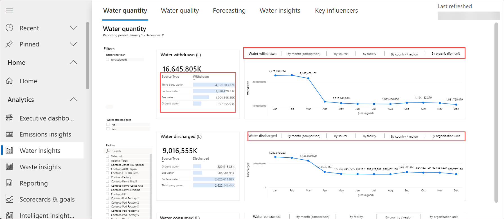

## Task 4:  Generate Quantitative preparation report

In this exercise, Amber Rodriguez informs Jessie Irwin - Sustainability lead for Contoso Corp that the Activity and Emission Reports are available for review. Jessie generates quantitative preparation reports that extract emission and activity data from Microsoft Sustainability Manager. The reports are in an Excel format that can be used to submit the data for public disclosure.

1.  In the left navigation pane, select **Reporting**.

2.  Select **New**.

     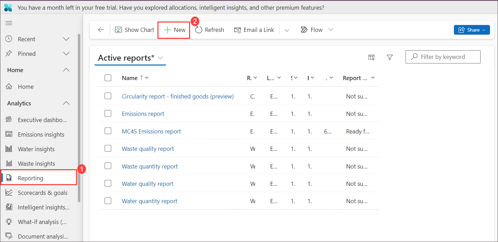

3.  Set the following fields:

    1. **Report type**: Emissions report
    1. **Name**: MC4S Emissions report
    1. **Report type**: Emissions report
    1. **Start date**: 01/01/2023
    1. **End date**: 12/31/2023
    1. **Report level** : All levels
    1. **Hierarchy as of** : 1/1/2023

    Fields can be selected to group data by, or column headers for the report. The available fields for Emissions report are **Country/Region**, **Regional group**, **Latitude/Longitude**, **Organization unit**, **Facility**, **Is market based**, **Is biogenic**, **Scope**, **Emission source**, **Activity type**.
    
5. For this task, we will just set the following fields to **Yes** for use in Contoso Corp’s carbon emissions reporting for public disclosure:

    - **Country/Region**
    - **Regional group**
    - **Facility**
    - **Scope**
    - **Emissions source**
    - **Activity data** 

     
    
6. Once these are selected, select **Save & Close** on the top command bar.

7.  Once the report is saved, the **Generate report** button will be visible on the command bar. Select **Generate report** and then the report is queued to be generated.

       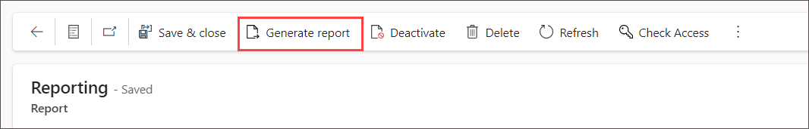
  
8.  Select **Refresh** button on the command bar until the **Report generation status** is changed from **Pending** to **Ready for download.** This may take a few minutes to generate.

     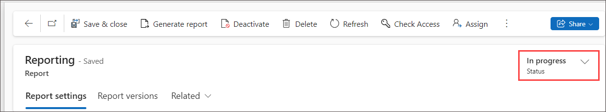

9.  Once the status is changed, a **Download report** button is visible in the command bar. Select that button to download the generated report. An Excel report begins to be downloaded. Open the report.

     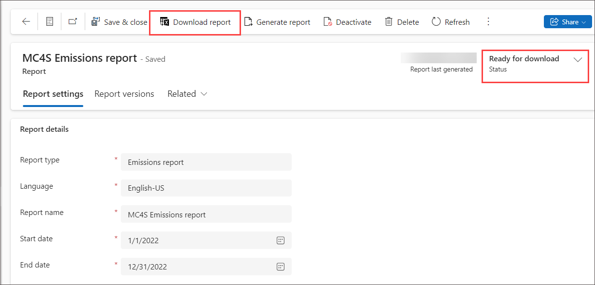

10.  The reports contain the following information:
    - The **Group by** column headers that were selected. In this case, it is grouped by Country/Region, Regional group, Facility, Scope, Emissions source, and Activity type
    - The following emission metrics: **CO2**, **CH4**, **N2O**, **SF6**, **NF3**, **CO2E**, **HFCs**, **PFCs**, and **Other GHGs.**

## Task 4 :  Sustainability scorecards and goals

Scorecards and Goals allow organizations to monitor progress against data-driven goals. They can help you curate sustainability metrics and track them against your company's key business objectives. After you’ve created a scorecard that includes some goals, you can periodically check on the scorecard’s progress and make required adjustments.

Additionally, you can have manual goals with the ability to connect to data and set rules for automatic status updates. You can enable several scorecards and goals and subgoals.

Scorecards and goals are manually updated or connected to data for automatic check-ins with optional Microsoft Teams collaboration.

### Task 1 : Create a new scorecard

1. From the lefy navigation pane select **Scorecards & goals** then select **+ Add Scorecard** to create a scorecard.

   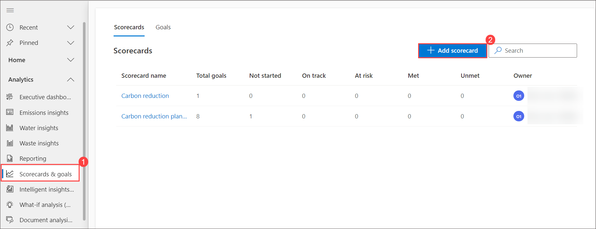
   
    - In the Name field, enter the name **Wide World Importers Reduction Plan - 2024** of the scorecard.

    - In the Owner field, search and select ODl to assign to the scorecard. Select Save to save the scorecard. You can now start to enter the associated goals as described in the next section.

      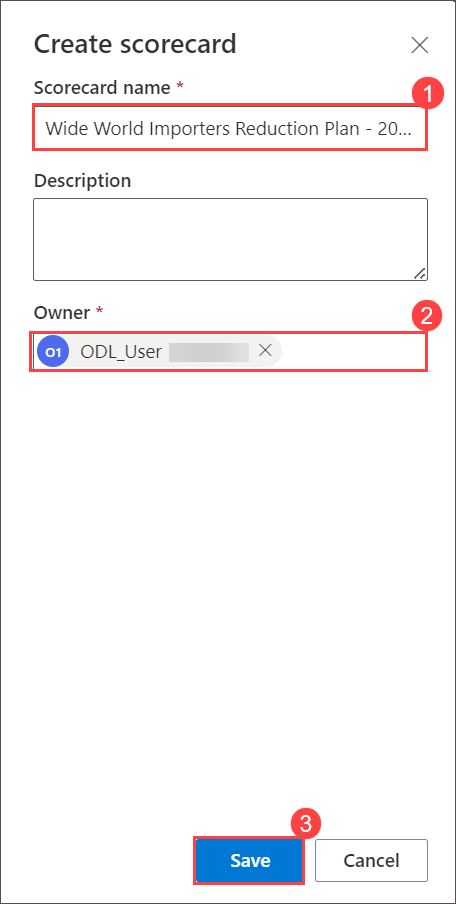

1. Your new Scorecard will open automatically.

   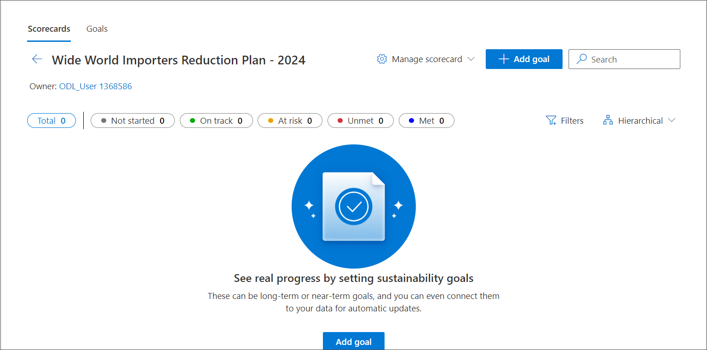

### Task 2 : Create a goal

1. Select the **+ Add goal** button to create a new goal.

     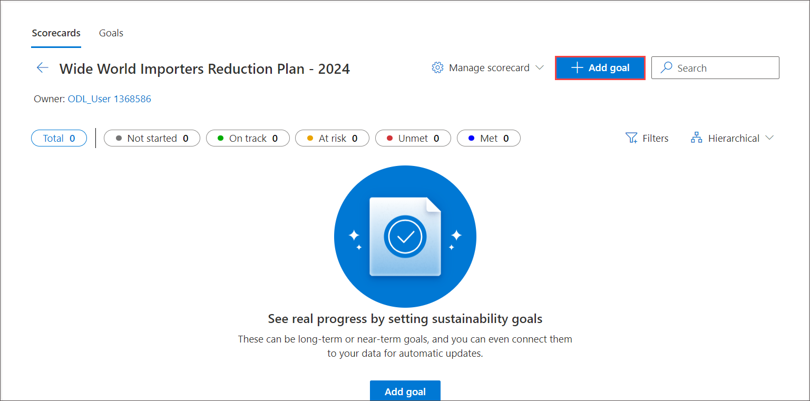

1. Use the following information to populate the fields on the New goal page:

    - **Goal name** - **Reduce Scope 2 Emissions - 2024**

    - **Owner** - ODL User

    - **Scorecard** - **Wide World Importers Reduction Plan - 2025**

    - **Organizational unit** - **Wide World Importers**

    - **Start date** - **12/31/2023**
  
    - **End date** - **12/31/2024**
  
    - **Unit of measure** - **mtCO2e**

    - **Starting value** - **900**

    - **Source of current value** - Select **Connect to data** from the drop down then select **Set up connection**.
  
    - On the **Set up connection: current value** blade, follow the below mentioned steps:

       a) Select the check box next to **Track all carbon emissions**.
       b) Value - Select **CO2E** from drop down.
       c) Select **+ Add** > **Add row** then choose **Organizational unit** equals **Wide World Importers**.
       d) At the top of the form, select **Calculate** for a preview of the data that would be used for the current value check-in. Copy this value. The value that's calculated might differ from what's shown in the following image.

         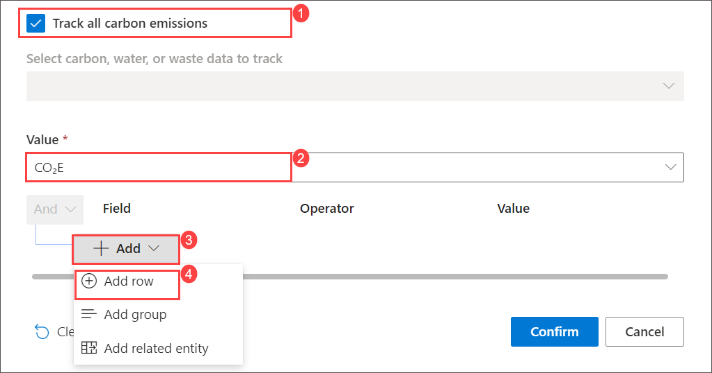
         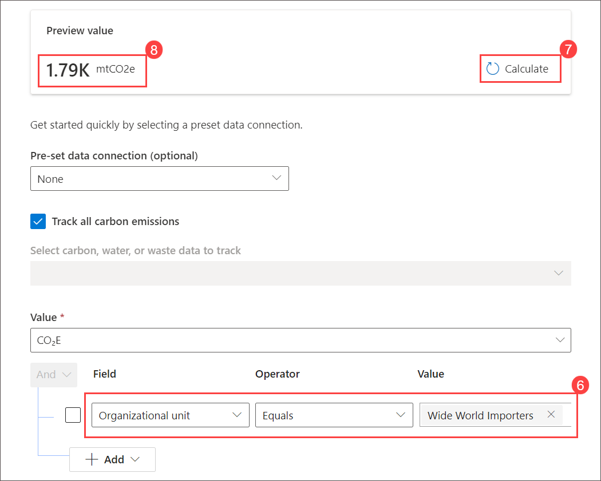

      e) Click on **Confirm** from the buttom of the page.

         

1. Back on **Add a goal** page

   - Use Source of target value to specify what the source of the target value is. You can connect the Source of target value to data or, in this scenario, you can enter it manually. Select Enter manually and then enter 600 to set your target of reducing annual emissions to 600 mtCO2E.

   - Use Status update method to specify how the status of the goal check-ins will be set. You can enter the Status update method manually or set it to update automatically. In this scenario, you'll set the status for goal check-ins automatically based on a set of rules. Select Automatic and then select +Set up status rules.

      
    
   - Select **+ Add Rule** to start a new rule for the Status.
      

   - In the Operator dropdown menu, select is **greater than**.
   - In the Value field, which currently shows 0, enter **600**. Select **At risk** from the Set status to dropdown menu.
   - In the Otherwise, set status to dropdown menu, select **On track**.
   - The status rules should resemble the following image. Select **Confirm**.

       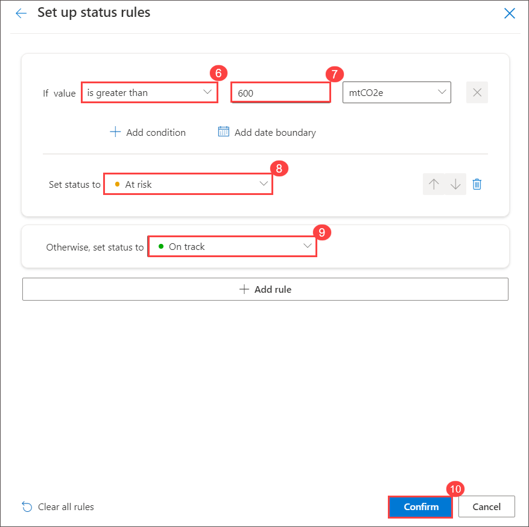
     
3.  Back on **Add a goal** page then click on **Save**.

      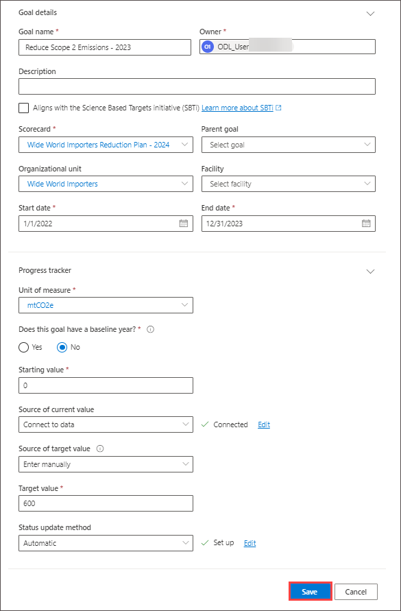

1. The new goal should be visible in the list of goals for the scorecard.

     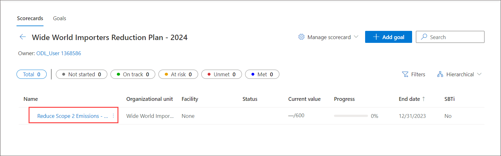

   >**Note**: You've now created a goal for your scorecard. Goals are beneficial for keeping track of an organization's progress toward reducing their carbon footprint. Any goals that you have with a current value that's connected to data will have check-ins created approximately every 24 hours. Next, you'll create your first check-in manually so that you're familiar with the check-in data.

### Task: Create a goal check-in

1. Open the goal that was created in the previous task by selecting the goal name from the list in the scorecard.
    

1. Review the following information for the goal:

    - Progress toward the Reduce Scope 2 Emissions - 2024 goal
 
    - The Goal details
    
      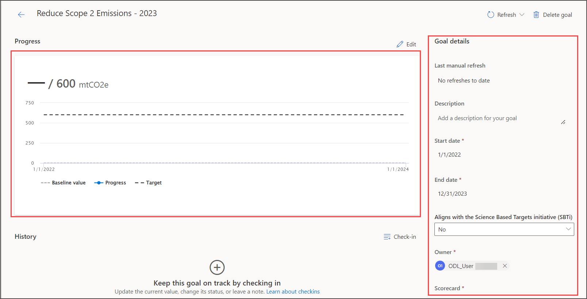

1. In the History section, select  check-in to  create a new goal check-in for the first check-in.

   

1. A New check-in dialog will appear.

  Populate the New check-in dialog with the following data:

   - Update for - **Use today's date.**

   - New value - The preview value that you copied from the Source of current value connection screen. In this scenario, that value is 179.

   - Add note - Enter **First check-in** in the field.

   - Click on **Save**
    
     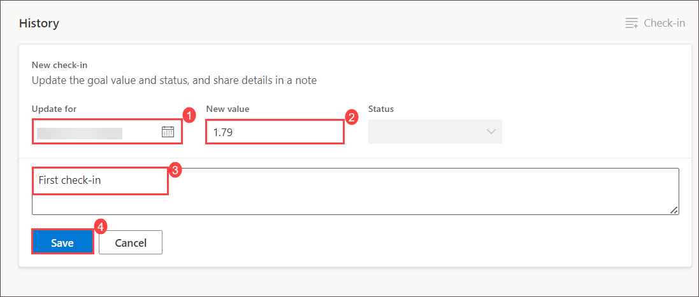

1. Now, the Progress section should show as updated with the latest check-in value and status, as well its plot on the graph. Additionally, the History section should show the recently created check-in with the status automatically set based on the goal rules. Check-ins will be shown in the order of newest to oldest.    

   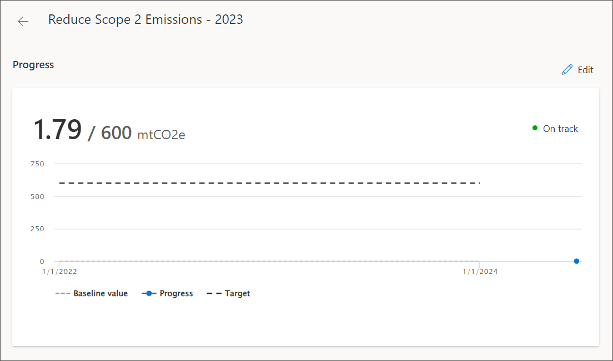
   
   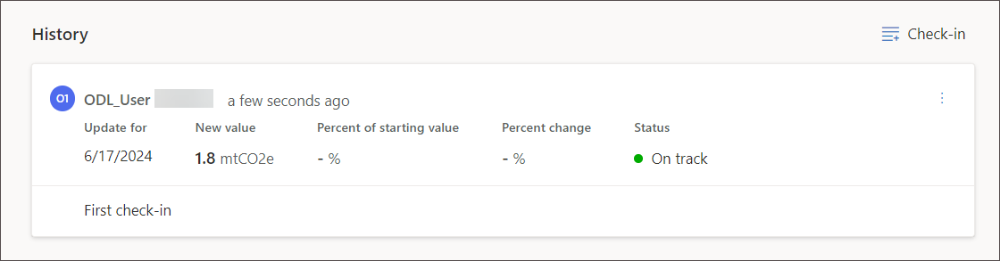
    
  >**Note**: The following list provides descriptions Use Update for to identify what date the check-in was for. This date might be the current date or a date in the past. Use New value to specify the current value of the goal check-in. This value will be used on the Progress chart.

## Review

During this lab we have completed sustainability tasks highlights effective tracking and reduction of emissions through comprehensive dashboards, reports, and goal-setting in Microsoft Sustainability Manager. These tools empower organizations like Contoso Corp to make data-driven decisions for achieving their sustainability objectives.

## You have successfully completed the lab. Click on Next >>.

