# Lab 8: Reduce Carbon Emissions for Azure Workloads

## Lab Overview
In this lab, you will review your current Azure deployments to understand their configurations and usage patterns. You will then use tools like the Carbon optimization to view and analyze carbon emissions data. Based on this analysis, you will identify opportunities for optimization and generate reports to visualize the impact of these changes.

## Lab Scenario
Your company wants to reduce its carbon footprint by optimizing its Azure cloud workloads. You'll review current deployments and analyze carbon emissions data to find ways to reduce emissions.


## Lab Objective

+ Excercise 1 : Review Carbon emissions from Azure workloads.

  - Task 1 : Review the Existing Azure Deployments
  - Task 2 : View Carbon Emissions from the Existing Azure Resources

+ Excercise 2 : Emission Impact Dashboard for Azure

  - Task 1 : Deploy the dashboards from the Solution Center

The primary objective of this lab is to enable participants to understand and implement strategies for reducing carbon emissions associated with Azure workloads. By the end of this lab, participants will be able to:

   - Review and assess existing Azure deployments to understand their current state and resource utilization.
   - Analyze and interpret carbon emissions data from the existing Azure resources.
   - Identify opportunities and best practices for optimizing Azure workloads to minimize carbon emissions.
   - Implement changes and monitor the impact of these optimizations on carbon emissions.

## Estimated timing: 90 minutes

## Excercise 1 : Review Carbon emissions from Azure workloads.

### Task 1 : Review the Existing Azure Deployments

1. Once logged in, Navigate to **Resource groups**

   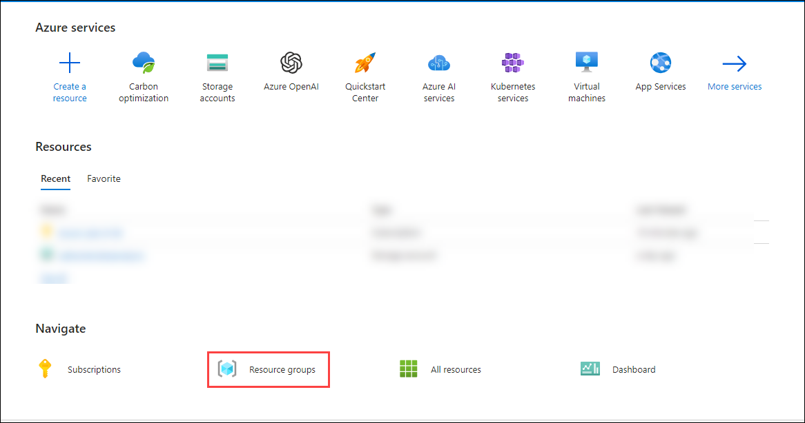

2. Navigate to each resource group and examine the types of resources currently deployed within them.

   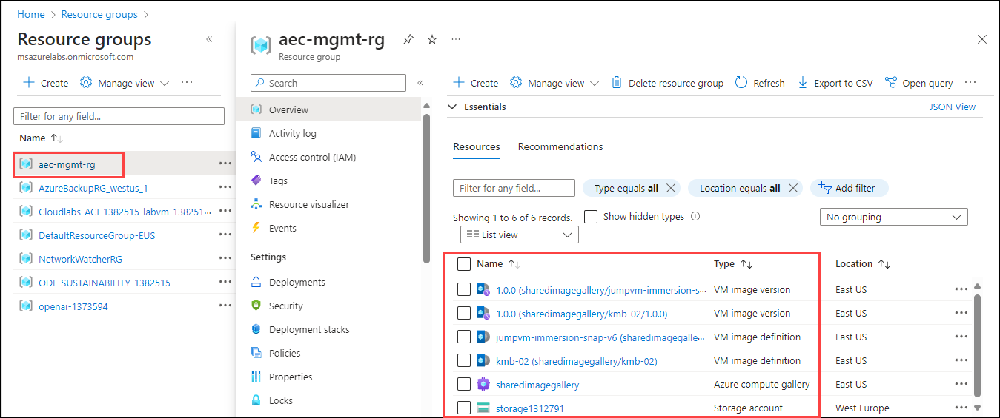

### Task 2 : View Carbon Emissions from the Existing Azure Resources

1. Search and select **Carbon optimization** from the Azure Portal.

   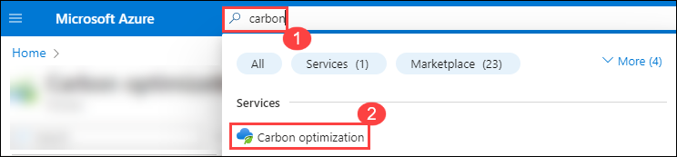

2. On the **Carbon optimization** page, observe the **Total carbon emissions**, **Carbon emissions for the last month** and also monthly emissions data in that subscription under **Emission Trends**

   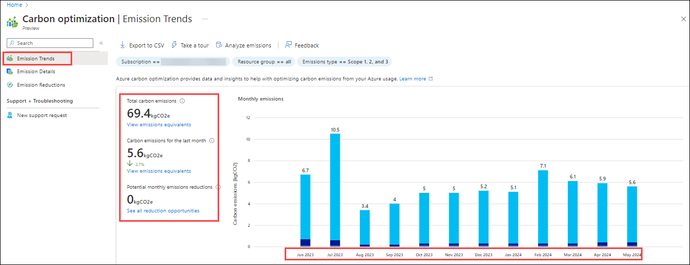

3. Use filters to identify each individual resourge group emission contribution and trends.

   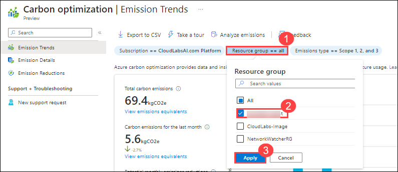

1. In the emission details section, You can view emission details at the subscription, resource group, resource, service, and location levels on the emission details page.

   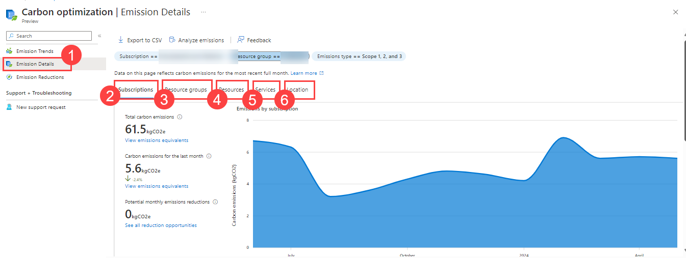

   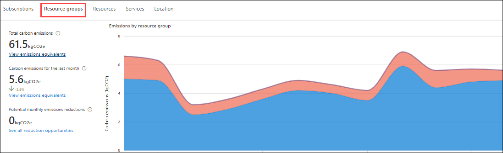

   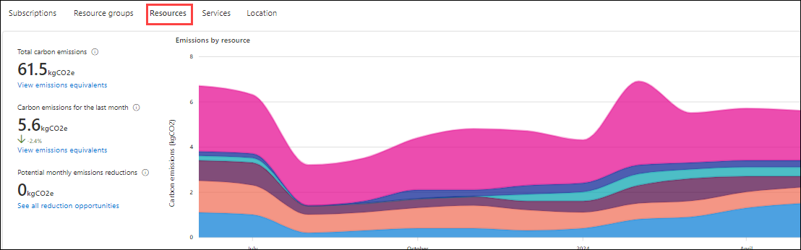

   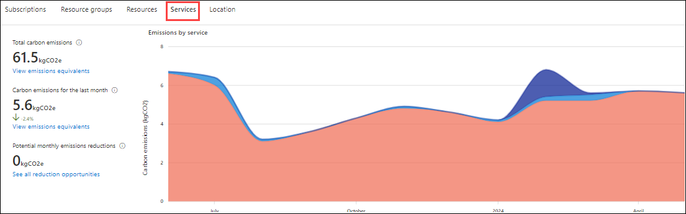

   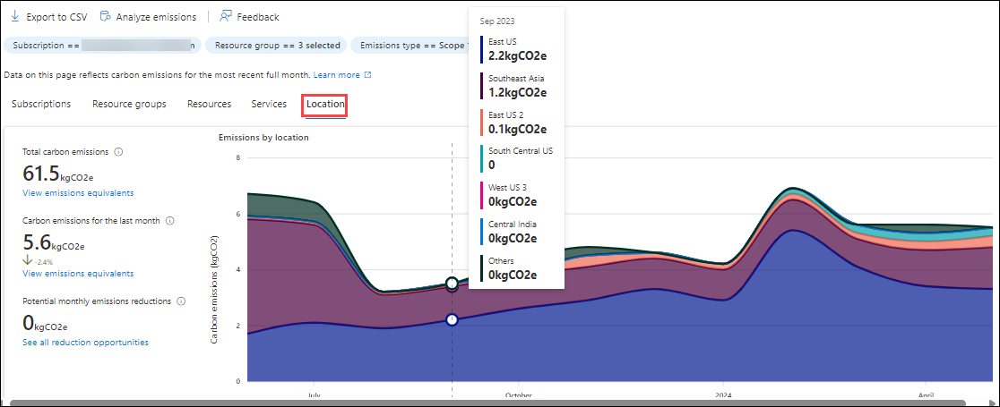

1. In the emission reduction section, you'll discover recommendations, if any, to optimize current Azure workloads based on usage trends.

  >**Note**: By following these steps, you'll learn how to assess and reduce the carbon emissions of your Azure workloads, helping your company achieve its sustainability goals and potentially reduce operational costs.

## Excercise 2 : Emission Impact Dashboard for Azure 

The Emissions Impact Dashboard promotes transparency of information and provides insights that empower you to make effective decisions to reach your sustainability goals.

### Task 1 : Deploy the dashboards from the Solution Center

In this task, you sign in to the Microsoft Cloud Solution Center and deploy the Microsoft Cloud for Sustainability dashboard solutions and view the dashboard with sample data in the PowerBi.

1. Open a browser in InPrivate or Incognito mode and then go to https://solutions.microsoft.com.

2. Use the below credentials to login.

   - **Email/Username:** <inject key="AzureAdUserEmail"></inject>
   - **Password:** <inject key="AzureAdUserPassword"></inject>

3. After sign-in is complete, on the Home page of Microsoft Cloud Solution Center, select View all solutions on the Microsoft Cloud for Sustainability tile.

   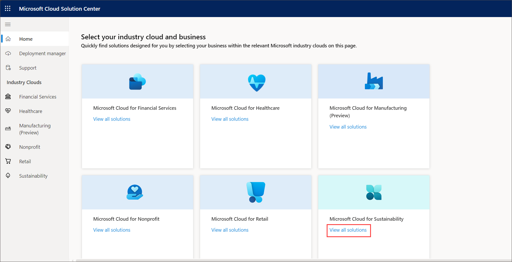

4. From the available capabilities, select Report impact and progress.

5. From the available solutions list, select **Emissions Impact Dashboard for Azure** with the **Added checkbox** and then select **Deploy**.   

   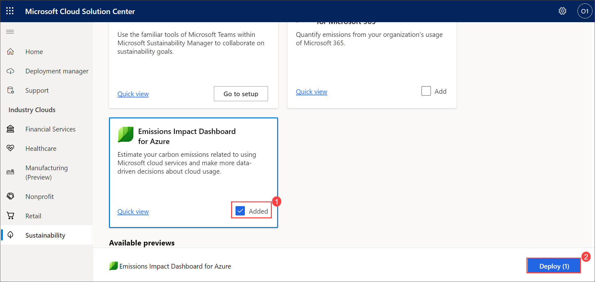

6. Provide the name for your deployment, select the terms of service and then select **Next**.

   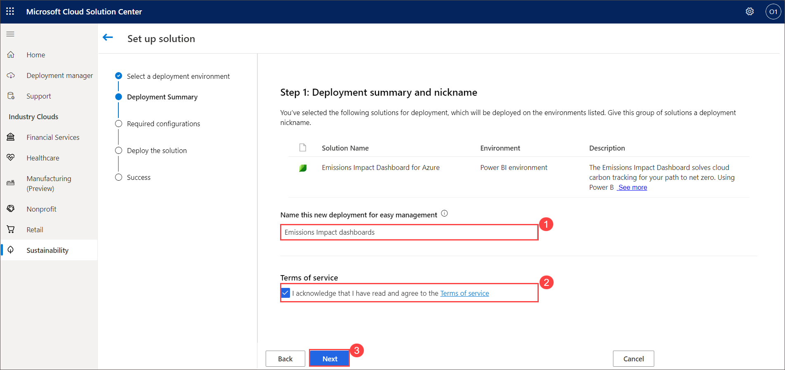

7. Verify that the pre-deployment dependencies are installed and set up. Select **Deploy**.

     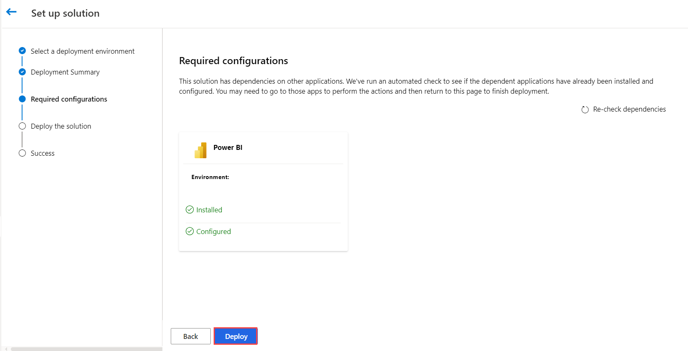

8. Wait for the deployment to show as successful. Select **Close**.

   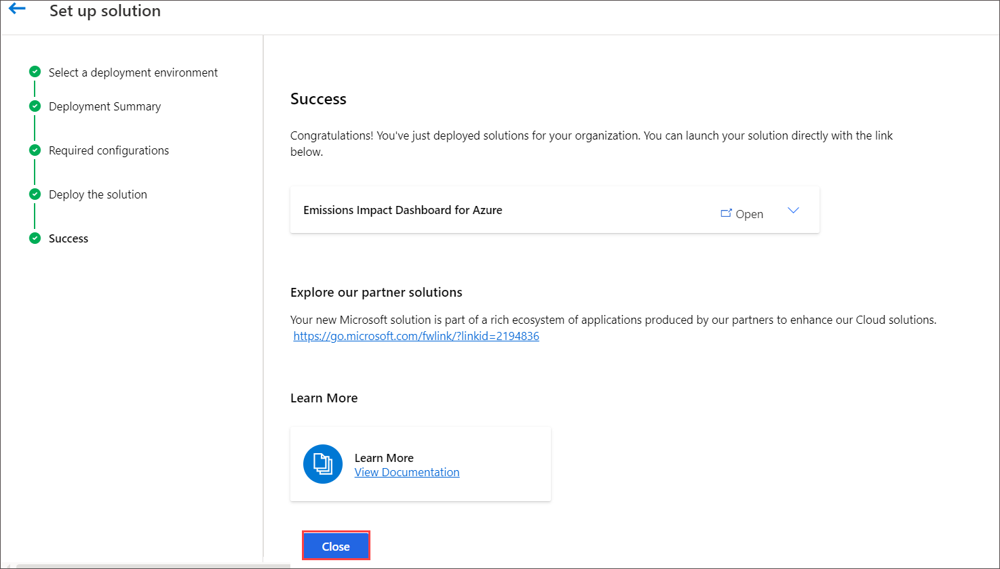

9. Navigate to Microsoft PowerBI using the link below.

```
 https://app.powerbi.com/home?experience=power-bi
```
10. select the **Apps** on the left navigation pane. You see the **Emissions Impact Dashboard for Azure** and select the Emissions Impact Dashboard for Azure listed on the Apps page.

    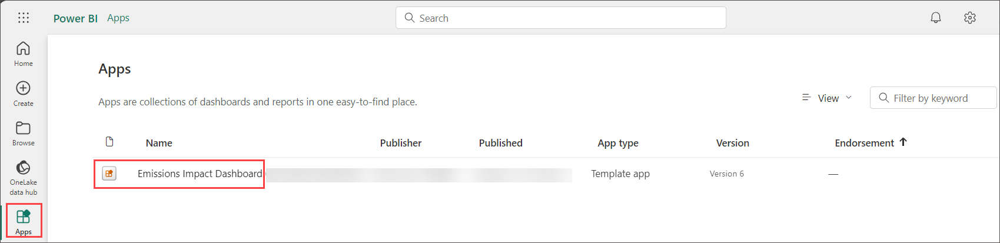

10. You will be navigated to **Emissions Impact Dashboard**.

      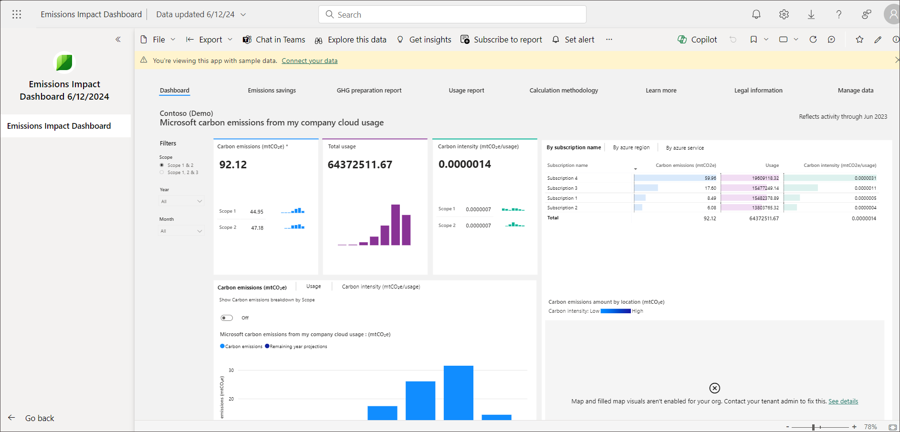

    You successfully installed the Emissions Impact Dashboard for Azure and Emissions Impact Dashboard for Microsoft 365 applications.

11. The Emissions Impact Dashboard for Azure has multiple tabs that detail a range of metrics.

    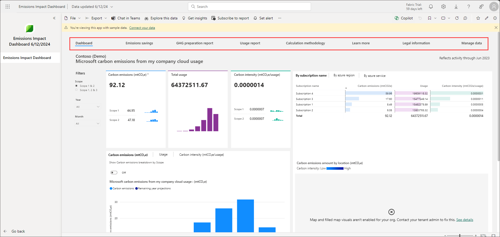
    
13. The dashboard provides insight into emissions that are generated based on an organization's use of Microsoft Cloud services. Key fact boxes across the upper left of the page provide visibility into carbon emissions, total cloud usage, and carbon intensity, which is a measure of efficiency.

     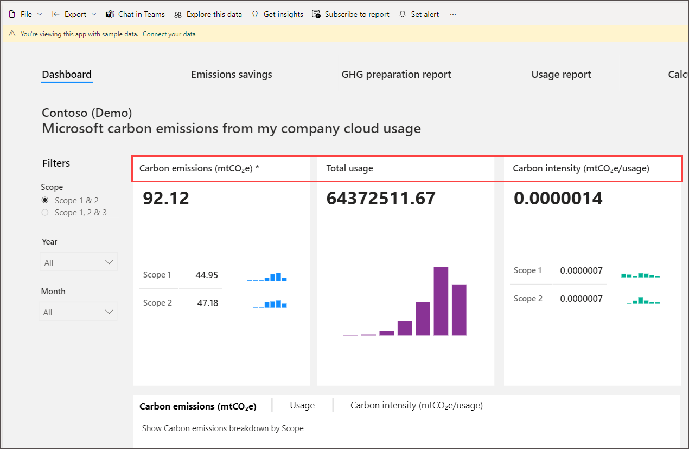
    
14. While most cloud services only provide a view into scope 1 and 2 emission types, Microsoft takes emissions analysis one step further by also providing visibility to scope 3 emissions.

15. **Emissions savings** lets organizations view the carbon emissions savings from running on Microsoft Cloud versus an on-premises alternative. On the efficiency scale, organizations can select their level of efficiency to be low, medium, or high by using the criteria on the right side of the page's guidance.

      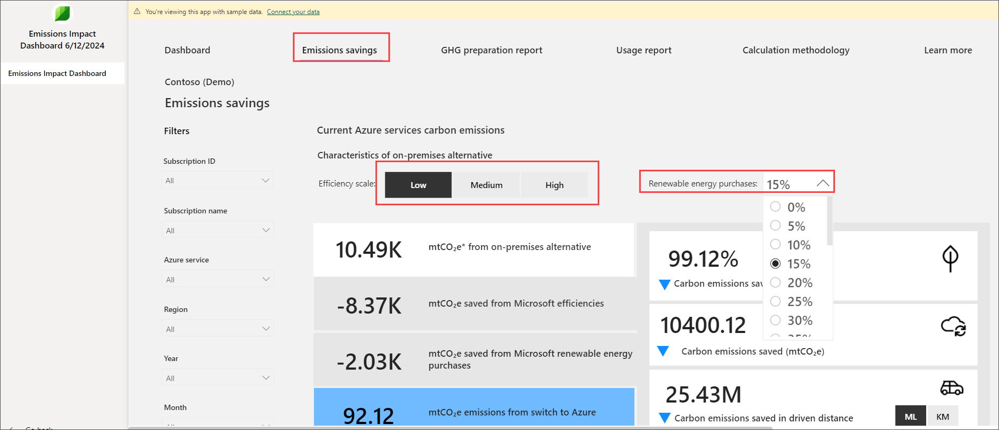
      
16. **GHG preparation** report helps organizations prepare internal or external sustainability reports. You can filter by time horizon, yearly, monthly, and quarterly, in addition to subscription name and ID, Azure service, Azure region, and scope type. You can export this report to Microsoft Excel for further analysis and reporting. 

     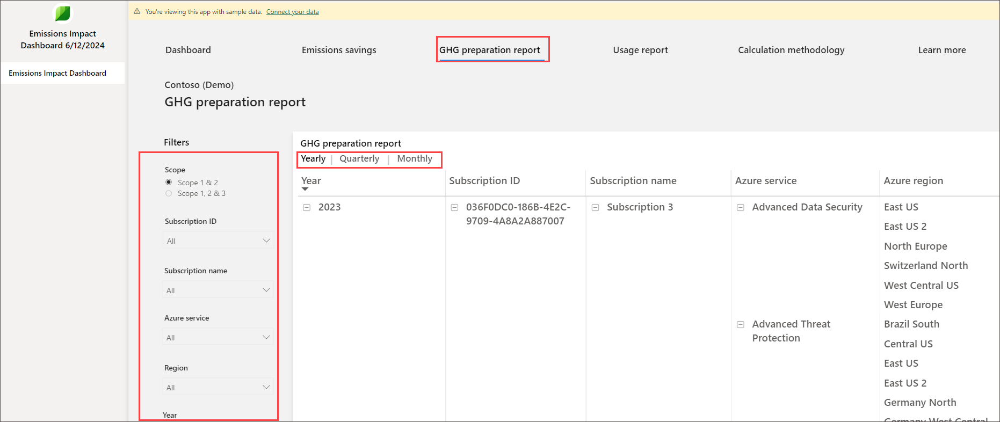

17. **Usage report** helps organizations know the usage hours of Azure services across all available subscriptions. The usage hours are based on the sum of the organization’s compute, storage, and data transfer in Microsoft Cloud. You can filter and export a usage report.

    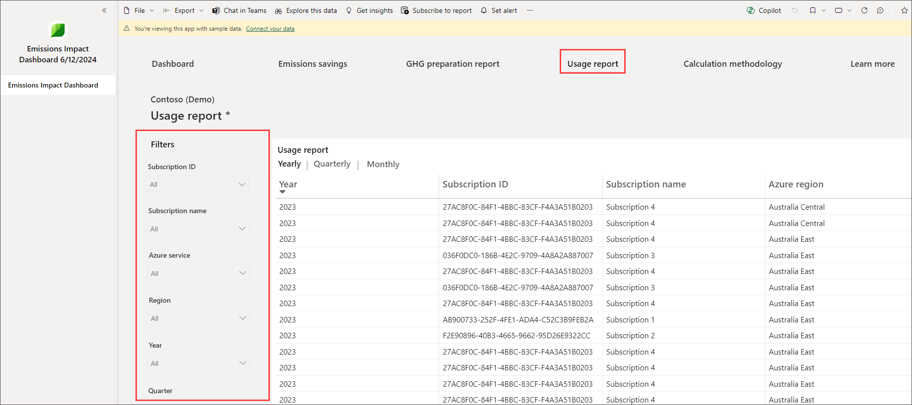
    
19. You can export data from the GHG preparation report, Usage report, and dashboard page on a per-visualization level. You can't export the overall report's data from the Export button on the page header.

20. The Calculation methodology page provides insights into how Microsoft calculates emissions and usage for the Emissions Impact Dashboard.

      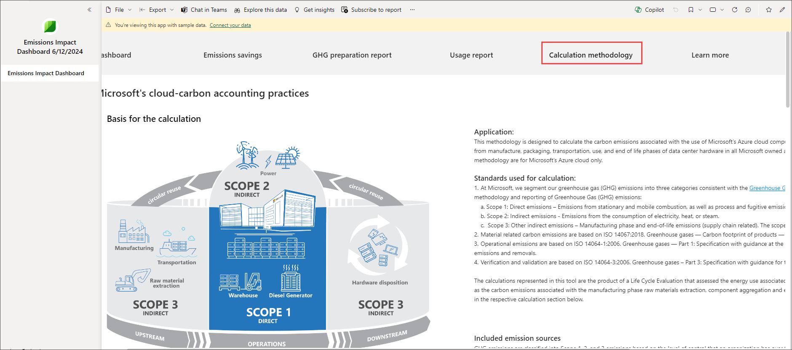    

21. The Learn more page contains information and tutorials on how to use the Emissions Impact Dashboard click on **Watch video** to get more details. It also provides insights into Microsoft sustainable energy initiatives and investments.

    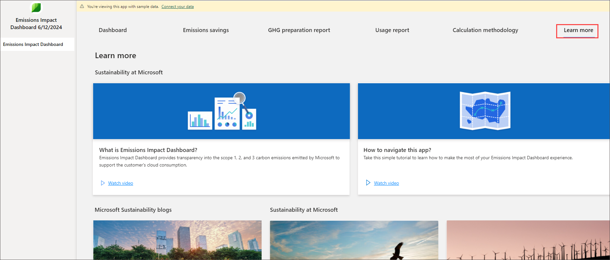 

22. The Manage data page provides organizations the ability to delete their emissions data from the Emissions Impact Dashboard.

### Reference Link:
https://learn.microsoft.com/en-us/power-bi/connect-data/service-connect-to-emissions-impact-dashboard?toc=%2Findustry%2Fsustainability%2Ftoc.json&bc=%2Findustry%2Fbreadcrumb%2Ftoc.json
