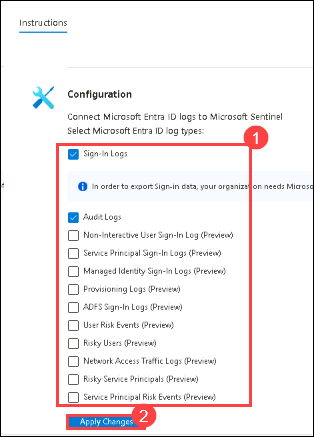

# Lab 01 - Setup Sentinel Environment

## Lab overview
In the initial phase of setting up the security infrastructure, the focus is on creating essential components to monitor and analyze security events. This involves establishing a Log Analytics workspace and integrating Microsoft Sentinel into the workspace, laying the foundation for subsequent security measures.

## Lab scenario
In this lab, you will undertake the essential task of setting up Log Analytics, which provides a centralized location to store and query data, while Sentinel serves as the platform for advanced security analysis, also enabling proactive threat detection and incident response.

## Lab objectives
In this lab, you will complete the following tasks:
- Task 1: Create Sentinel Workspace

## Estimated timing: 30 minutes

## Architecture Diagram

  

### Task 1: Create Sentinel Workspace

In this task, you will create Microsoft Sentinel workspace where you will be monitoring and analyzing security events in upcoming labs.

1.  On Azure Portal page, in **Search resources, services and docs (G+/)** box at the top of the portal, enter **Microsoft Sentinel**, and then select **Microsoft Sentinel** under services.

    

1. From the Microsoft Sentinel page, select **+ Create**.

1. From Add Microsoft Sentinel to a workspace, select **+ Create a new workspace**.

1. From the basics tab of the Create Log Analytics workspace, enter the following and click **Review + Create**.   

    | Setting | Action |
    | -- | -- |
    | Subscription |  Retain the default Subscription.  |
    | Resource group | select ResourceGroup(sentinel-rg). |
    | Name | Set the name to 'sentinelworkspace'. |
    | Region | Retain the default region. |
    |||

    

1. Verify the information you entered then select **Create**.

1. If you don’t see the new workspace listed, select **Refresh**, then select newly created workspace **sentinelworkspace** and click on **Add**.

   

1. Once the new workspace is added, the Microsoft Sentinel | News & guides page will display., including that the Microsoft Sentinel free trial is activated. Select **OK**  Note the three steps listed on the Get started page.

   
   
   

# Lab 06 - Ingest Logs from Microsoft Entra ID

## Lab Overview
Gain insights into Microsoft Entra ID by connecting Audit and Sign-in logs to Microsoft Sentinel to gather insights around Microsoft Entra ID scenarios. You can learn about app usage, conditional access policies, legacy auth relate details using our Sign-in logs. You can get information on your Self Service Password Reset (SSPR) usage, Microsoft Entra ID Management activities like user, group, role, app management using our Audit logs table.

## Lab scenario
Microsoft Entra ID is an integrated cloud identity and access solution. In this lab, you will enable the ingestion of logs from Microsoft Entra ID into Security Information and Event Management (SIEM) solution to enhance security monitoring and analytical capabilities.

## Lab objectives 
In this lab, you will complete the following tasks:
- Task 1: Install Microsoft Entra ID data connector to Sentinel
- Task 2: Set up the data connector to ingest logs to workspace
- Task 3: View data ingested into Microsoft Sentinel

## Estimated timing: 45 minutes

## Architecture Diagram

   

### Task 1: Install Microsoft Entra ID data connector to Sentinel

In this task, you will explore the Microsoft Sentinel in the Azure Portal and install the Microsoft Entra ID data connector.

1. On Azure Portal page, in **Search resources, services and docs (G+/)** box at the top of the portal, enter **Microsoft Sentinel**, and then select **Microsoft Sentinel** under services.

     

1. Select **sentinelworkspace**.

1. Select the **Data Connectors(1)** under **Configuration** and select **Go to content hub(2)**.

     

1. Search and select the **Microsoft Entra ID** connector.

   

1. Click on **Install**.

   >**Congratulations** on completing the task! Now, it's time to validate it. Here are the steps:
   > - Navigate to the Lab Validation Page, from the upper right corner in the lab guide section.
   > - Hit the Validate button for the corresponding task. If you receive a success message, you can proceed to the next task. 
   > - If not, carefully read the error message and retry the step, following the instructions in the lab guide.
   > - If you need any assistance, please contact us at labs-support@spektrasystems.com. We are available 24/7 to help you out.

### Task 2: Set up the data connector to ingest logs to workspace

In this task, you will configure the Microsoft Entra ID data connector to ingest relevant logs into your designated Log Analytics workspace

1. In Microsoft Sentinel, select Data connectors.

1. Search for and select the **Microsoft Entra ID** connector.

1. In the details pane for the connector, select Open connector page.

1. On the **Instructions** page, under configuration, select the required record types data to be collected and click on **Apply changes**

   

  >**Note**: Wait for atleast 15 mins and proceed to next task.

### Task 3: View data ingested into Microsoft Sentinel

In this task, you will be checking the logs ingested to sentinel.

1. In Microsoft Sentinel, select Data connectors.

1. Search for and select the **Microsoft Entra ID** data connector.

1. In the details pane for the connector, select Open connector page.

1. Review the Status of the data connector. It should be Connected.

      

1. Scroll down and select **Go to log analytics**.

1. In the query pane, run the default query, to view the activity data ingested into the workspace.

      

  >**Note**: It might take upto **2hrs** to generate the activity logs. Please continue with the next lab. Additionally, remember to come back and check again later for the logs.

### Conclusion
In this lab, you successfully configured and set up the ingestion of logs from Microsoft Entra ID into Microsoft Sentinel. By connecting Audit and Sign-in logs, you've enhanced the Security Information and Event Management (SIEM) capabilities within your organization. This integration allows for comprehensive monitoring, analysis, and insights into Microsoft Entra ID scenarios, empowering your security teams to proactively respond to potential threats and maintain a robust security posture
